# ElasticSearch 基础

## 1.初识 elasticsearch

### 1.1.了解 ES

elasticsearch 是一款非常强大的开源搜索引擎，可以从海量数据中快速找到需要的内容。

> 很多针对海量数据的搜索服务都可以用 elasticsearch 实现，例如 github 的全站搜索，购物平台的搜索，地理导航系统的地图位置搜索，甚至是浏览器自带的搜索引擎。

elasticsearch 结合 kibana、Logstash、Beats，也就是 elastic stack (ELK)，被广泛应用于日志数据分析、实时监控等领域。


elasticsearch 是 elastic stack 的核心，负责存储、搜索、分析数据。

kibana 是数据可视化工具。

Logstash、Beats 则负责数据抓取。

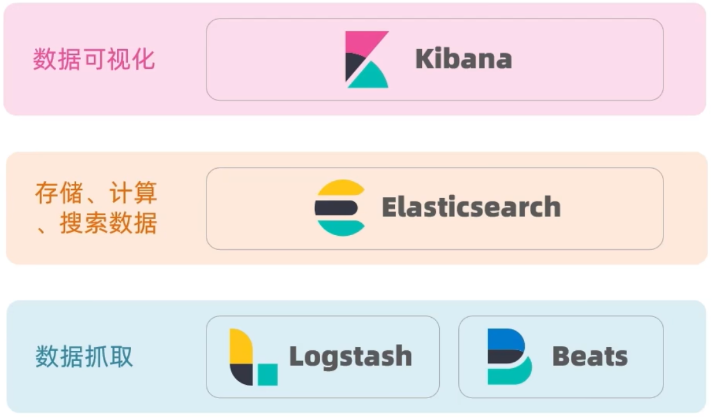


#### elasticsearch 的发展

elasticsearch 基于 Lucene 开发。

Lucene 是一个 Java 语言的搜索引擎类库，是 Apache 公司的顶级项目，由 DougCutting 于 1999 年研发。

官网地址：https://lucene.apache.org/

Lucene 的优势：易扩展，方便二次开发；高性能 (基于倒排索引)

Lucene 的缺点：只限于 Java 语言开发；学习曲线陡峭；不支持水平扩展


2004 年 Shay Banon 基于 Lucene 开发了 Compass，2010 年 Shay Banon 重写了 Compass，取名为 Elasticsearch。

官网地址：https://www.elastic.co/cn/

相比 lucene，elasticsearch 具备下列优势：

- 支持分布式，可水平扩展
- 提供 Restful 接口，可被任何语言调用


搜索引擎技术排名：

1. Elasticsearch：开源的分布式搜索引擎
2. Splunk：商业项目
3. Solr：Apache 的开源搜索引擎


#### 总结

什么是 elasticsearch ？

一个开源的分布式搜索引擎，。可以用来实现搜索、日志统计、分析、系统监控等功能


什么是 elastic stack (ELK) ？

是以 elasticsearch 为核心的技术栈，包括 beats、Logstash、kibana、elasticsearch


什么是 Lucene ？

是 Apache 的开源搜索引擎类库，提供了搜索引擎的核心 API


### 1.2.倒排索引

#### 正向索引和倒排索引

传统数据库 (如 MySQL) 采用正向索引，例如给下表 (tb_goods) 中的 id 创建索引：

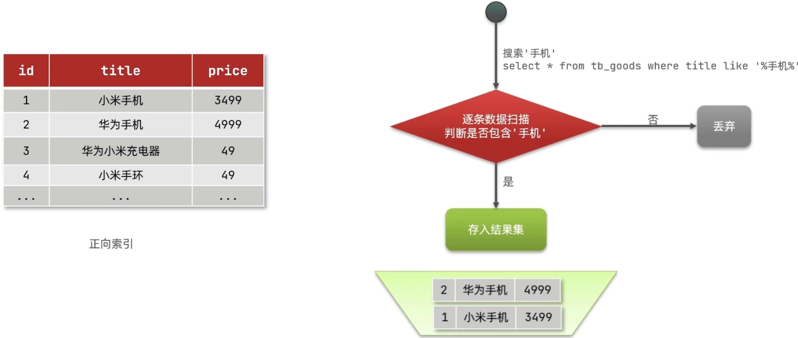

这里的 id 建立的索引会形成 B+ 树，以大大加快检索速度，这种索引就是一种正向索引。但是如果检索的字段并不是 id 而是 title，并且一般情况下检索 title 这类字段都会使用模糊查询，即使创建了索引，也不会生效 (数据库索引失效的情况之一)。

在没有索引的情况下，数据库只能逐条数据扫描来判断匹配的数据，在数据量比较庞大的时候，这种方式的效率很低。

正向索引在局部内容检索的情况下效率不高。

> 数据库索引失效的几种情况可参考相关文章：
>
> https://coder-world.blog.csdn.net/article/details/140531274
>
> https://blog.csdn.net/weixin_46224056/article/details/137597431


elasticsearch 采用倒排索引：

倒排索引创建时会形成新的结构，包含了两个字段：词条 term 和 文档 id。

- 文档 (document)：每条数据就是一个文档，类似于数据表的一条记录。
- 词条 (term)：文档按照语义分成的词语。

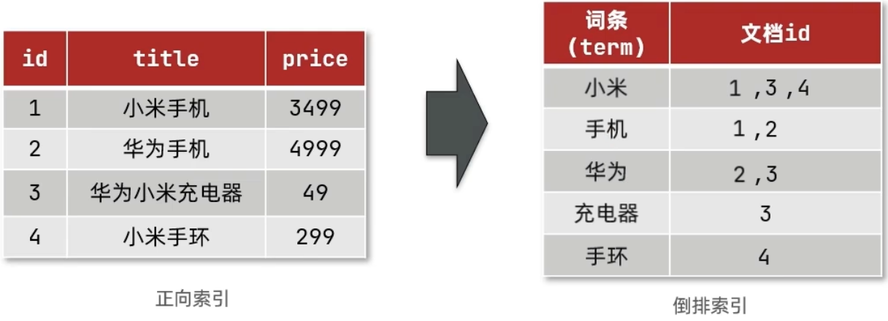

倒排索引存储时，先将文档中的内容分成词条，再记录词条对应的文档 id。倒排索引的词条不会重复，当遇到相同的词条时，会将对应的文档 id 存储到已有的词条中。

由于词条的唯一性，那么就可以给词条创建索引，之后根据词条查询的速度就会非常快。

在搜索时，用户输入的内容会先进行分词得到多个词条，然后根据词条去检索到对应的文档 id，由于词条都是索引级查询，查询效率远高于正向索引的逐条扫描。

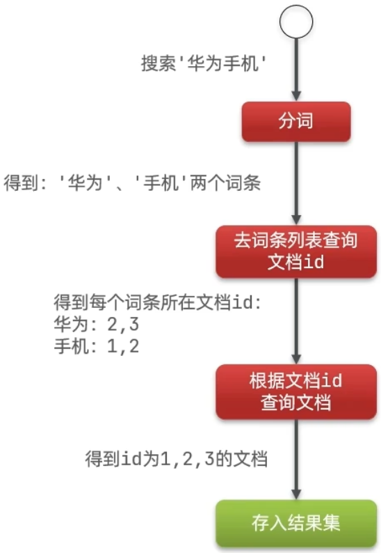

正向索引是先逐条扫描，然后查找到对应的词条，而倒排索引是反过来根据词条查找到关联的文档，因此称为倒排索引。倒排索引更擅长基于文档的局部内容进行搜索。这些复杂的搜索场景更适合使用倒排索引，因此很多搜索引擎以及 elasticsearch 本身都是使用倒排索引实现的。


#### 总结

什么是文档和词条？

每一条数据就是一个文档

对文档中的内容分词，得到的词语就是词条


什么是正向索引？

基于文档 id 创建索引。

查询词条时必须先找到文档，而后判断是否包含词条


什么是倒排索引？

对文档内容分词，对词条创建索引，并记录词条所在文档的位置。

查询时先根据词条查询到文档 id，而后获取到文档


### 1.3. es 与 mysql 的概念对比

#### 文档

elasticsearch 是面向文档存储的，可以是数据库中的一条商品数据或一个订单信息等。

文档数据会被序列化为 json 格式后存储在 elasticsearch 中。


#### 索引 (Index)

- 索引 (index)：相同类型的文档的集合
- 映射 (mapping)：索引中文档的字段约束信息，类似表的结构约束

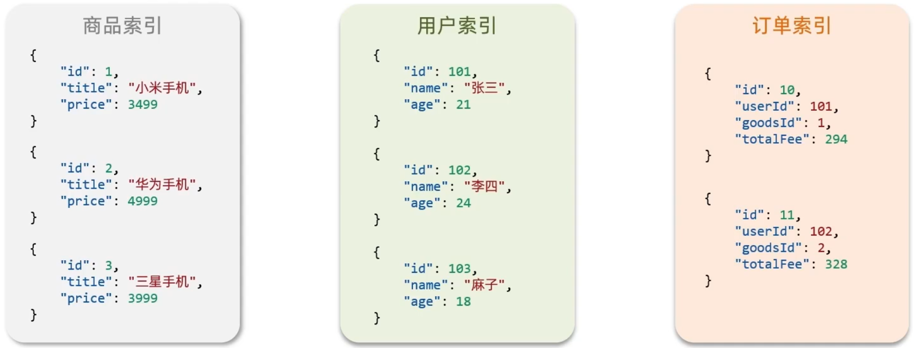


#### 概念对比

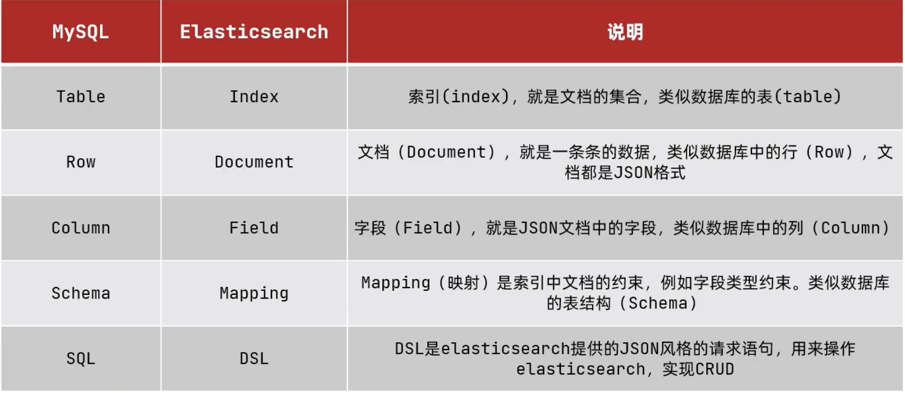


#### 架构

MySQL：擅长事务类型操作，可以确保数据的安全和一致性

Elasticsearch：擅长海量数据的搜索、分析、计算

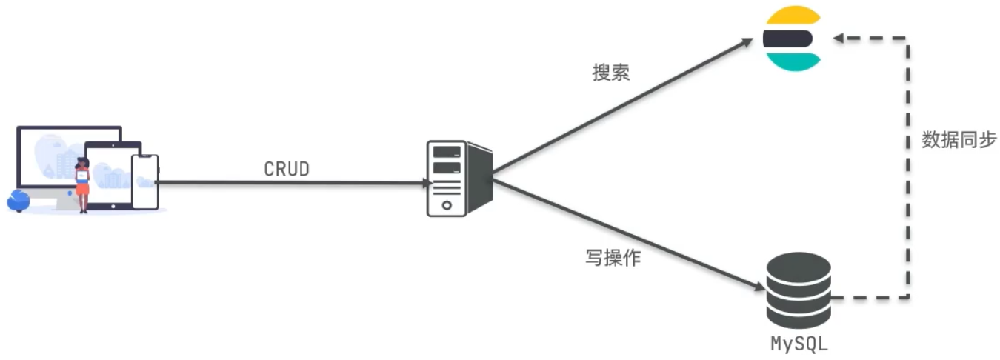

实践中可以结合两者使用，将数据写入到 MySQL，并同步数据到 Elasticsearch 中，以实现复杂的搜索功能。


#### 总结

文档：一条数据就是一个文档，在 es 中是 json 格式

字段：json 文档中的字段

索引：同类型文档的集合

映射：索引中文档的约束，比如字段名称、类型

elasticsearch 与数据库的关系 (互补关系)：

- 数据库负责事务类型操作
- elasticsearch 负责海量数据的搜索、分析、计算

elasticsearch 适合在业务量大、搜索需求复杂的场景下使用。对于简单的查询，例如 id 查询使用数据库即可。


### 1.4.安装 es、kibana

官方文档参考：https://www.elastic.co/guide/en/elasticsearch/reference/current/docker.html

> 注意对应的版本，这里使用的是 7.12.1 版本，不同版本的部署方式存在差异

#### 单节点 es 部署

创建网络

```bash
docker network create es-net
```

拉取镜像

```bash
docker pull docker.elastic.co/elasticsearch/elasticsearch:7.12.1
```

运行容器，部署单节点 es

```bash
docker run -d \
	--name es \
  -e "ES_JAVA_OPTS=-Xms512m -Xmx512m" \
  -e "discovery.type=single-node" \
  -v es-data:/usr/share/elasticsearch/data \
  -v es-plugins:/usr/share/elasticsearch/plugins \
  --privileged \
  --network es-net \
  -p 9200:9200 \
  -p 9300:9300 \
  docker.elastic.co/elasticsearch/elasticsearch:7.12.1
```

访问 http://localhost:9200 测试是否正常工作


#### kibana 部署

运行容器，部署 kibana

```bash
docker run -d \
	--name kibana \
  -e "ELASTICSEARCH_HOSTS=http://es:9200" \
  --network es-net \
  -p 5601:5601 \
  docker.elastic.co/kibana/kibana:7.12.1
```

访问 http://localhost:5601 测试是否正常工作


#### 简单使用

访问 kibana 控制台，选择 Dev Tools 就可以快速使用 DSL 发起对 elasticsearch 的查询请求。

一个最简单的请求如下，

```dsl
GET /
```

请求的目标地址就是 http://localhost:9200/，kibana 自动补齐了前面的地址。


### 1.5.分词器

es 在创建倒排索引时需要对文档分词；在搜索时，需要对用户输入内容分词。但默认的分词规则对中文处理并不友好。

在 kibana 的 Dev Tools 中测试以下用例，`analyzer` 为分词器类型，`text` 为分词的原始内容

```dsl
POST /_analyze
{
  "analyzer": "standard",
  "text": "你好hello世界world"
}
```

测试下来分词器会将中文一个词一个词地分割，无法分割出有效的词语。


#### 安装 IK 分词器

处理中文分词，可能涉及复杂的智能算法，不过可以使用现成的 IK 分词器。

项目地址：https://github.com/infinilabs/analysis-ik

进入 elasticsearch 容器

```bash
docker exec -it es bash
```

安装分词器插件，需要对应当前 elasticsearch 的版本

```bash
bin/elasticsearch-plugin install https://get.infini.cloud/elasticsearch/analysis-ik/7.12.1
```

或者直接在 plugins 目录下载并解压插件包

```bash
# 下载
curl -OL https://github.com/infinilabs/analysis-ik/releases/download/v7.12.1/elasticsearch-analysis-ik-7.12.1.zip
# 解压
unzip elasticsearch-analysis-ik-7.12.1.zip  -d plugins/ik
```

重启容器

```bash
docker restart es
```


IK 分词器包含两种模式

- `ik_smart`：最少切分，可用于搜索的词条较少，但内存占用相对低。
- `ik_max_word`：最细切分，可用于搜索的词条相对较多，但内存占用相对高。


#### IK 分词器的拓展和停用词典

IK 分词器依赖于一个词典工作，虽然能对中文分词，但是无法处理所有的中文组合排列情况，而且中文词语也在不断发展，如果出现了不存在于词典中的新词，例如网络流行词，那么 IK 分词器就不能很好地处理分词。此外，分词器也需要能够过滤掉敏感词。


##### IK 分词器 - 拓展词库

要拓展 IK 分词器的词库，只需要修改 IK 分词器 config 目录下的 IKAnalyzer.cfg.xml 文件

```xml
<?xml version="1.0" encoding="UTF-8"?>
<!DOCTYPE properties SYSTEM "http://java.sun.com/dtd/properties.dtd">
<properties>
  <comment>IK Analyzer 扩展配置</comment>
  <!--用户可以在这里配置自己的扩展字典 -->
  <entry key="ext_dict">ext.dic</entry>
</properties>
```

在同级目录下创建 ext.dic 文件，然后在其中添加需要拓展的词语即可。


##### IK 分词器 - 停用词库

要禁用某些敏感词条，同样修改 IK 分词器 config 目录下的 IKAnalyzer.cfg.xml 文件

```xml
<?xml version="1.0" encoding="UTF-8"?>
<!DOCTYPE properties SYSTEM "http://java.sun.com/dtd/properties.dtd">
<properties>
  <comment>IK Analyzer 扩展配置</comment>
  <!--用户可以在这里配置自己的扩展字典 -->
  <entry key="ext_dict">ext.dic</entry>
  <!--用户可以在这里配置自己的扩展停止词字典-->
  <entry key="ext_stopwords">stopword.dic</entry>
</properties>
```

在同级目录下创建 stopword.dic 文件，然后在其中添加需要过滤的词语即可。


#### 总结

分词器的作用是什么？

- 创建倒排索引时对文档分词

- 用户搜索时，对输入的内容分词


IK 分词器有几种模式？

- ik_smart：智能切分，粗粒度
- ik_max_word：最细切分，细粒度


IK 分词器如何拓展词条？如何停用词条？

- 通过 config 目录下的 IKAnalyzer.cfg.xml 文件添加拓展词典和禁用词典
- 在词典中添加对应的拓展词条或者禁用词条


## 2.索引库操作

### 2.1. mapping 属性

mapping 是对索引库中文档的约束，常见的 mapping 属性包括：

- type：字段数据类型，常用的简单类型有：

  - 字符串：text (可分词的文本)、keyword (精确值，例如：品牌、国家、ip 地址)
  - 数值：long、integer、short、byte、double、float、half_float、scaled_float、unsigned_long
  - 布尔：boolean
  - 日期：date
  - 对象：object

  elasticsearch 允许一个类型像数组一样拥有多个值，只要确保这些值都是同一个类型即可。

- index：是否创建索引，默认为 true

- analyzer：分词器的类型，只用于 text 类型文本的分词

- properties：一个字段的子字段


#### 总结

mapping 常见属性有哪些？

- type：数据类型
- index：是否索引
- analyzer：分词器
- properties：子字段


type 常见的有哪些？

- 字符串：text、keyword

- 数字：long、integer、short、byte、double、float
- 布尔：boolean
- 日期：date
- 对象：object


### 2.2.索引库的 CRUD

#### 创建索引库

ES 中通过 Restful 请求操作索引库、文档。请求内容用 DSL 语句表示。创建索引库和 mapping 的 DSL 示例如下：

```dsl
PUT /test
{
  "mappings": {
    "properties": {
      "info": {
        "type": "text",
        "analyzer": "ik_smart"
      },
      "email": {
        "type": "keyword",
        "index": false
      },
      "name": {
        "type": "object",
        "properties": {
          "firstName": {
            "type": "keyword"
          },
          "lastName": {
            "type": "keyword"
          }
        }
      }
    }
  }
}
```


#### 查询、删除索引库

查询索引库的语法

```dsl
GET /索引库名
```

示例

```dsl
GET /test
```


删除索引库的语法

```dsl
DELETE /索引库名
```

示例

```dsl
DELETE /test
```


#### 修改索引库

索引库和 mapping 一旦创建就无法修改已存在的字段，但是可以在原来的基础上增加新的字段，语法如下

```dsl
PUT /索引库名/_mapping
{
	"properties": {
		"新字段名": {
			"type": "integer"
		}
	}
}
```

示例

```dsl
PUT /test/_mapping
{
	"properties": {
		"age": {
			"type": "integer"
		}
	}
}
```


#### 总结

索引库操作有哪些？

- 创建索引库：PUT /索引库名
- 查询索引库：GET /索引库名
- 删除索引库：DELETE /索引库名
- 添加字段：PUT /索引库名/_mapping


## 3.文档操作

### 3.1.添加文档

新增文档的 DSL 语法如下

```dsl
POST /索引库名/_doc/文档id
{
	"字段1": "值1",
	"字段2": "值2",
	"字段3": {
		"子属性1": "值3",
		"子属性2": "值4"
	},
	...
}
```

示例

```dsl
POST /test/_doc/1
{
	"info": "你好世界",
	"email": "hello@world.com",
	"name": {
		"firstName": "四",
		"lastName": "李"
	}
}
```


### 3.2. 查询、删除文档

查询文档的语法

```dsl
GET /索引库名/_doc/文档id
```

示例

```dsl
GET /test/_doc/1
```


删除文档的语法

```dsl
DELETE /索引库名/_doc/文档id
```

示例

```dsl
DELETE /test/_doc/1
```


### 3.3. 修改文档

方式一：全量修改，会删除旧文档，添加新文档，如果文档 id 原本就不存在，则该操作变为新增操作。

```dsl
PUT /索引库名/_doc/文档id
{
	"字段1": "值1",
	"字段2": "值2",
	...
}
```

示例

```dsl
PUT /test/_doc/1
{
	"info": "周游世界",
	"email": "tarvel@everywhere.com",
	"name": {
		"firstName": "白",
		"lastName": "李"
	}
}
```


方式二：增量修改，修改指定字段值

```dsl
POST /索引库名/_update/文档id
{
	"doc": {
		"字段名": "新值"
	}
}
```

示例

```dsl
POST /test/_update/1
{
	"doc": {
		"email": "fly@sky.com"
	}
}
```


#### 总结

文档操作有哪些？

- 创建文档：POST /索引库名/_doc/文档 id { json 文档 }
- 查询文档：GET /索引库名/_doc/文档 id
- 删除文档：DELETE /索引库名/_doc/文档 id
- 修改文档
  - 全量修改：PUT /索引库名/_update/文档 id { json 文档 }
  - 增量修改：POST /索引库名/_update/文档 id { "doc": { 字段 } }


## 4. RestClient 操作索引库

- 创建索引库
- 删除索引库
- 判断索引库是否存在

### 4.1.什么是 RestClient

ES 官方提供了各种不同语言的客户端，用来操作 ES。这些客户端的工作原理就是组装 DSL 语句，通过 http 请求发送给 ES。

官方文档地址：https://www.elastic.co/guide/en/elasticsearch/client/index.html

> elasticsearch 7.15.x 版本废弃了 RestClient，旧版文档地址参考：
>
> https://www.elastic.co/guide/en/elasticsearch/client/java-rest/current/index.html


### 4.2.案例：使用 JavaRestClient 创建、删除索引库、判断索引库是否存在

#### 步骤1：导入数据，搭建初始环境

导入数据到数据库，数据库环境及数据文件参考此[地址](https://github.com/s-chance/Middleware-Records/tree/main/elasticsearch-notes/elasticsearch-demo/common)


#### 步骤2：分析数据结构

mapping 要考虑的问题：字段名、数据类型、是否参与搜索、是否分词、使用的分词器类型

id 字段在 ES 中一般都使用 keyword 类型，用于支持复杂的搜索功能。

不参与搜索的字段不需要创建倒排索引，同时也不会使用 text 类型和分词器。

> text 类型和分词器只有在使用倒排索引时才有作用，但倒排索引的对象并不一定是 text 类型的。


对于地理坐标信息的处理，ES 中支持两种地理坐标数据类型：

- geo_point：由纬度 (latitude) 和 经度 (longitude) 确定的一个点。例如 "32.8752345, 120.2981576"
- geo_shape：由多个 geo_point 组成的复杂几何图形。例如一条直线，"LINESTRING (-77.03653 38.897676, -77.009051, 38.889939)"


需要根据多个字段搜索时，ES 提供了字段拷贝，可以使用 copy_to 属性，将当前字段拷贝到指定字段。示例

```json
"all": {
  "type": "text",
  "analyzer": "ik_max_word"
},
"brand": {
  "type": "keyword",
  "copy_to": "all"
}
```

完整的 DSL 参考如下

```dsl
PUT /hotel
{
  "mappings": {
    "properties": {
      "id": {
        "type": "keyword"
      },
      "name": {
        "type": "text",
        "analyzer": "ik_max_word",
        "copy_to": "all"
      },
      "address": {
        "type": "keyword",
        "index": false
      },
      "price": {
        "type": "integer"
      },
      "score": {
        "type": "integer"
      },
      "brand": {
        "type": "keyword",
        "copy_to": "all"
      },
      "city": {
        "type": "keyword",
        "copy_to": "all"
      },
      "starName": {
        "type": "keyword",
        "copy_to": "all"
      },
      "business": {
        "type": "keyword",
        "copy_to": "all"
      },
      "location": {
        "type": "geo_point"
      },
      "pic": {
        "type": "keyword",
        "index": false
      },
      "all": {
        "type": "text",
        "analyzer": "ik_max_word"
      }
    }
  }
}
```


#### 步骤3：初始化 JavaRestClient

1.引入 es 的 RestHighLevelClient 依赖

```xml
<dependency>
  <groupId>org.elasticsearch.client</groupId>
  <artifactId>elasticsearch-rest-high-level-client</artifactId>
  <version>7.12.1</version>
</dependency>
```

2.配置 ES 版本，覆盖 springboot 默认的 ES 版本

```xml
<properties>
  <elasticsearch-client.version>7.12.1</elasticsearch-client.version>
</properties>
```

3.初始化 RestHighLevelClient

```java
private RestHighLevelClient client;

@Test
void testInit() {
  System.out.println(client);
}

@BeforeEach
void setUp() {
  this.client = new RestHighLevelClient(RestClient.builder(
    HttpHost.create("http://localhost:9200")
  ));
}

@AfterEach
void tearDown() throws IOException {
  this.client.close();
}
```


#### 步骤4：创建索引库

创建索引库代码如下

```java
@Test
void testCreateIndex() throws IOException {
  // 创建request对象
  CreateIndexRequest request = new CreateIndexRequest("hotel");
  // 请求参数：MAPPING_TEMPLATE是静态常量字符串，内容就是创建索引库的DSL语句
  request.source(MAPPING_TEMPLATE, XContentType.JSON);
  // 发起请求
  client.indices().create(request, RequestOptions.DEFAULT);
}
```


#### 步骤5：删除索引库、判断索引库是否存在

删除索引库代码如下

```java
@Test
void testDeleteIndex() throws IOException {
  DeleteIndexRequest request = new DeleteIndexRequest("hotel");
  client.indices().delete(request, RequestOptions.DEFAULT);
}
```


判断索引库是否存在

```java
@Test
void testExistsIndex() throws IOException {
  GetIndexRequest request = new GetIndexRequest("hotel");
  boolean exists = client.indices().exists(request, RequestOptions.DEFAULT);
  System.out.println(exists);
}
```


### 4.3.总结

索引库操作的基本步骤：

- 初始化 RestHighLevelClient
- 创建 XxxIndexRequest，Xxx 是 Create、Get、Delete
- 准备 DSL (使用 Create 时需要)
- 发送请求，调用 RestHighLevelClient 的 indices() 中的 create、exists、delete 方法


完整代码参考此 [commit](https://github.com/s-chance/Middleware-Records/commit/4831e64f4b9fdf0fc90f2e52c41ec51fd45fa6ba)


## 5. RestClient 操作文档

### 5.1.案例：使用 JavaRestClient 实现文档的 CRUD

从数据库查询数据，导入到 elasticsearch 索引库，实现文档的 CRUD


#### 步骤1：初始化 JavaRestClient

新建测试类，实现文档相关操作，初始化 JavaRestClient 代码同上


#### 步骤2：添加数据到索引库

先查询数据，然后给数据创建倒排索引，即可完成添加。以下是一份仅供参考的示例代码

```java
@Test
void testIndexDocument() throws IOException {
  IndexRequest request = new IndexRequest("indexName").id("1");
  request.source("{ \"name\": \"Jack\", \"age\": 21 }", XContentType.JSON);
  client.index(request, RequestOptions.DEFAULT);
}
```


#### 步骤3：根据 id 查询数据

根据 id 查询到 json 格式的文档数据，反序列化为 java 对象输出。以下是一份仅供参考的示例代码

```java
@Test
void testGetDocumentById() throws IOException {
  GetRequest request = new GetRequest("indexName", "1");
  GetResponse response = client.get(request, RequestOptions.DEFAULT);
  String json = response.getSourceAsString();
  System.out.println(json);
}
```


#### 步骤4：根据 id 修改数据

修改文档数据有两种方式：

方式一：全量更新，再次写入 id 一样的文档，就会删除旧文档，创建新文档

方式二：局部更新，只更新部分字段

以下是方式二的简单示例代码

```java
@Test
void testUpdateDocumentById() throws IOException {
  UpdateRequest request = new UpdateRequest("indexName", "1");
  request.doc(
    "age", 18,
    "name", "Tom"
  );
  client.update(request, RequestOptions.DEFAULT);
}
```


#### 步骤5：根据 id 删除数据

删除文档示例代码如下

```java
@Test
void testDeleteDocumentById() throws IOException {
  DeleteRequest request = new DeleteRequest("indexName", "1");
  client.delete(request, RequestOptions.DEFAULT);
}
```


#### 总结

文档操作的基本步骤

- 初始化 RestHighLevelClient
- 创建 XxxRequest，Xxx 为 Index、Get、Update、Delete
- 准备参数 (使用 Index 和 Update 时需要)
- 发送请求，调用 RestHighLevelClient 的 index、get、update、delete 方法
- 解析结果 (使用 Get 时需要)


### 5.2. 案例：使用 JavaRestClient 批量导入数据到 ES

需求：批量查询数据，然后批量导入索引库

思路：

1.使用 mybatis-plus 查询数据

2.将查询到的数据转换为对应的文档类型数据

3.使用 JavaRestClient 中的 bulk 批处理方法，实现批量创建文档，示例代码如下

```java
@Test
void testBulk() throws IOException {
  // 创建bulk请求
  BulkRequest request = new BulkRequest();
  // 批量添加要处理的请求，这里是新增两个文档的请求
  request.add(new IndexRequest("hotel")
              .id("101").source("json source", XContentType.JSON));
  request.add(new IndexRequest("hotel")
              .id("102").source("json source2", XContentType.JSON));
  // 发起bulk请求
  client.bulk(request, RequestOptions.DEFAULT);
}
```


完整代码参考此 [commit](https://github.com/s-chance/Middleware-Records/commit/a566440b97e95302d9134d3cf22f4a4d0eb0c2f2)


# ElasticSearch 搜索

## 1. DSL 查询文档

### 1.1. DSL Query 的分类和基本语法

Elasticsearch 提供了基于 JSON 的 DSL (Domain Specific Language) 来定义查询。常用的查询类型包括：

- 查询所有：查询出所有数据，一般用于测试。例如：match_all
- 全文检索 (full text) 查询：利用分词器对用户输入内容分词，然后从倒排索引库中匹配。例如：
  - match_query
  - multi_match_query
- 精确查询：根据精确词条值查找数据，一般是查找 keyword、数值、日期、boolean 等类型字段。例如：
  - ids
  - range
  - term
- 地理 (geo) 查询：根据经纬度查询。例如：
  - geo_distance
  - geo_bounding_box
- 复合 (compound) 查询：复合查询可以将上述各种查询条件组合起来，合并查询条件。例如：
  - bool
  - function_score


查询的基本语法如下

```dsl
GET /indexName/_search
{
	"query": {
		"查询类型": {
			"查询条件": "条件值"
		}
	}
}
```

查询所有

```dsl
GET /indexName/_search
{
	"query": {
		"match_all": {}
	}
}
```


### 1.2.全文检索查询

全文检索查询，会对用户输入内容分词，常用于搜索框搜索：

match 查询：全文检索查询的一种，用户输入内容分词，然后在倒排索引库检索，语法：

````dsl
GET /indexName/_search
{
	"query": {
		"match": {
			"FIELD": "TEXT"
		}
	}
}
````

multi_match：与 match 查询类似，不过允许同时查询多个字段，语法：

```dsl
GET /indexName/_search
{
	"query": {
		"multi_match": {
			"query": "TEXT",
			"fields": ["FIELD1", "FIELD2"]
		}
	}
}
```

从多个字段和单个字段搜索效率上对比更推荐使用 match 查询。


总结

match 和 multi_match 的区别

- match：根据一个字段查询
- multi_match：根据多个字段查询，参与查询字段越多，查询性能越差

建议使用字段拷贝 + match 查询的方式，效率更高。


### 1.3.精确查询

精确查询一般是查找 keyword、数值、日期、boolean 等类型字段，不会对搜索条件分词。常用的有：

- term：根据词条精确值查询
- range：根据值的范围查询

精确查询一般是根据 id、数值、keyword 类型或布尔字段来查询。语法如下

term 查询：

```dsl
GET /indexName/_search
{
	"query": {
		"term": {
			"FIELD": {
				"value": "VALUE"
			}
		}
	}
}
```

range 查询：

```dsl
GET /indexName/_search
{
	"query": {
		"range": {
			"FIELD": {
				"gte": 10,
				"lte": 20
			}
		}
	}
}
```


总结

精确查询常见的有哪些？

- term 查询：根据词条精确匹配，一般搜索 keyword 类型、数值类型、布尔类型、日期类型字段
- range 查询：根据数值范围查询，可以是数值、日期的范围


### 1.4.地理查询

根据经纬度查询。常见的使用场景包括：

- 携程：搜索附近的酒店
- 滴滴：搜索附近的出租车
- 微信：搜索附近的人

查询方式有：

geo_bounding_box：查询 geo_point 值落在某个矩形范围内的所有文档

```dsl
GET /indexName/_search
{
	"query": {
		"geo_bounding_box": {
			"FIELD": {
				"top_left": {
					"lat": 31.1,
					"lon": 121.5
				},
				"bottom_right": {
					"lat": 30.9,
					"lon": 121.7
				}
			}
		}
	}
}
```

geo_distance：查询到指定中心点小于某个距离值的所有文档

```dsl 
GET /indexName/_search
{
	"query": {
		"geo_distance": {
			"distance": "15km",
			"FIELD": "31.21,121.5"
		}
	}
}
```


### 1.5.复合查询

复合 (compound) 查询：复合查询可以将其它简单查询组合起来，实现更复杂的搜索逻辑。


#### 相关性算分 (相关性打分算法)

相关性算分：使用 match 查询时，会对文档与搜索词条的关联度打分 (_score)，返回结果时按照分值降序排列。

早期计算文档得分的算法为


TF 值越高，排名越靠前。

但是这种算法存在一些问题，没有考虑到词条的权重。因此出现了新的算法 TF-IDF，内容如下


逆文档频率就是词条的权重，当一个词条越是稀缺，则权重越高。


ES 早期使用的是 TF-IDF 算法，但是后来采用了新的 BM25 算法。


BM25 算法相比 TF-IDF 算法更加复杂，但是不会受到过高的词频影响，其最终得分会趋于水平，避免了传统 TF 算法因为词频过高而无限增长的问题。

ES 5.0 版本之后默认都使用 BM25 算法。


总结

elasticsearch 中的相关性打分算法

- TF-IDF：在 elasticsearch 5.0 之前，会随词频增加而越来越大
- BM25：在 elasticsearch 5.0 之后，会随着词频增加而增大，但增长曲线会趋于水平


#### Function Score Query

function score：算分函数查询，可以控制文档相关性算分，控制文档排名。

使用 function score query，可以修改文档的相关性算分 (query score)，根据新得到的算分排序。

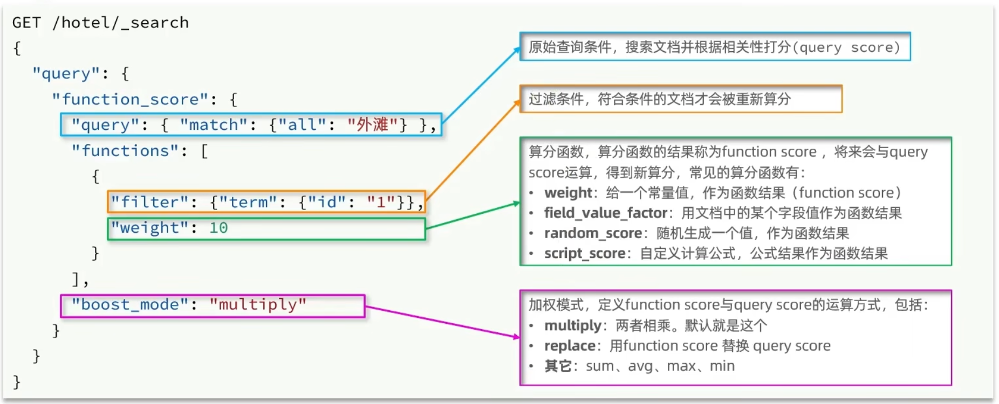


案例：人工干预排名

function score 三要素：

1.需要算分加权的文档，作为 filter 的对象

2.算分函数的选择，使用 weight 函数即可

3.加权模式的选择，选择 sum、multiply 任一个均可，这里选择 sum


总结

function score 定义的三要素：

-  过滤条件：哪些文档要加分
-  算分函数：如何计算 function score
-  加权方式：function score 与 query score 如何运算


#### Boolean Query

布尔查询是一个或多个查询子句的组合。子查询的组合方式有：

- must：必须匹配每个子查询，类似“与”
- should：选择性匹配子查询，类似“或”
- must_not：必须不匹配，不参与算分，类似“非”
- filter：必须匹配，不参与算分

通常，除了与算分相关的关键字应该使用 must 或 should，其他不参与算分的都应该使用 must_not 或 filter，以避免不必要的性能消耗，提高查询效率。


案例：使用 bool 查询

> 数据集来源于 [table.sql](https://github.com/s-chance/Middleware-Records/blob/main/elasticsearch-notes/elasticsearch-demo/common/table.sql)，通过 RestClient 批量导入到 es 中

需求：搜索名字包含 “如家”，价格不高于 400，在坐标 31.21, 121.5 周围 10km 范围内的酒店

DSL 参考

```dsl
GET /hotel/_search
{
  "query": {
    "bool": {
      "must": [
        {
          "match": {
            "name": "如家"
          }
        }
      ],
      "must_not": [
        {
          "range": {
            "price": {
              "gt": 400
            }
          }
        }
      ],
      "filter": [
        {
          "geo_distance": {
            "distance": "10km",
            "location": {
              "lat": 31.21,
              "lon": 121.5
            }
          }
        }
      ]
    }
  }
}
```


总结

bool 查询的逻辑关系

- must：必须匹配的条件，可理解为 “与”
- should：选择性匹配的条件，可理解为 “或”
- must_not：必须不匹配的条件，可理解为 “非”，不参与算分
- filter：必须匹配的条件，不参与算分


## 2.搜索结果处理

### 2.1.排序

elasticsearch 支持对搜索结果排序，默认是根据相关度算分 (_score) 来排序。可排序字段类型有：keyword 类型，数值类型、地理坐标类型、日期类型等。

基本排序语法

```dsl
GET /indexName/_search
{
	"query": {
		"match_all": {}
	},
	"sort": [
		{
			"FIELD": "desc"
		}
	]
}
```

地理坐标类型的排序语法比较特殊

```dsl
GET /indexName/_search
{
	"query": {
		"match_all": {}
	},
	"sort": [
		{
			"_geo_distance": {
				"FIELD": "纬度, 经度",
				"order": "asc",
				"unit": "km"
			}
		}
	]
}
```


案例：对酒店数据按照用户评价降序排序，评价相同的按照价格升序排序

评价是 score 字段，价格是 price 字段，按照顺序添加两个排序规则即可。

DSL 参考

```dsl
GET /hotel/_search
{
  "query": {
    "match_all": {}
  },
  "sort": [
    {
      "score": {
        "order": "desc"
      }
    },
    {
      "price": {
        "order": "asc"
      }
    }
  ]
}
```


案例：实现从酒店到指定位置坐标的距离升序排序

DSL 参考

```dsl
GET /hotel/_search
{
  "query": {
    "match_all": {}
  },
  "sort": [
    {
      "_geo_distance": {
        "location": {
          "lat": 31.034661,
          "lon": 121.612282
        }, 
        "order": "asc",
        "unit": "km"
      }
    }
  ]
}
```


使用了排序的功能之后，es 不会再进行相关性算分，因为不再依赖于算分进行排序。同时，由于不需要再计算相关性得分，查询效率也会提高。


### 2.2.分页

elsaticsearch 默认情况下只返回 top 10 的数据，如果要查询更多的数据需要修改分页参数。

elasticsearch 中通过修改 from、size 参数来控制要返回的分页结果：

```dsl
# from: 分页开始的位置，默认为0
# size：期望获取的文档总数
GET /hotel/_search
{
  "query": {
    "match_all": {}
  },
  "from": 990,
  "size": 10,
  "sort": [
    {
      "price": "asc"
    }
  ]
}
```

> 注意：`from` 表示的是位置，而非页码

es 中的分页与 mysql 中的分页底层原理不一样。es 底层采用的是倒排索引，这种结构不利于分页，因此 es 的分页是一种逻辑上的分页。

例如，获取从 990 开始到 1000 的数据，它只能先查询 0-1000 的所有数据，然后截取 990-1000 这一部分数据。


在单点环境下使用逻辑分页没有问题，但是在集群环境下就会出现新的问题。


#### 深度分页问题

ES 是分布式的，所以会面临深度分页问题。例如按 price 排序后，获取 from = 990, size = 10 的数据：

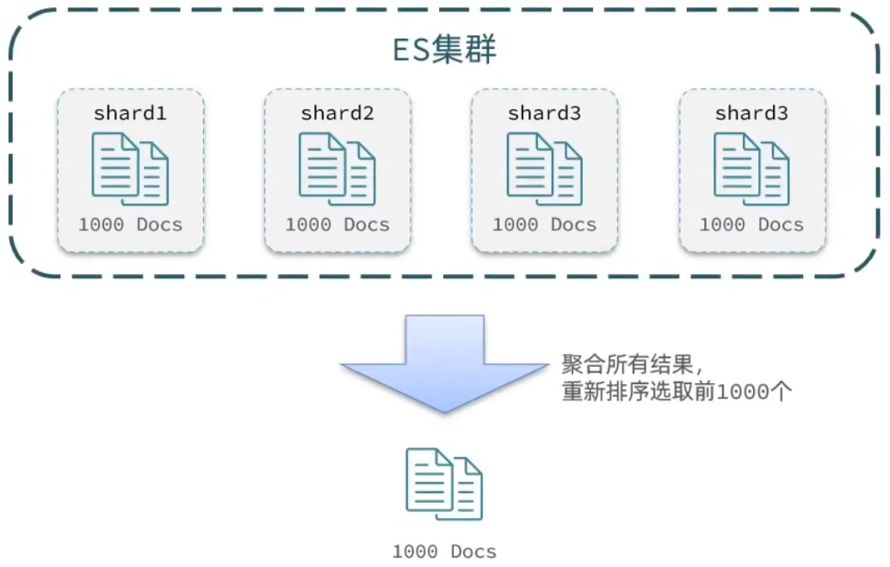

es 集群会把数据拆分，放到不同的机器上，每一份就是一个分片，每片上的数据不一样。在集群中查询分页数据时

1. 首先在每个数据分片上都排序并查询前 1000 条文档
2. 然后将所有节点的结果聚合，在内存中重新排序选出 1000 条文档
3. 最后从这 1000 条中，选取从 990 开始的 10 条文档

es 集群规模往往很大，需要处理的数据量也非常巨大。如果搜索页数过深，或者结果集 (from + size) 越大，对内存和 CPU 的消耗也越高。因此 ES 设定结果集查询的上限是 10000

> 一般情况下，业务上会限制查询的上限，以规避深度分页问题。


如果确实需要查询超过上限的数据量，针对深度分页，ES 提供了两种解决方案：

- search after：分页时需要排序，原理是从上一次的排序值开始，查询下一页数据。官方推荐使用的方式。但是只能向后翻页，不能向前翻页。
- scroll：原理是将排序数据形成快照，保存在内存。官方已经不推荐使用。


#### 总结

分页查询方式

from + size：

- 优点：支持随机翻页
- 缺点：深度分页问题，默认查询上限 (from+size) 是 10000
- 场景：百度、京东、谷歌、淘宝这样的随机翻页搜索

search after：

- 优点：没有查询上限 (单次查询的 size 不能超过 10000)
- 缺点：只能向后逐页查询，不支持随机翻页
- 场景：没有随机翻页需求的搜索，例如手机向下滚动翻页等下拉式搜索

scroll：

- 优点：没有查询上限 (单次查询的 size 不能超过 10000)
- 缺点：有额外内存消耗，并且搜索结果不是实时的
- 场景：海量数据的获取和迁移。从 ES 7.1 开始不推荐使用 scroll，建议用 search after 方案。


### 2.3.高亮

高亮：就是在搜索结果中把搜索关键字突出显示。

原理就是先将搜索结果中的关键字用标签标记出来，然后在页面中给标签添加 css 样式。

语法：

```dsl
# fields：指定要高亮的字段
# pre_tags：用来标记高亮字段的前置标签
# post_tags：用来标记高亮字段的后置标签
GET /hotel/_search
{
  "query": {
    "match": {
      "FIELD": "TEXT"
    }
  },
  "highlight": {
    "fields": {
      "FIELD": {
        "pre_tags": "<em>",
        "post_tags": "</em>"
      }
    }
  }
}
```

默认情况下，搜索字段必须和高亮字段一致，否则不会高亮。或者通过设置 `"require_field_match": "false"` 来关闭匹配。


### 3.3.总结

搜索结果处理整体语法

```dsl
GET /hotel/_search
{
	"query": {
		"match": {
			"name": "如家"
		}
	},
	"from": 0,
	"size": 20,
	"sort": [
		{ "price": "asc" },
		{
			"_geo_distance": {
				"location": "31.040699,121.618075",
				"order": "asc",
				"unit": "km"
			}
		}
	],
	"highlight": {
		"fields": {
			"name": {
				"pre_tags": "<em>",
				"post_tags": "</em>"
			}
		}
	}
}
```


## 3. RestClient 查询文档

### 3.1.快速入门

RestAPI 构建 DSL 是通过 HighLevelRestClient 中的 resource() 来实现的，其中包含了查询、排序、分页、高亮等所有功能。

RestAPI 构建查询条件的核心部分是由 QueryBuilders 的工具类提供的，其中包含了各种查询方法。

查询的基本步骤是：

1. 创建 SearchRequest 对象
2. 准备 Request.source()，也就是 DSL。QueryBuilders 用于构建查询条件，并传入 Request.source().query() 方法
3. 发送请求，得到结果
4. 解析结果，从外到内，逐层解析


#### 全文检索查询

全文检索的 match 和 multi_match 查询与 match_all 的 api 基本一致，区别是 query 部分不同。

```java
// 单字段
QueryBuilders.matchQuery("all", "如家");
// 多字段
QueryBuilders.multiMatchQuery("如家", "name", "business");
```


#### 精确查询

精确查询主要是 term 查询和 range 查询

```java
// 词条查询
QueryBuilders.termQuery("city", "上海");
// 范围查询
QueryBuilders.rangeQuery("price").gte(100).lte(150);
```


#### 复合查询 

boolean query

```java
// 创建布尔查询
BoolQueryBuilder boolQuery = QueryBuilders.boolQuery();
// 设置must条件
boolQuery.must(QueryBuilders.termQuery("city", "上海"));
// 设置filter条件
boolQuery.filter(QueryBuilders.rangeQuery("price").lte(250));
```


#### 排序和分页

搜索结果的排序和分页是与 query 同级的参数，对应的 API 如下：

```java
request.source()
  .query(QueryBuilders.matchAllQuery())
  .from((page - 1) * size)
  .size(size)
  .sort("price", SortOrder.ASC);
```


#### 高亮

高亮 API 包括请求 DSL 构建和结果解析两部分。

构建 DSL

```java
request.source()
  .query(QueryBuilders.matchQuery("all", "如家"))
  .highlighter(new HighlightBuilder()
               .field("name")
               .requireFieldMatch(false));
```

结果解析

```java
ObjectMapper mapper = new ObjectMapper();
// 获取source
HotelDoc hotelDoc = mapper.readValue(hit.getSourceAsString(), HotelDoc.class);
// 处理高亮
Map<String, HighlightField> highlightFields = hit.getHighlightFields();
if (!CollectionUtils.isEmpty(highlightFields)) {
  // 获取高亮的字段
  HighlightField highlightField = highlightFields.get("name");
  if (highlightField!=null) {
    // 使用高亮字段中的值替换source中对应的值
    String name = highlightField.getFragments()[0].string();
    hotelDoc.setName(name);
  }
}
```


#### 总结

- 所有搜索 DSL 的构建都需要使用 SearchRequest 的 source() 方法
- 高亮结果的解析可以根据 JSON 结构，逐层解析


完整代码用例参考此 [commit](https://github.com/s-chance/Middleware-Records/commit/a75fe2b02fba2eed332e75ad2c037e157d0e7169)


## 4.综合案例

### 案例1：实现酒店搜索功能，完成关键字搜索和分页

先实现关键词搜索

1. 定义实体类
2. 定义 controller 类，调用 service 的 search 方法
3. 定义 serivce 的 search 方法，利用 match 查询实现根据关键词搜索

代码参考此 [commit](https://github.com/s-chance/Middleware-Records/commit/20577ae768dae415162fb7496638e1429e38299e)


### 案例2：添加品牌、城市、星级、价格等过滤功能

步骤：

1. 修改 RequestParams 类， 添加 brand、city、starName、minPrice、maxPrice 等参数

2. 修改 search 方法的实现，在关键词搜索时，如果 brand 等参数存在，对其做过滤

   过滤条件包括：

   - city 精确匹配
   - brand 精确匹配
   - starName 精确匹配
   - price 范围过滤

   注意事项：

   - 多个条件之间是 AND 关系，组合多条件使用 Boolean Query
   - 参数存在才需要过滤，做好非空判断

代码参考此 [commit](https://github.com/s-chance/Middleware-Records/commit/c468477b91a9e1d8be59396291f1c73877895f8c)


### 案例3：附近的酒店

步骤：

1. 修改 RequestParams 参数，接收 location 字段
2. 修改 search 方法业务逻辑，如果 location 有值，则根据 geo_distance 排序

距离排序的 API 示例

```java
request.source()
  .sort(SortBuilders
        .geoDistanceSort("location", new GeoPoint("31.21, 121.5"))
        .order(SortOrder.ASC)
        .unit(DistanceUnit.KILOMETERS)
       );
```

代码参考此 [commit](https://github.com/s-chance/Middleware-Records/commit/b3794dafc899dd33046b1040cd050b19c520b67b)


### 案例4：让指定酒店在搜索结果中排名置顶

步骤：

1. 给 HotelDoc 类添加 isAD 字段，Boolean 类型
2. 挑选几个酒店，设置其 isAD 字段值为 true
3. 修改 search 方法，添加 function score 功能，给 isAD 值为 true 的酒店增加权重

DSL 测试数据

```dsl
POST /hotel/_update/728180
{
	"doc": {
		"isAD": true
	}
}
```

Funciton Score 查询示例代码

```java
FunctionScoreQueryBuilder functionScoreQueryBuilder = QueryBuilders.functionScoreQuery(
  QueryBuilders.matchQuery("name", "如家"),
  new FunctionScoreQueryBuilder.FilterFunctionBuilder[]{
    new FunctionScoreQueryBuilder.FilterFunctionBuilder(
      QueryBuilders.termQuery("isAD", true),
      ScoreFunctionBuilders.weightFactorFunction(5)
    )
  }
);
request.source().query(functionScoreQueryBuilder);
```

代码参考此 [cmmit](https://github.com/s-chance/Middleware-Records/commit/76a2ae72dc17f18036e3c406ee7c14ae1220cca4)


#  Elasticsearch 进阶

## 1.数据聚合

### 1.1.聚合的分类

聚合 (aggregations) 可以实现对文档数据的统计、分析、运算。常见的聚合有三类：

- 桶 (Bucket) 聚合：对文档数据分组，并统计每组数量
  - TermAggregation：按照文档字段值分组
  - Date Histogram：按照日期阶梯分组，例如一周为一组，或者一月为一组
- 度量 (Metric) 聚合：对文档数据做计算，比如：最大值、最小值、平均值等
  - Avg：求平均值
  - Max：求最大值
  - Min：求最小值
  - Stats：同时求 max、min、avg、sum 等
- 管道 (pipeline) 聚合：以其它聚合的结果为基础做二次聚合

参与聚合的字段类型必须是：

- keyword
- 数值
- 日期
- 布尔


#### DSL 实现 Bucket 聚合

统计所有数据中酒店的品牌有几种，此时可以根据酒店品牌的名称做聚合。

DSL 示例：

```dsl
GET /hotel/_search
{
	"size": 0, // 设置size为0，结果中不包含文档，只包含聚合结果
	"aggs": { // 定义聚合
		"brandAgg": { // 自定义名称
			"terms": { // 聚合类型，按照品牌值聚合，所以为term
				"field": "brand", // 参与聚合的字段
				"size": 20 // 希望获取的聚合结果数量
			}
		}
	}
}
```

默认情况下，Bucket 聚合会统计 Bucket 内的文档数量，记为 _count，并且按照 _count 降序排序。

可以通过设置 order 修改排序方式

```dsl
GET /hotel/_search
{
  "size": 0,
  "aggs": {
    "brandAgg": {
      "terms": {
        "field": "brand",
        "order": {
          "_count": "asc" // 按照_count升序排序
        }, 
        "size": 20
      }
    }
  }
}
```


默认情况下，Bukect 聚合是对索引库的所有文档做聚合，可以限定要聚合的文档范围，只要添加 query 条件即可：

```dsl
GET /hotel/_search
{
  "query": {
    "range": {
      "price": {
        "lte": 200 // 只聚合price小于等于200的文档
      }
    }
  }, 
  "size": 0,
  "aggs": {
    "brandAgg": {
      "terms": {
        "field": "brand",
        "size": 20
      }
    }
  }
}
```


总结

aggs 代表聚合，与 query 同级，此时 query 的作用主要是限定聚合的文档范围，避免聚合整个索引库带来内存压力。

聚合三要素：

- 聚合名称
- 聚合类型
- 聚合字段

聚合可配置的属性有：

- size：指定聚合结果的数量，默认是 10
- order：指定聚合结果的排序方式，默认是降序
- field：指定聚合字段


#### DSL 实现 Metrics 聚合

获取每个品牌的用户评分的 min、max、avg 等值。

可以使用 stats 聚合

```dsl
GET /hotel/_search
{
  "size": 0,
  "aggs": {
    "brandAgg": {
      "terms": {
        "field": "brand",
        "order": {
          "scoreAgg.avg": "desc"
        }, 
        "size": 20
      },
      "aggs": { // brands聚合的子聚合
        "scoreAgg": { // 聚合名称
          "stats": { // 聚合类型，stat可以计算min、max、avg等
            "field": "score" // 聚合字段
          }
        }
      }
    }
  }
}
```


### 1.2. RestAPI 实现数据聚合

以品牌聚合为例，演示 Java RestClient 的使用

API 示例

组装 DSL

```java
request.source()
  .size(0)
  .aggregation(AggregationBuilders
               .terms("brandAgg")
               .field("brand")
               .size(20));
```

解析结果

```java
// 解析聚合结果
Aggregations aggregations = search.getAggregations();
// 根据名称获取聚合结果
Terms brandTerms = aggregations.get("brandAgg");
// 获取桶
List<? extends Terms.Bucket> buckets = brandTerms.getBuckets();
for (Terms.Bucket bucket : buckets) {
  String brandName = bucket.getKeyAsString();
  long docCount = bucket.getDocCount();
  System.out.println(brandName + ": " + docCount);
}
```

完整代码参考此 [commit](https://github.com/s-chance/Middleware-Records/commit/a9997e6841cc901884783538c564e07ef4f6f588)


#### 案例：实现对品牌、城市、星级的聚合

需求：将品牌、城市等信息通过聚合索引库中的酒店数据得来

代码参考此 [commit](https://github.com/s-chance/Middleware-Records/commit/bf00bbb44471362ac94430550b89eb7ab6034901)


#### 案例：带有过滤条件的聚合

前面的聚合是对整个索引库聚合，没有条件过滤的功能，不能很好地与条件搜索功能配合。

请求参数和前面 search 方法的参数 RequestParams 保持一致，以限定聚合时的文档范围。

例如：用户搜索 “外滩”，价格在 300~600，则聚合也必须在此搜索条件的基础上完成。

步骤：

1. 编写 controller 方法
2. 修改 service 的方法，添加 RequestParams 参数
3. 修改 service 的方法，聚合时添加 query 条件

改进后的代码参考此 [commit](https://github.com/s-chance/Middleware-Records/commit/f3d20405dd5ea63cd87443550b35fa1179b854c2)


## 2.自动补全

### 2.1.拼音分词器

当用户在搜索框输入时，会提示出与该字符有关的搜索项。

#### 使用拼音分词

要实现根据字母做补全，就必须对文档按照拼音分词。GitHub 上有 elasticsearch 的拼音分词插件。

插件地址：https://github.com/infinilabs/analysis-pinyin

安装方式同 [IK 分词器](#安装 IK 分词器)

```bash
curl -OL https://github.com/infinilabs/analysis-pinyin/releases/download/v7.12.1/elasticsearch-analysis-pinyin-7.12.1.zip

unzip elasticsearch-analysis-pinyin-7.12.1.zip -d plugins/pinyin

docker restart es
```

DSL 测试

```dsl
POST /_analyze
{
  "text": ["你好世界"],
  "analyzer": "pinyin"
}
```


### 2.2.自定义分词器

拼音分词器一方面没有从中文上分词，另一方面产生了很多不必要的拼音关键词。实际使用会进行自定义配置。

elasticsearch 中分词器 (analyzer) 的组成包含三部分：

- character filters：在 tokenizer 之前对文本进行处理。例如删除字符、替换字符
- tokenizer：将文本按照一定的规则切割成词条 (term)。
- tokenizer filter：将 tokenizer 输出的词条做进一步处理。例如大小写转换、同义词处理、拼音处理等。

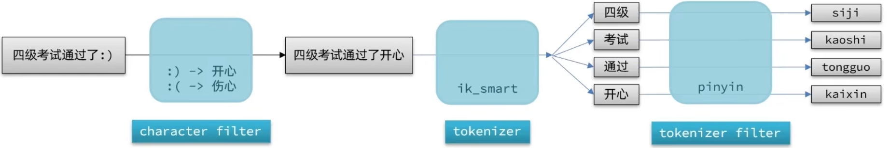

可以在创建索引库时，通过 settings 来配置自定义的 analyzer (分词器)：

```dsl
PUT /test
{
  "settings": {
    "analysis": {
      "analyzer": { // 自定义分词器
        "my_analyzer": { // 分词器名称
          "tokenizer": "ik_max_word",
          "filter": "pinyin"
        }
      }
    }
  }
}
```

参考文档，还可以进一步配置分词器

```dsl
PUT /test
{
  "settings": {
    "analysis": {
      "analyzer": { // 自定义分词器
        "my_analyzer": { // 分词器名称
          "tokenizer": "ik_max_word",
          "filter": "py"
        }
      },
      "filter": { // 自定义tokenizer filter
        "py": { // 过滤器名称
          "type": "pinyin", // 过滤器类型
          "keep_full_pinyin": false, // 不保留单个词的拼硬
          "keep_joined_full_pinyin": true, // 全拼
          "keep_original": true, // 保留中文
          "limit_first_letter_length": 16,
          "remove_duplicated_term": true,
          "none_chinese_pinyin_tokenize": false
        }
      }
    }
  }
}
```

完整的 DSL 示例

```dsl
PUT /test
{
  "settings": {
    "analysis": {
      "analyzer": {
        "my_analyzer": {
          "tokenizer": "ik_max_word",
          "filter": "py"
        }
      },
      "filter": {
        "py": {
          "type": "pinyin",
          "keep_full_pinyin": false,
          "keep_joined_full_pinyin": true,
          "keep_original": true,
          "limit_first_letter_length": 16,
          "remove_duplicated_term": true,
          "none_chinese_pinyin_tokenize": false
        }
      }
    }
  },
  "mappings": {
    "properties": {
      "name": {
        "type": "text",
        "analyzer": "my_analyzer"
      }
    }
  }
}
```

测试效果

```dsl
POST /test/_analyze
{
  "text": ["你好世界"],
  "analyzer": "my_analyzer"
}
```

测试同音字

```dsl
POST /test/_doc/1
{
  "id": 1,
  "name": "狮子"
}

POST /test/_doc/2
{
  "id": 2,
  "name": "虱子"
}

GET /test/_search
{
  "query": {
    "match": {
      "name": "shizi"
    }
  }
}
```


拼音分词器适合在创建倒排索引的时候使用，但不能在搜索的时候使用。

创建倒排索引时：

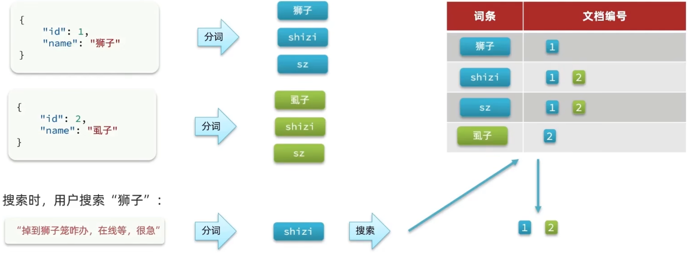

同音字搜索会出现错误匹配的情况，搜索 “狮子” 会搜索出 “虱子” 的结果。因此字段在创建倒排索引时应该使用 my_analyzer 分词器，字段在搜索时应该使用 ik_smart 分词器

指定 `search_analyzer` 为 `ik_smart`，以在搜索时指定使用 `ik_smart`

```dsl
PUT /test
{
  "settings": {
    "analysis": {
      "analyzer": {
        "my_analyzer": {
          "tokenizer": "ik_max_word",
          "filter": "py"
        }
      },
      "filter": {
        "py": {
          "type": "pinyin",
          "keep_full_pinyin": false,
          "keep_joined_full_pinyin": true,
          "keep_original": true,
          "limit_first_letter_length": 16,
          "remove_duplicated_term": true,
          "none_chinese_pinyin_tokenize": false
        }
      }
    }
  },
  "mappings": {
    "properties": {
      "name": {
        "type": "text",
        "analyzer": "my_analyzer",
        "search_analyzer": "ik_smart"
      }
    }
  }
}
```


#### 总结

如何使用拼音分词器？

1. 下载 pinyin 分词器
2. 解压并放到 elasticsearch 的 plugin 目录
3. 重启 elasticsearch

如何自定义分词器？

1. 创建索引库时，在 settings 中配置，可以包含三部分
2. character filter
3. tokenizer
4. filter

拼音分词器注意事项？

为了避免搜索到同音字，搜索时不要使用拼音分词器


### 2.3.自动补全查询

#### completion suggester 查询

elasticsearch 提供了 Completion Suggester 查询来实现自动补全功能。这个查询会匹配以用户输入内容开头的词条并返回。为了提高补全查询的效率，对于文档中字段的类型有一些约束：

- 参与补全查询的字段必须是 completion 类型。
- 字段的内容一般是用来补全的多个词条形成的数组。

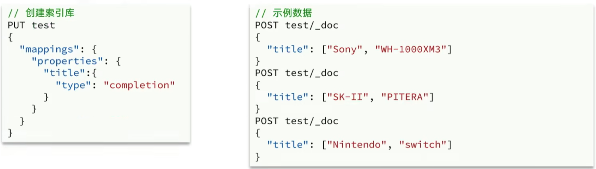

查询语法如下：

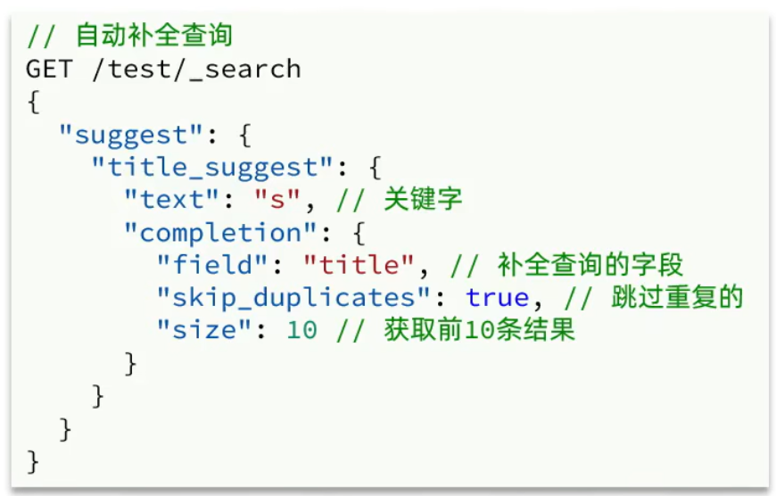

测试用例

```dsl
# 自动补全索引库
PUT /test2
{
  "mappings": {
    "properties": {
      "title": {
        "type": "completion"
      }
    }
  }
}
# 示例数据
POST /test2/_doc
{
  "title": ["Sony", "WH-1000XM3"]
}
POST /test2/_doc
{
  "title": ["SK-II", "PITERA"]
}
POST /test2/_doc
{
  "title": ["Nintendo", "switch"]
}
# 自动补全查询
GET /test2/_search
{
  "suggest": {
    "title_suggest": {
      "text": "s",
      "completion": {
        "field": "title",
        "skip_duplicates": true,
        "size": 10
      }
    }
  }
}
```


#### 总结

自动补全对字段的要求：

- 类型是 completion 类型
- 字段值是多词条的数组


#### 案例：实现 hotel 索引库的自动补全、拼音搜索功能

步骤：

1.修改 hotel 索引库结构，设置自定义拼音分词器

2.修改索引库的 name、all 字段，使用自定义分词器

3.索引库添加新字段 suggestion，类型为 completion 类型，使用自定义的分词器

<details>
  <summary>DSL 示例(点击展开)</summary>
  <pre>
  <blockcode class="json">
  PUT /hotel
  {
    "settings": {
      "analysis": {
        "analyzer": {
          "text_analyzer": { // 配置自定义分词器
            "tokenizer": "ik_max_word",
            "filter": "py"
          },
          "completion_analyzer": {
            "tokenizer": "keyword",
            "filter": "py"
          }
        },
        "filter": { // 自定义拼音分词器
          "py": {
            "type": "pinyin",
            "keep_full_pinyin": false,
            "keep_joined_full_pinyin": true,
            "keep_original": true,
            "limit_first_letter_length": 16,
            "remove_duplicated_term": true,
            "none_chinese_pinyin_tokenize": false
          }
        }
      }
    },
    "mappings": {
      "properties": {
        "id": {
          "type": "keyword"
        },
        "name": {
          "type": "text",
          "analyzer": "text_analyzer", // 使用自定义分词器
          "search_analyzer": "ik_smart", 
          "copy_to": "all"
        },
        "address": {
          "type": "keyword",
          "index": false
        },
        "price": {
          "type": "integer"
        },
        "score": {
          "type": "integer"
        },
        "brand": {
          "type": "keyword",
          "copy_to": "all"
        },
        "city": {
          "type": "keyword",
          "copy_to": "all"
        },
        "starName": {
          "type": "keyword",
          "copy_to": "all"
        },
        "business": {
          "type": "keyword",
          "copy_to": "all"
        },
        "location": {
          "type": "geo_point"
        },
        "pic": {
          "type": "keyword",
          "index": false
        },
        "all": {
          "type": "text",
          "analyzer": "text_analyzer", // 使用自定义分词器
          "search_analyzer": "ik_smart"
        },
        "suggestion": { // 自动补全提示字段
          "type": "completion",
          "analyzer": "completion_analyzer"
        }
      }
    }
  }</blockcode>
  </pre>		
</details>


4.HotelDoc 类型添加 suggestion 字段，内容包含 brand、business

5.重新导入数据到 hotel 库

重新执行批量导入方法即可。


#### RestAPI 实现自动补全

请求参数构造的 API 示例

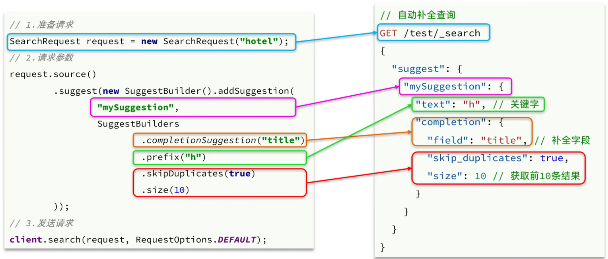

结果解析示例

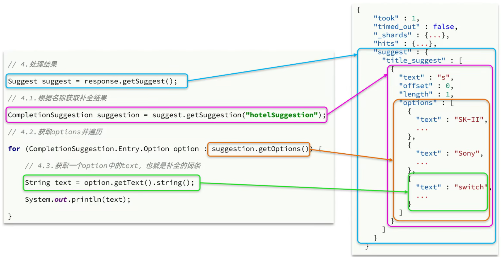

代码参考此 [commit](https://github.com/s-chance/Middleware-Records/commit/91cfad4e950279e21153f25b72329b8b4c694aba)


#### 案例：实现酒店搜索页面输入框的自动补全

代码参考此 [commit](https://github.com/s-chance/Middleware-Records/commit/43016db0a0ba83e53dad0190be152dee1cadc9e7)


## 3.数据同步

### 3.1.数据同步问题分析

elasticsearch 中的酒店数据来自 mysql 数据库，因此 mysql 数据发生改变时，elasticsearch 也必须跟着改变，这个就是 elasticsearch 与 mysql 之间的数据同步。

在微服务中，负责酒店管理 (操作 mysql) 的业务与负责酒店搜索 (操作 elasticsearch) 的业务可能在两个不同的微服务上，数据同步该如何实现？

#### 方案一：同步调用

写入数据库、调用更新接口、更新 es，三个步骤依次进行。

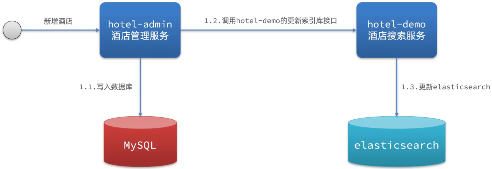

这种方案存在数据耦合、业务耦合的问题，影响性能 。

#### 方案二：异步通知

写入数据库、发布消息，微服务监听消息、更新 es。

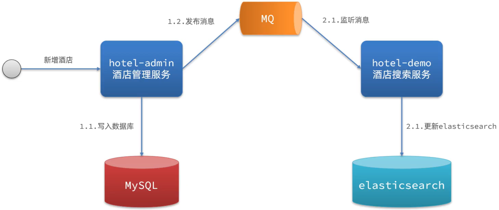

这种方案解除了业务之间的耦合，不再需要同步等待 es 更新完成，提升了性能，但是依赖于 MQ 的可靠性。

#### 方案三：监听 binlog

mysql 的 binlog 功能默认是关闭的，当开启 binlog 时，数据库的增删改操作都会被记录到 binlog 中。利用类似于 [canal](https://github.com/alibaba/canal) 这样的中间件可以监听 binlog，当数据发生变更时通知对应的微服务更新 es。

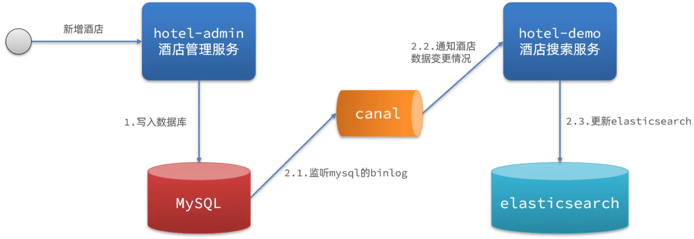

这种方案完全依赖于 canal 这类的中间件，不需要在微服务中主动调用或者发布消息，耦合度最低，但是由于使用了 binlog 功能，mysql 的压力会增加。


#### 总结

方式一：同步调用

- 优点：实现简单
- 缺点：业务耦合度高

方式二：异步通知

- 优点：低耦合
- 缺点：依赖 mq 的可靠性

方式三：监听 binlog

- 优点：完全解除服务间耦合
- 缺点：开启 binlog 增加数据库负担、实现难度高


#### 案例：利用 MQ 实现 mysql 与 elasticsearch 数据同步

当酒店数据发生增删改时，对 elasticsearch 的数据进行相同的操作。


##### 搭建基础环境 hotel-admin 服务

代码参考此 [commit](https://github.com/s-chance/Middleware-Records/commit/d219f059f4f396a290beb236cd41fb6b48686c20)


##### 声明 exchange、queue、RoutingKey

增、改操作可根据 id 的有无来判断是属于增还是改操作，因此可以将增、改合并为一种业务。

最终的消息模型如下：

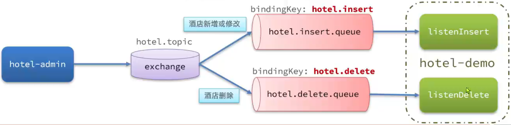

代码参考此 [commit](https://github.com/s-chance/Middleware-Records/commit/c99191d3a60201804c04643e65f86eeb958fb505)


启动 rabbitmq 容器的命令

```bash
docker network create rabbitmq-net

docker run \
	-e RABBITMQ_DEFAULT_USER=rabbit \
	-e RABBITMQ_DEFAULT_PASS=123456 \
	-v mq-plugins:/plugins \
	--name rabbitmq \
	--hostname rabbitmq \
	-p 15672:15672 \
	-p 5672:5672 \
	--network rabbitmq-net \
	-d \
	rabbitmq:3.13-management
```


##### 在 hotel-admin 服务的增删改业务中完成消息发送

代码参考此 [commit](https://github.com/s-chance/Middleware-Records/commit/e074703276a0f077affadf6e8f8d99b9fecb7281)


##### 在 hotel-demo 服务中实现消息监听，并更新 elasticsearch 中的数据

代码参考此 [commit](https://github.com/s-chance/Middleware-Records/commit/d1f165bb814637854f84e87943ebb1bf7c51aab0)


##### 启动并测试数据同步功能


# Elasticsearch 集群

## 1.搭建 ES 集群

### 1.1. ES 集群结构

单机的 elasticsearch 做数据存储，必然面临两个问题：海量数据存储问题、单点故障问题。

- 海量数据存储问题：将索引库从逻辑上拆分为 N 个分片 (shard)，存储到多个节点

  > 这个分片并没有解决单点故障问题，只要有一个节点故障，那么就得不到完整的分片集合。

  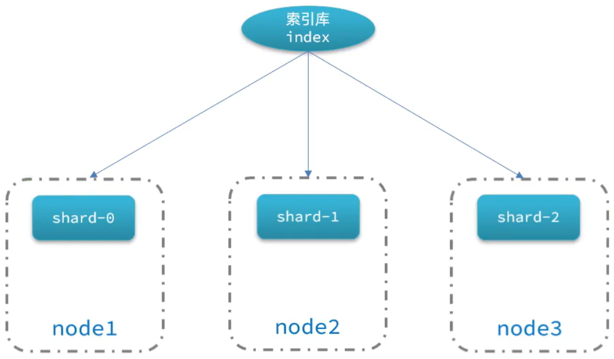

- 单点故障问题：将分片数据在不同节点备份 (replica)

  > 单个节点上的备份分片和主分片通常不能是同一份，需要进行一定的排列组合，使得即使在一个节点故障的情况下，剩下的节点也能凑出完整的分片集合。

  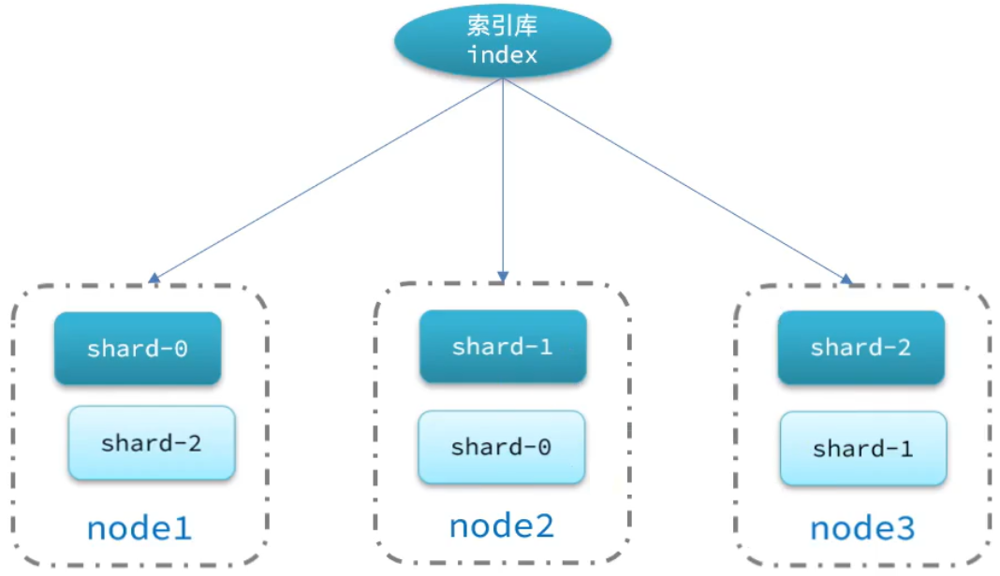

  > 即使其中任意一个节点故障了，也能保证剩下的节点依然能持有完整的分片集合。


### 1.2.搭建 ES 集群

使用 3 个 docker 容器模拟 3 个 es 的节点 (es 集群对内存的占用较大，部署集群前先确保是否有足够的内存)

docker-compose.yaml

```yaml
services:
  es01:
    image: docker.elastic.co/elasticsearch/elasticsearch:7.12.1
    container_name: es01
    environment:
      node.name: es01
      cluster.name: es-docker-cluster
      discovery.seed_hosts: es02,es03
      cluster.initial_master_nodes: es01,es02,es03
      ES_JAVA_OPTS: "-Xms512m -Xmx512m"
    volumes:
      - data01:/usr/share/elasticsearch/data
    ports:
      - 9200:9200
    networks:
      - elastic

  es02:
    image: docker.elastic.co/elasticsearch/elasticsearch:7.12.1
    container_name: es02
    environment:
      node.name: es02
      cluster.name: es-docker-cluster
      discovery.seed_hosts: es01,es03
      cluster.initial_master_nodes: es01,es02,es03
      ES_JAVA_OPTS: "-Xms512m -Xmx512m"
    volumes:
      - data02:/usr/share/elasticsearch/data
    ports:
      - 9201:9200
    networks:
      - elastic

  es03:
    image: docker.elastic.co/elasticsearch/elasticsearch:7.12.1
    container_name: es03
    environment:
      node.name: es03
      cluster.name: es-docker-cluster
      discovery.seed_hosts: es01,es02
      cluster.initial_master_nodes: es01,es02,es03
      ES_JAVA_OPTS: "-Xms512m -Xmx512m"
    volumes:
      - data03:/usr/share/elasticsearch/data
    ports:
      - 9202:9200
    networks:
      - elastic

volumes:
  data01:
  data02:
  data03:

networks:
  elastic:
```


### 1.3.集群状态监控

kibana 可以监控 es 集群，不过需要依赖 es 的 x-pack 功能，配置比较复杂。

可以使用 cerebro 来监控集群状态，不过该项目最近更新时间是 2021 年，可能不支持 2021 年之后的 es 版本，项目地址：https://github.com/lmenezes/cerebro

快速启动

```bash
docker run -d -p 9000:9000 lmenezes/cerebro
```


### 1.4.创建索引库

#### 通过 kibana 创建索引库

利用 kibana 的 DevTools 创建索引库

```dsl
PUT /test
{
	"settings": {
		"number_of_shards": 3, // 分片数量
		"number_of_replicas": 1, // 副本数量
	},
	"mappings": {
		"properties": {
			// mapping 映射定义
		}
	}
}
```


#### 通过 cerebro 创建索引库

利用 cerebro 提供的 API 创建索引库

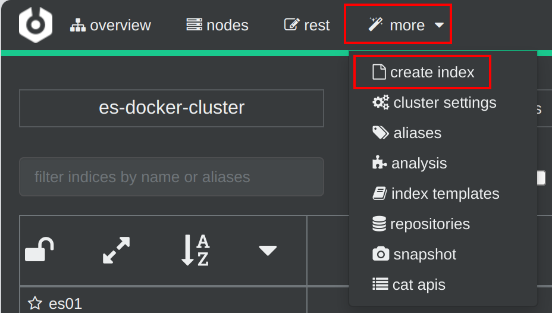

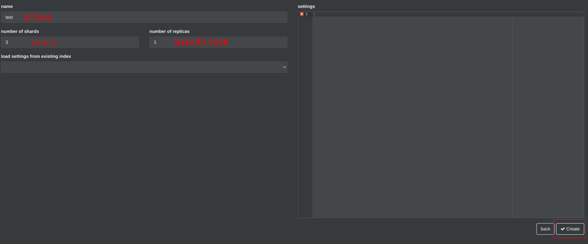

如果出现部分分片未被分配的情况，可以参考以下文章排查问题 (有可能是 es 磁盘使用率超过警戒水位线)

[彻底解决 es 的 unassigned shards 症状 ](https://www.cnblogs.com/lvzhenjiang/p/14196973.html)

[Elasticsearch 集群状态变成黄色或者红色，怎么办？](https://mp.weixin.qq.com/s/8nWV5b8bJyTLqSv62JdcAw)


## 2.集群脑裂问题

### 2.1. ES 集群的节点角色

elasticsearch 中集群节点有不同的职责划分：

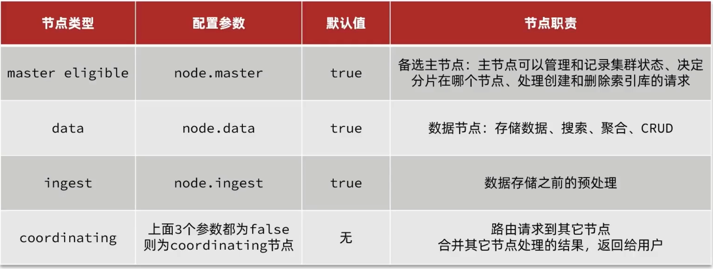


elasticsearch 中的每个节点角色都有自己不同的职责。没有明确指定角色时，节点默认可以担任所有职责，但是会导致单个节点承担过多职责而降低性能，因此建议集群部署时，每个节点都指定独立的角色。

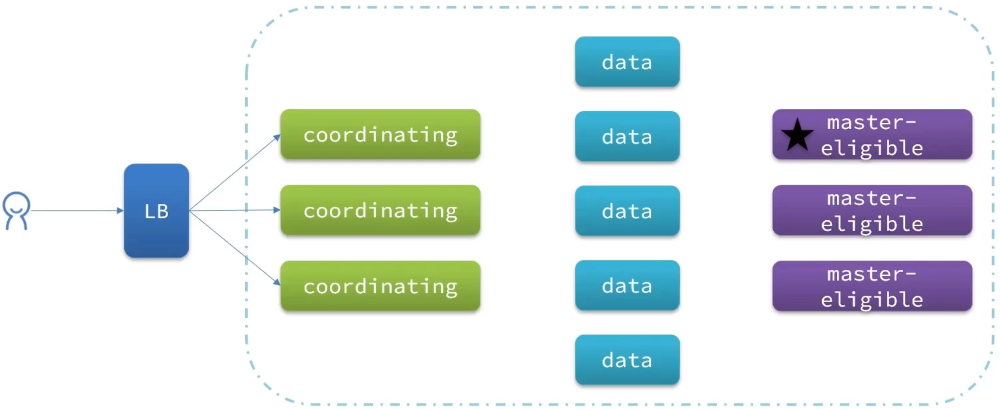


### 2.2. ES 集群的脑裂

默认情况下，每个节点都是 master eligible 节点，因此一旦 master 节点宕机，其它候选节点会选举新的主节点。当主节点与其它节点网络故障时，可能发生脑裂问题。

脑裂问题通常是指在集群环境中，由于主节点集群出现了网络故障等问题，导致集群内同时存在两个以上的主节点 (正常情况下，同一时间只会存在一个主节点和多个候选主节点)

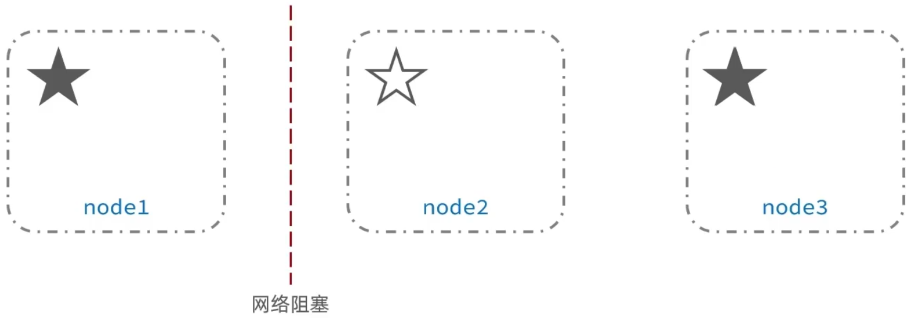

多个主节点会管理各自的集群部分，当网络恢复时，整个集群就会出现数据不一致的问题。


为了避免脑裂，主节点的选举需要现存可通信的节点数不少于 ( eligible 节点数量 / 2 + 1 ) 才能发起。因此 eligible 节点数量最好是奇数。对应配置项是 discovery.zen.minimum_master_nodes，在 es 7.0 以后，该项已经成为默认配置，因此一般不会发生脑裂问题。


### 总结

master eligible 节点的作用

- 参与集群选主
- 主节点可以管理集群状态、管理分片信息、处理创建和删除索引库的请求

data 节点的作用

- 数据的 CRUD

coordinator 节点的作用

- 路由请求到其它节点
- 合并查询到的结果，返回给用户


## 3. ES 集群的分布式存储与查询

### 3.1. ES 集群的分布式存储

当新增文档时，应该保存到不同分片，保证数据均衡，那么 coordinating node 如何确定数据该存放到哪个分片？

elasticsearch 会通过 hash 算法来计算文档应该存储到哪个分片：

首先使用哈希运算得到一个数字，然后对分片的数量取余。


说明：

- _routing 默认是文档的 id
- 算法与分片数量有关，因此索引库一旦创建，分片数量不能修改


新增文档流程：


### 3.2. ES 集群的分布式查询

elasticsearch 的查询分成两个阶段：

- scatter phase：分散阶段，coordinating node 会把请求分发到每一个分片
- gather phase：聚集阶段，coordinating node 汇总 data node 的搜索结果，并处理为最终结果集返回用户

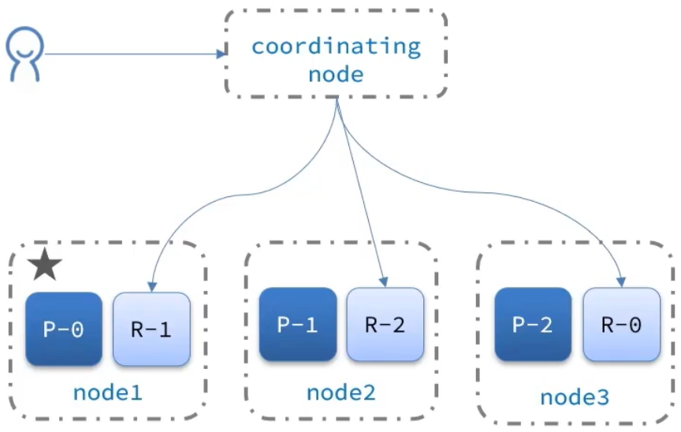


### 总结

分布式新增如何确定分片？

coordinating node 根据 id 做 hash 运算，得到结果对 shard 数量取余，余数就是对应的分片


分布式查询

复杂条件查询因为没有 id，无法确定分片，因此会分成两个阶段

- 分散阶段：coordinating node 将查询请求分发给不同分片
- 收集阶段：将查询结果汇总到 coordinating node，整理并返回给用户


## 4. ES 集群的故障转移

集群的 master 节点会监控集群中的节点状态，如果发现有节点宕机，会立即将宕机节点的分片数据迁移到其它节点，确保数据安全，这就是 ES 集群的故障转移。

node1 节点宕机，选出新的主节点 node2

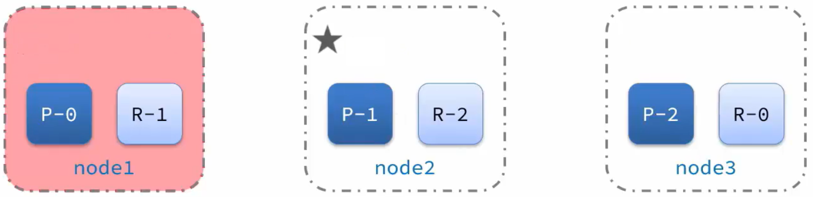

此时新的主节点 node2 会监控分片状态，会发现分片 1 只有主分片没有副分片，分片0 只有副分片没有主分片。分片 1 和分片 0 被判断为不健康的状态。

此时，新主节点会连同现存的其它节点将现存的分片分别补充主分片和副分片，使集群恢复到健康状态。

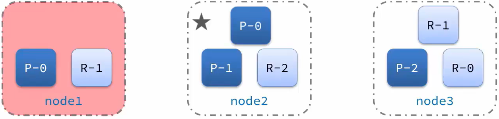


模拟主节点宕机

```bash
docker stop 主节点容器名
```

> 主节点可以在 cerebro 的控制台根据 :star: 标志​来判断

观察 cerebro 控制台，会发现一段时间后，新的主节点产生，并且分片也被补充到现存节点上。


模拟宕机节点重新加入

```bash
docker start 主节点容器名
```

观察 cerebro 控制台，会发现一段时间后，原本的节点重新加入，并且分片又被平均分配到所有的节点上。


### 总结

故障转移

- master 节点宕机后，Eligible Master 选举为新的主节点。
- master 节点监控分片、节点状态，将缺失的故障节点上的分片，根据现存节点的分片情况，把副分片提升为主分片，并基于主分片创建新的副分片，直到分片整体情况处于健康状态。

