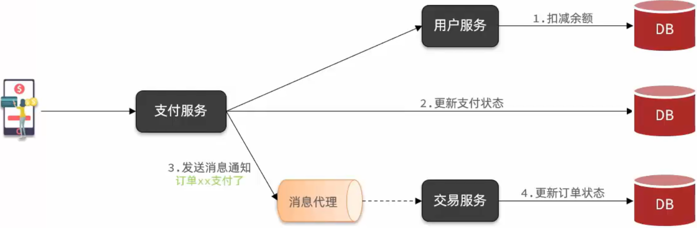
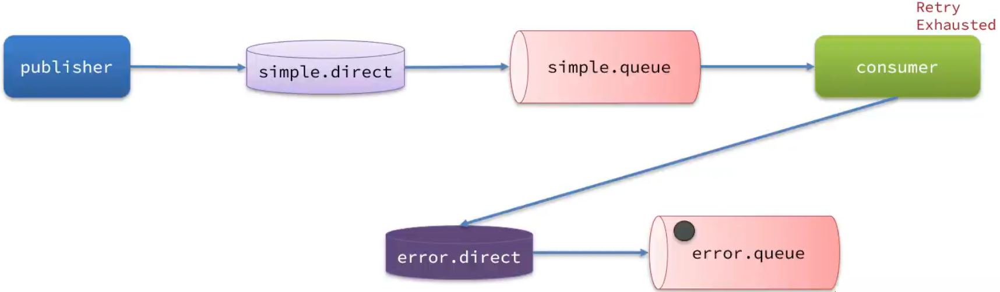
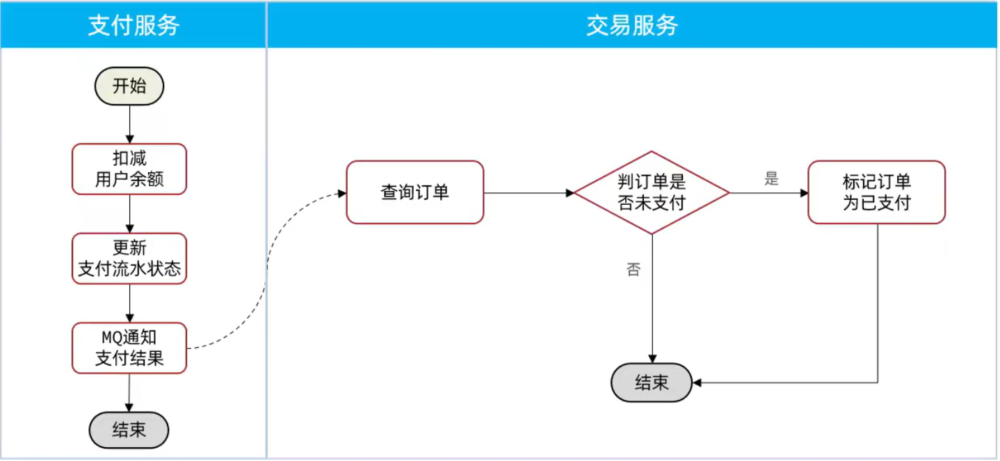
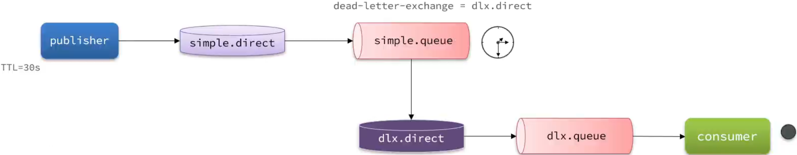
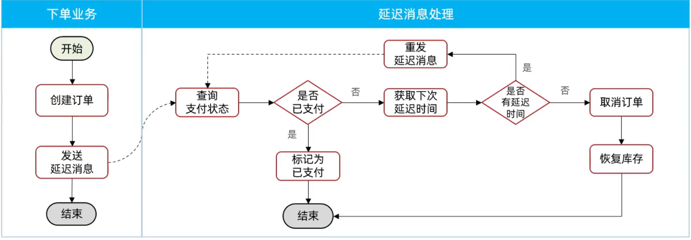

# RabbitMQ 高级

## 1. 消息可靠性问题

MQ 的消息可能存在可靠性的问题

有以下场景



在消息发送过程中，支付服务与 MQ 之间的网络交互可能会出现故障，那么这条消息就无法到达 MQ，最终交易服务就收不到消息。或者在消息到达 MQ 之后，MQ 本身发生了故障，导致消息无法传递给交易服务。如果交易本身也出现了故障，那么最终订单状态也不会被改变。

以上三种情况，都会导致业务状态不一致。

消息的可靠性就是要保证一个消息发送出去以后至少被成功消费一次。

要解决消息可靠性问题，可以从发送者、消息代理、消费者三方面入手。


### 1.1 发送者的可靠性

发送者的可靠性问题可以通过生产者重连和生产者确认两个手段解决。

#### 1.1.1 生产者重连

由于网络波动，可能会导致客户端连接 MQ 失败的情况。通过配置可以开启连接失败后的重连机制

```yaml
spring:
  rabbitmq:
    host: 127.0.0.1
    port: 5672
    virtual-host: /test
    username: test
    password: 123
    connection-timeout: 1s # 设置 MQ 的连接超时时间
    template:
      retry:
        enabled: true # 开启超时重试机制
        initial-interval: 1000ms # 失败后的初始等待时间
        multiplier: 1 # 失败后下次的等待时长倍数，下次等待时长 = initial-interval * multiplier
        max-attempts: 3 # 最大重试次数
```

> 当网络不稳定的时候，利用重试机制可以有效提高消息发送的成功率。不过 SpringAMQP 提供的重试机制是阻塞式重试，多次重试等待的过程中，当前线程是阻塞的，会影响业务性能。
>
> 如果对于业务性能有要求，建议禁用重试机制。如果一定要使用，需要合理配置等待时长和重试次数，也可以考虑使用异步线程来执行发送消息的代码。


#### 1.1.2 生产者确认

> 生产者确认相比生产者重连，更加侧重的是消息发送时失败的处理。

RabbitMQ 有 Publisher Confirm 和 Publisher Return 两种确认机制。开启确认机制后，在 MQ 成功收到消息后会返回确认消息给生产者。返回的结果有以下几种情况：

- 消息发送给了 MQ，但是路由失败。此时会通过 Publisher Return 返回路由异常原因，然后返回 ACK，告知发送成功。一般来说可能是 RoutingKey 错误或者交换机未绑定。
- **临时消息**发送给了 MQ，并且入队成功返回 ACK，告知发送成功。
- **持久消息**发送给了 MQ，并且入队完成持久化，返回 ACK，告知发送成功。
- 其它情况都会返回 NACK，告知发送失败。


接收返回结果有两种方式，同步等待和异步回调。


##### SpringAMQP 实现生产者确认

1.在 publisher 微服务的 application.yml 中添加配置

```yaml
spring:
  rabbitmq:
    host: 127.0.0.1
    port: 5672
    virtual-host: /test
    username: test
    password: 123
    connection-timeout: 200ms # 设置 MQ 的连接超时时间
    template:
      retry:
        enabled: true # 开启超时重试机制
        initial-interval: 1000ms # 失败后的初始等待时间
        multiplier: 1 # 失败后下次的等待时长倍数，下次等待时长 = initial-interval * multiplier
        max-attempts: 3 # 最大重试次数
    publisher-confirm-type: correlated # 开启 publisher confirm 机制，并设置 confirm 类型
    publisher-returns: true # 开启 publisher return 机制
```

> 需要保证性能请删除掉重连机制的配置

配置说明

publisher-confirm-type 有三种模式：

- none：关闭 confirm 机制
- simple：同步阻塞等待 MQ 的回执消息
- correlated：MQ 异步回调方式返回回执消息


2.每个 RabbitTemplate 只能配置一个 ReturnCallback，因此需要在项目启动过程中配置

```java
rabbitTemplate.setReturnsCallback(new RabbitTemplate.ReturnsCallback() {
  @Override
  public void returnedMessage(ReturnedMessage returned) {
    log.debug("路由失败，收到消息的 return callback，exchange: {}, routingKey: {}, message: {}, replyCode: {}, replyText: {}",
              returned.getExchange(), returned.getRoutingKey(), returned.getMessage(),
              returned.getReplyCode(), returned.getReplyText());
  }
});
```


3.同样地配置 ConfirmCallback

```java
rabbitTemplate.setConfirmCallback(new RabbitTemplate.ConfirmCallback() {
  @Override
  public void confirm(CorrelationData correlationData, boolean ack, String cause) {
    if (ack) {
      // 消息发送成功
      log.debug("消息发送成功，ack");
    } else {
      // 消息发送失败
      log.debug("消息回调失败，nack cause: {}", cause);
    }
  }
});
```


步骤 2、3 的完整配置如下

```java
@Slf4j
@Configuration
public class MQConfirmConfig implements ApplicationContextAware {

  @Override
  public void setApplicationContext(ApplicationContext applicationContext) throws BeansException {
    RabbitTemplate rabbitTemplate = applicationContext.getBean(RabbitTemplate.class);
    // 配置回调
    rabbitTemplate.setReturnsCallback(new RabbitTemplate.ReturnsCallback() {
      @Override
      public void returnedMessage(ReturnedMessage returned) {
        log.debug("路由失败，收到消息的 return callback，exchange: {}, routingKey: {}, message: {}, replyCode: {}, replyText: {}",
                  returned.getExchange(), returned.getRoutingKey(), returned.getMessage(),
                  returned.getReplyCode(), returned.getReplyText());
      }
    });

    rabbitTemplate.setConfirmCallback(new RabbitTemplate.ConfirmCallback() {
      @Override
      public void confirm(CorrelationData correlationData, boolean ack, String cause) {
        if (ack) {
          // 消息发送成功
          log.debug("消息发送成功，ack");
        } else {
          // 消息发送失败
          log.debug("消息回调失败，nack cause: {}", cause);
        }
      }
    });
  }
}
```

注意在 application.yaml 配置 logging 在控制台输出信息

```yaml
logging:
  level:
    org.entropy: debug
```

ConfirmCallback 是根据消息是否成功发送到交换机，ReturnsCallback 是根据消息是否成功从交换机路由到正确的队列。


#### 总结

SpringAMQP 中生产者消息确认的几种返回值情况：

- 消息发送到了 MQ，但是路由失败，会 return 路由异常原因，返回 ACK
- 临时消息发送到了 MQ，并且入队成功，返回 ACK
- 持久消息发送到了 MQ，并且入队完成持久化，返回 ACK
- 其它情况都会返回 NACK，告知发送失败


如何处理生产者的确认消息？

- 生产者确认需要额外的网络和系统资源开销，尽量不要使用
- 如果一定要使用，无需开启 Publisher-Return 机制，因为一般路由失败是自己的业务问题
- 对于 nack 消息可以有限次数重试，依然失败则记录异常消息


如何保证生产者消息发送可靠性？

首先可以在 RabbitMQ 中配置生产者的重连机制，在连接 MQ 出现网络波动时尝试重连，避免网络波动问题导致消费发送失败。如果是其它原因导致的失败，RabbitMQ 还可以启用生产者确认机制。当发送消息到 MQ 时，MQ 可以返回一个 ACK 的回执，发送失败会返回 NACK 的回执。基于回执的情况来判断如果失败是否可以重新发送消息。

通过以上手段可以基本保证生产者消息的可靠性，但是这些手段都会增加系统的负担和额外的资源开销。大多场景下，尽量不要开启确认机制，除非对消息可靠性有较高的要求。


### 1.2 MQ 的可靠性

在默认情况下，RabbitMQ 会将接收到的信息保存在内存中以降低消息收发的延迟。这样会导致两个问题：

- 一旦 MQ 宕机，内存中的消息会丢失
- 内存空间有限，当消费者故障或处理过慢时，会导致消息积压，引发 MQ 阻塞


有两种应对手段：数据持久化和 Lazy Queue


#### 1.2.1 数据持久化

RabbitMQ 实现数据持久化包括 3 个方面：

- 交换机持久化

  在 RabbitMQ 控制台创建交换机时会有 Durable 和 Transient 两个配置项，选择 Transient 会创建一个临时交换机，重启 RabbitMQ 会自动删除临时交换机。

- 队列持久化

  在 RabbitMQ 控制台创建队列也会有 Durable 和 Transient 两个配置项，效果同上。

- 消息持久化

  在 RabbitMQ 控制台发送的消息默认是非持久化的，持久化需要将 Delivery mode 设置为 2。持久化的消息在重启 RabbitMQ 后也不会丢失。同时持久化消息也有利于减少频繁 page out 导致的 RabbitMQ 阻塞。

SpringAMQP 创建交换机和队列默认是持久化的，发送的消息也是默认持久化的。


测试 page out

```java
@Test
void testPageOut() {
  Message message = MessageBuilder
    .withBody("hello".getBytes(StandardCharsets.UTF_8))
    .setDeliveryMode(MessageDeliveryMode.NON_PERSISTENT) // PERSISTENT
    .build();
  for (int i = 0; i < 1000_000; i++) {
    rabbitTemplate.convertAndSend("simple.queue", message);
  }
}
```

注意最新版的 rabbitmq 默认启用了 Lazy Queue，所以可能没有明显的阻塞情况出现。旧版的 rabbitmq 则会因为内存占用过大引起 page out 导致阻塞。

使用数据持久化可以避免内存占用问题以及 page out 导致的阻塞问题，但是整体性能会有所下降。


#### 1.2.2 Lazy Queue

在 RabbitMQ 3.6.0 版本引入了 Lazy Queue，也就是惰性队列。

惰性队列的特性如下：

- 接收到消息后直接存入磁盘而非内存 (内存中只保留最近的消息，默认 2048 条，最新版本可能有所改动)
- 消费者要消费消息时才会从磁盘中读取并加载到内存
- 支持数百万条的消息存储

在 3.12 版本后，所有队列都是 Lazy Queue 模式，无法更改。


在旧版 RabbitMQ 中

要设置一个队列为惰性队列，只需要在声明队列时，指定 x-queue-mode 属性为 lazy 即可

可以在 RabbitMQ 控制台设置，也可以通过 Java 代码指定

```java
@Bean
public Queue lazyQueue() {
  return QueueBuilder
    .durable("lazy.queue")
    .lazy() // 开启 lazy 模式
    .build();
}
```

也可以基于注解指定

```java
@RabbitListener(queuesToDeclare = @Queue(
  name = "lazy.queue",
  durable = "true",
  arguments = @Argument(name = "x-queue-mode", value = "lazy")
))
public void listenLazyQueue(String msg) {
  System.out.println("receive message from lazy.queue.... [" + msg + "]");
}
```


惰性队列虽然也会涉及到写入磁盘，但是它进行了底层优化，使得其写入效率要比数据持久化的方式高，并且后续的 RabbitMQ 版本也推荐使用惰性队列。


#### 总结

RabbitMQ 如何保证消息的可靠性

- 首先通过配置让交换机、队列、发送的消息都持久化。这样队列中的消息会持久化到磁盘，MQ 重启后消息依然存在。
- RabbitMQ 在 3.6 版本引入了 LazyQueue，并且在 3.12 版本后默认启用。LazyQueue 会将所有消息持久化。
- 开启持久化和生产者确认时，RabbitMQ 只有在消息持久化完成后，才会给生产者返回 ACK 回执。


### 1.3 消费者的可靠性

#### 1.3.1 消费者确认机制

为了确认消费者是否成功处理消息，RabbitMQ 提供了消费者确认机制 (Consumer Acknowledgement)。当消费者处理消息结束后，应该向 RabbitMQ 发送一个回执，告知 RabbitMQ 消息处理状态。回执有三种可选值：

- ack：成功处理消息，RabbitMQ 从队列中删除该消息
- nack：消息处理失败，RabbitMQ 需要重新发送消息
- reject：消息处理失败并拒绝该消息，RabbitMQ 从队列中删除该消息


SpringAMQP 已经实现了消息确认功能，可以通过配置文件选择 ACK 处理方式，有三种：

- none：不处理。消息发送给消费者后立刻 ack，消息会立即从 MQ 删除。不建议使用。
- manual：手动处理。需要在业务代码中调用 api，发送 ack 或 reject，存在业务入侵，但是更灵活。
- auto：自动处理。SpringAMQP 利用 AOP 对消息处理逻辑进行环绕增强，当业务正常执行时自动返回 ack。当业务出现异常时，根据异常判断返回不同结果：
  - 业务异常，自动返回 nack
  - 消息处理或校验异常，自动返回 reject

在消费者服务的 application.yaml设置消费者确认机制

```yaml
spring:
  rabbitmq:
    host: 127.0.0.1
    port: 5672
    virtual-host: /test
    username: test
    password: 123
    listener:
      simple:
        prefetch: 1 # 每次只获取一条消息，处理完才能获取下一个消息
        acknowledge-mode: auto # none，关闭ack；manual，手动ack；auto，自动ack
```


可以在消费者服务手动抛出异常测试消费者确认机制

```java
@RabbitListener(queues = "simple.queue")
public void listenSimpleQueueMessage(String msg) {
  System.out.println("consumer receive message from simple.queue [" + msg + "]");
  // throw new RuntimeException("error"); // nack
  // throw new MessageConversionException("message convert error"); // reject
}
```

一般来说将 acknowledge-mode 设置为 auto 就足够了。

 

#### 1.3.2 消费失败处理

在极端情况下，消息一直消费失败，不断重新发送，会对系统带来很大的负载。因此需要消费失败处理的策略。


##### 失败重试机制

当消费者出现异常后，消息会不断 requeue (重新入队)，再重新发送给消费者，然后再次异常，再次 requeue，无限循环，导致 MQ 的消息处理飙升，带来不必要的压力。

可以配置 Spring 的 retry 机制，在消费者出现异常时进行重试，而不是无限制的 requeue

```yaml
spring:
  rabbitmq:
    host: 127.0.0.1
    port: 5672
    virtual-host: /test
    username: test
    password: 123
    listener:
      simple:
        prefetch: 1 # 每次只获取一条消息，处理完才能获取下一个消息
        acknowledge-mode: auto # none，关闭ack；manual，手动ack；auto，自动ack
        retry:
          enabled: true  # 开启消费者失败重试
          initial-interval: 1000ms # 初始失败等待时间
          multiplier: 1 # 下次失败等待的时长倍数
          max-attempts: 3 # 最大重试次数
          stateless: true # true无状态，false有状态
```


在消费者服务测试消费失败重试机制

```java
@RabbitListener(queues = "simple.queue")
public void listenSimpleQueueMessage(String msg) {
  System.out.println("consumer receive message from simple.queue [" + msg + "]");
  throw new RuntimeException("error");
}
```

在超过最大重试次数后，消息默认会被直接丢弃。


##### 失败消息处理策略

在开启重试模式后，重试次数耗尽，如果消息依然失败，需要用 MessageRecoverer 接口来处理，它包含三种不同的实现：

- RejectAndDontRequeueRecoverer：重试次数耗尽后，直接 reject，丢弃消息。(默认处理方式)

- ImmediateRequeueMessageRecoverer：重试次数耗尽后，返回 nack，消息重新入队。

- RepublishMessageRecoverer：重试次数耗尽后，将失败消息发送到指定的交换机。(可以将失败的消息发送到监控服务的交换机上，进行服务告警或日志收集)

  

第一种默认实现一般不推荐使用，第二种实现还是可能会不断重新发送，但是可以控制重试等待时间，第三种实现需要人工介入处理，但是一般这种需要人工介入处理的异常场景比较少。


第三种方案的使用步骤

将失败处理策略改为 RepublishMessageRecoverer

```java
@Configuration
@ConditionalOnProperty(prefix = "spring.rabbitmq.listener.simple.retry", name = "enabled", havingValue = "true")
public class ErrorHandlerConfiguration {

  @Bean(name = "ee")
  public DirectExchange errorExchange() {
    return ExchangeBuilder.directExchange("error.direct").build();
  }

  @Bean(name = "eq")
  public Queue errorQueue() {
    return QueueBuilder.durable("error.queue").build();
  }

  @Bean
  public Binding errorBinding(@Qualifier("eq") Queue queue, @Qualifier("ee") DirectExchange directExchange) {
    return BindingBuilder
      .bind(queue)
      .to(directExchange)
      .with("error");
  }

  @Bean
  public MessageRecoverer messageRecoverer(RabbitTemplate rabbitTemplate) {
    return new RepublishMessageRecoverer(rabbitTemplate, "error.direct", "error");
  }
}
```

使用前面的测试代码重新测试。


##### 总结

消费者如何保证消息一定被消费？

- 设置消费者确认机制为 auto，由 spring 确认消息处理成功后返回 ack，异常时返回 nack
- 开启消费者失败重试机制，并设置 MessageRecoverer，多次重试失败后将消息发送到用于专门接收异常信息的交换机，交由人工介入处理


#### 1.3.3 业务幂等性

幂等是一个数学概念，用函数表达式 f(x) = f(f(x)) 来描述。在程序开发中，是指同一个业务执行一次或多次对业务状态的影响是一致的。

例如，根据 id 查询和根据 id 删除就是幂等的，多次增加库存和多次扣减余额就是非幂等的。


所有的业务都有可能发生重复执行的情况，RabbitMQ 的重试机制可能会导致重复执行，表单重复提交也会导致重复执行。因此业务幂等性是必须保证的，对于幂等业务可以不用处理，对于非幂等业务必须通过某种手段来保证其幂等性。

对于表单重复提交，可以在服务端生成一个唯一的表单 token 存储在 redis 并传递给前端，在表单提交时携带这个 token。在服务端只比较这个 token 一次后就立即销毁 redis 中的 token，后面再有多次重复请求都会因为找不到对应的 token 而失败。利用令牌机制实现业务幂等性。


对于 MQ 消息，也可以利用类似的思路。

##### 唯一消息 id

第一种方案，给每个消息设置一个唯一 id，利用 id 区分是否是重复消息：

1. 每条消息都生成一个唯一的 id，与消息一起发送给消费者
2. 消费者接收到消息后处理业务，业务处理成功后将消息保存到数据库
3. 下次收到相同的消息，去数据库查询判断是否存在，存在则为重复消息放弃处理

可以在 MessageConverter 的时候配置自动生成 id

```java
@Bean
public MessageConverter jacksonMessageConverter() {
  Jackson2JsonMessageConverter jackson2JsonMessageConverter = new Jackson2JsonMessageConverter();
  jackson2JsonMessageConverter.setCreateMessageIds(true);
  return jackson2JsonMessageConverter;
}
```

但是这种方案需要在业务中引入额外的处理逻辑，存在业务侵入。而且存在数据库读写操作，对性能也有一定影响。


##### 基于业务本身判断

第二种方案，结合业务逻辑，基于业务本身做判断。例如，在支付服务后修改订单状态为已支付，应该在修改订单状态前先查询订单状态，判断状态是否未支付。只有未支付的订单才需要修改，其它状态不处理：



这种方案类似于乐观锁机制，且可以进一步改造为直接在 sql update 语句中额外添加状态条件来实现。


#### 总结

如何保证支付服务与交易服务之间的订单状态一致性？

- 首先，支付服务会在用户支付成功以后利用 MQ 消息通知交易服务，完成订单状态同步。

- 其次，为了保证 MQ 消息的可靠性，采用了生产者确认机制、消费者确认、消费者失败重试等策略，确保消息发送和处理的可靠性。同时也开启了 MQ 的数据持久化，避免因服务宕机导致消息丢失。
- 最后，在交易服务更新订单状态时做了业务幂等判断，避免因消息重复消费导致订单状态异常。


如果交易服务消息处理失败，有没有什么兜底方案？

可以在交易服务中设置定时任务，定期查询订单支付状态。这样即便 MQ 通知失败，还可以利用定时任务作为兜底方案，确保订单支付状态的最终一致性。


### 1.4 延迟消息

**延迟消息**：生产者发送消息时指定一个时间，消费者不会立刻受到消息，而是在指定时间之后才收到消息。

**延迟任务**：设置在一定时间后执行的任务。

在交易服务中下单之后，可以设置在下单后的第 30 分钟检查订单状态是否支付，如果未支付则关闭订单，这就是一种延迟任务。

但是使用定时任务时存在一些问题，时间设置过短，会频繁查询数据库导致压力过大，时间设置过长，会导致时效性变差。而且定时任务是业务逻辑无关的，只会根据固定的时间间隔周期执行，每个订单的创建时间不同，定时任务不能灵活地控制在每个订单创建后的第 30 分钟执行。

为了解决这些问题，可以使用基于 MQ 的延迟消息，能灵活地为每个订单设置从创建到发送的延时时间，即使是不同时间创建的订单，也能在一个固定的延时时间后发送消息。

当用户下单之后，立刻向 MQ 发送一条消息，这条消息设置 30 分钟的延时，在 30 分钟后再发送给服务，服务收到消息后就去检查订单状态，如果发现未支付，就取消订单。这样既解决了时效性问题，同时也避免了频繁查询数据库的压力。


#### 1.4.1 死信交换机

> 死信交换机不是处理延迟消息的标准做法，但是也可以作为一种备选方案。

当一个队列中的消息满足下列情况之一时，就会成为死信 (dead letter)：

- 消费者使用 basic.reject 或 basic.nack 声明消费失败，并且消息的 requeue 参数设置为 false
- 消息是一个过期消息 (达到了队列或消息本身设置的过期时间)，超时无人消费
- 要发送的队列消息堆积满了，最早的消息可能成为死信

如果队列通过 dead-letter-exchange 属性指定了一个交换机，那么该队列中的死信就会发送到这个交换机中。这个交换机称为死信交换机 (Dead Letter Exchange, 简称 DLX)。



这里的死信队列和死信交换机是为了处理这样一种情况：

在一个队列中存在多个延迟消息，但是这些延迟消息有不同的延迟时间，短的延迟有几分钟，长的延迟有几小时。这可能会导致大量短延迟的消息被长延迟的消息阻塞而无法得到及时处理 (由于队列先进先出的特性)。

使用死信队列和死信交换机可以实现优先级处理，短延时的消息在超时后会优先被处理，这种处理机制独立于队列先进先出的特性，可以确保短延迟的消息不会被队列中长延迟的消息阻塞，实现了一种基于超时时间的延迟消息排序。


步骤

在 RabbitMQ 控制台

- 创建 dlx.queue 和 dlx.direct 并绑定，routingKey 为 delay。

- 在创建 simple.queue 时设置 Arguments 的 x-dead-letter-exchange 参数为 dlx.direct。

  需要在控制台上看到创建好的 simple.queue 的 Features 中包含 DLX 才算成功绑定死信交换机。

- 创建 simple.direct 并和 simple.queue 绑定，routingKey 为 delay。


在消费者服务编写 dlx.queue 的监听代码

```java
@RabbitListener(queues = "dlx.queue")
public void listenDlxQueue(String msg) {
  log.info("dlx.queue message: [" + msg + "]");
}
```


在 RabbitMQ 控制台或 java 代码发送带有过期时间的消息

生产者服务编写发送代码

```java
@Test
void testTTL() {
  rabbitTemplate.convertAndSend("simple.direct", "delay", "this is a delay", new MessagePostProcessor() {
    @Override
    public Message postProcessMessage(Message message) throws AmqpException {
      message.getMessageProperties().setExpiration("10000"); // 10s
      return message;
    }
  });
  log.info("message send successfully!");
}
```

需要注意 simple.queue 不能绑定任何消费者


但是死信交换机的实现步骤较为繁琐，需要定义很多交换机和队列。

> 其实死信交换机的原本用途就不是用来处理延迟消息，只是恰好能用于实现延迟消息的功能。
>
> 在官方没有推出延迟消息插件之前，这种方案可能是处理延迟消息的通用方案。
>
> 于是后来官方推出了一个专门的延迟消息插件，可以自动实现延迟消息的效果。


#### 1.4.2 延迟消息插件

RabbitMQ 的官方推出了一个插件，原生支持延迟消息功能。该插件的原理是设计了一种支持延迟消息功能的交换机，当消息发送到交换机后可以暂存一定时间，到期后再发送到队列。

官网下载地址：https://github.com/rabbitmq/rabbitmq-delayed-message-exchange/releases

选择对应的版本下载到本地，将插件包复制到 rabbitmq docker 容器中的 /opt/rabbitmq/plugins 目录下

```bash
docker cp rabbitmq_delayed_message_exchange-3.13.0.ez rabbitmq:/opt/rabbitmq/plugins
```

进入容器中加载插件

```bash
docker exec -it rabbitmq bash
cd /opt/rabbitmq/plugins
chmod 755 rabbitmq_delayed_message_exchange-3.13.0.ez
rabbitmq-plugins enable rabbitmq_delayed_message_exchange
```

查看插件是否加载成功

```bash
rabbitmq-plugins list | grep rabbitmq_delayed_message_exchange
```

在 RabbitMQ 控制台创建交换机时如果 Type 有 x-delayed-message 的选项，则表示插件加载成功。


使用代码的方式创建

基于 @RabbitListener 注解

```java
@RabbitListener(bindings = @QueueBinding(
  value = @Queue(name = "delay.queue", durable = "true"),
  exchange = @Exchange(name = "delay.direct", delayed = "true"),
  key = "delay"
))
public void listenDelayQueue(String msg) {
  log.info("receive delayed message from delay.queue: {}", msg);
}
```

基于 @Bean 注解

```java
@Bean
public DirectExchange delayExchange() {
  return ExchangeBuilder
    .directExchange("delay.direct")
    .delayed()  // 设置 delay 属性为 true
    .durable(true)
    .build();
}
```


发送消息时需要通过消息头 x-delay 来设置过期时间

```java
@Test
void testDelay() {
  String message = "delayed message";
  rabbitTemplate.convertAndSend("delay.direct", "delay", message, new MessagePostProcessor() {
    @Override
    public Message postProcessMessage(Message message) throws AmqpException {
      message.getMessageProperties().setDelayLong(10000L);
      return message;
    }
  });
  log.info("message send successfully!");
}
```

执行代码测试


除了redis 的定时功能比较特殊，其他的定时功能都会有一定的性能损耗。

定时功能的实现，需要在程序内部维护一个时钟，每创建一个定时任务就会维护一个时钟。时钟运行过程中需要 CPU 不断计算，如果定时任务很多，对 CPU 的占用也会很高。

定时任务属于 CPU 密集型的任务，它的定时计算对于 CPU 的压力是很大的。所以采用延迟消息的弊端就是会给服务器的 CPU 造成额外压力，特别是在队列中有非常多的定时消息时。这种情况一般是设置了很长的延时时间，同时又遇到了高峰流量，就会导致大量长延时的消息堆积在队列中。

因此，基于 MQ 的延迟消息只适用于延时时间相对较短的场景。


#### 1.4.3 取消超时订单

设置 30 分钟后检测订单支付状态的实现比较简单，但是存在两个问题：

- 如果并发较高，30 分钟可能堆积消息过多，对 MQ 压力很大
- 大多数订单在下单后 1 分钟内就被支付，但是 MQ 依旧会等待 30 分钟再发送，浪费资源

一种优化的思路就是把长的时间片分成多个短的时间片，每一个时间片到了就会查询一次支付状态，如果已支付，则不再继续发送延时消息，如果未支付，则继续发送下一个时间片的延时消息。所有的时间片耗尽之后，如果还是未支付，则取消订单。


大多数用户可能会在前几个时间片中就完成了支付，只有极少数用户还会继续等待支付。这样就大大减轻了 MQ 的压力，同时减少了资源的浪费。

整体思路如下




#### 案例：超时订单处理

##### 实现步骤

创建新的 common 模块用于定义公共数据。

由于需要定义一堆延时消息的时间间隔，因此会准备一个延时消息的数组或集合来存放这些时间片

```java
@Data
public class MultiDelayMessage<T> {
  /**
     * 消息体
     */
  private T data;
  /**
     * 记录延时时间的集合
     */
  private List<Long> delayMillis;

  public MultiDelayMessage(T data, List<Long> delayMillis) {
    this.data = data;
    this.delayMillis = delayMillis;
  }

  public static <T> MultiDelayMessage<T> of(T data, Long... delayMillis) {
    return new MultiDelayMessage<>(data, new ArrayList<>(Arrays.asList(delayMillis)));
  }


  /**
     * 获取并移除下一个延时时间
     *
     * @return 队列中的第一个延时时间
     */
  public Long removeNextDelay() {
    return delayMillis.remove(0);
  }


  /**
     * 是否还有下一个延时时间
     */
  public boolean hasNextDelay() {
    return !delayMillis.isEmpty();
  }
}
```

定义交换机、队列、routingKey 的值以及时间片数组

```java
public interface MqConstant {
  String DELAY_EXCHANGE = "trade.delay.topic";
  String DELAY_ORDER_QUEUE = "trade.order.delay.queue";
  String DELAY_ORDER_ROUTING_KEY = "order.query";

  Long[] DELAY_MILLIS = new Long[]{10000L, 10000L, 10000L, 15000L, 15000L, 30000L, 30000L};
}
```

配置消息后置处理器，用于设置延时时间

```java
@RequiredArgsConstructor
public class DelayMessageProcessor implements MessagePostProcessor {

  private final Long delay;

  @Override
  public Message postProcessMessage(Message message) throws AmqpException {
    message.getMessageProperties().setDelayLong(delay);
    return message;
  }
}
```


支付服务模块

controller

```java
@RestController
@RequiredArgsConstructor
public class PayController {

  private final IPayService payService;

  @PostMapping("/payOrder")
  public String createPayOrder(@RequestBody Map<String, Object> data) {
    Long orderId = payService.createOrderId(data);
    return "成功生成支付单，支付的订单号为 " + orderId;
  }

  @PostMapping("/pay/{orderId}")
  public Boolean payOrder(@PathVariable("orderId") Long id) {
    return payService.payOrder(id);
  }

  @GetMapping("/pay/status/{orderId}")
  public Boolean payStatus(@PathVariable("orderId") Long id) {
    return payService.getPayStatus(id);
  }
}
```

service

```java
public interface IPayService {

  Long createOrderId(Map<String, Object> data);

  Boolean payOrder(Long id);

  Boolean getPayStatus(Long id);
}
```

```java
@Slf4j
@Service
@RequiredArgsConstructor
public class PayService implements IPayService {

  private final RabbitTemplate rabbitTemplate;

  private final Map<Long, Boolean> order = new HashMap<>();

  @Override
  public Long createOrderId(Map<String, Object> data) {
    data.forEach((s, o) -> System.out.println(s + ": " + o));
    System.out.println("幂等性校验...成功");

    Long orderId = Long.valueOf(data.get("orderId").toString());
    order.put(orderId, false);
    System.out.println("要支付的订单号: " + orderId);

    return orderId;
  }

  @Override
  public Boolean payOrder(Long id) {
    log.info("等待支付");
    // 模拟用户等待支付的时间
    try {
      TimeUnit.SECONDS.sleep(30);
      System.out.println("扣减余额...成功");
      log.info("支付成功");
    } catch (InterruptedException e) {
      log.error("系统故障", e);
    }

    // 已支付的消息给交易服务
    try {
      rabbitTemplate.convertAndSend("pay.direct", "pay.success", id);
      log.info("已支付的消息发送成功");
    } catch (AmqpException e) {
      log.error("已支付的消息发送失败", e);
    }
    // 支付服务的订单支付状态为已支付
    order.put(id, true);
    return true;
  }

  @Override
  public Boolean getPayStatus(Long id) {
    return order.get(id);
  }
}
```

- createPayOrder 根据已创建的订单检验消息幂等性。接收的 json 数据参考如下

  ```json
  {
    "orderId": 10001
  }
  ```

- payOrder 根据对应的订单号进行支付，修改支付状态为已支付，同时发送已支付的订单号通知交易服务模块更新状态。请求格式参考如下

  ```
  http://127.0.0.1:8080/pay/10001
  ```
  
- payStatus 根据订单号查询该订单是否已支付，用于后续交易服务模块的主动查询，方便获取最新数据。请求格式参考如下

  ```
  http://127.0.0.1:8080/pay/status/10001
  ```


交易服务模块

定义接收已支付消息的监听者，接收到已支付的订单号后更新交易服务中的订单支付状态，由于通信延迟，这里的支付状态不一定是最新的数据。

```java
@Component
@RequiredArgsConstructor
public class PayStatusListener {

  private final IOrderService orderService;

  @RabbitListener(bindings = @QueueBinding(
    value = @Queue(value = "pay.queue", durable = "true"),
    exchange = @Exchange(value = "pay.direct"),
    key = "pay.success"
  ))
  public void listenPayQueue(Long orderId) {
    // 模拟网络波动和远程调用带来的通信耗时
    try {
      TimeUnit.SECONDS.sleep(45);
    } catch (InterruptedException e) {
      throw new RuntimeException(e);
    }
    // 将交易服务的订单标记为已支付
    orderService.markAsPaid(orderId);
  }
}
```


controller

```java
@RestController
@RequiredArgsConstructor
public class OrderController {

  private final IOrderService orderService;

  @PostMapping("/order")
  public Long createOrder(@RequestBody Map<String, Object> orderData) {
    return orderService.createOrder(orderData);
  }

  @PutMapping("/order/{orderId}")
  public void markAsPaid(@PathVariable("orderId") Long id) {
    orderService.markAsPaid(id);
  }
}
```

service

```java
public interface IOrderService {
  Long createOrder(Map<String, Object> orderData);

  void markAsPaid(Long id);

  Boolean getPayStatusById(Long id);

  void removeOrder(Long id);
}
```

```java
@Slf4j
@Service
@RequiredArgsConstructor
public class OrderService implements IOrderService {

  private final RabbitTemplate rabbitTemplate;

  private final Map<Long, Boolean> order = new HashMap<>();

  @Override
  public Long createOrder(Map<String, Object> orderData) {
    Long orderId = Long.valueOf(orderData.get("orderId").toString());
    // 创建订单，初始支付状态为未支付，默认为false
    order.put(orderId, false);
    System.out.println("查询商品...成功");
    System.out.println("计算价格...成功");
    System.out.println("扣减库存...成功");
    System.out.println("清理购物车...成功");

    // 发送延迟消息用于确认该订单号是否已支付
    try {
      MultiDelayMessage<Long> delayMessage = MultiDelayMessage.of(orderId, MqConstant.DELAY_MILLIS);
      rabbitTemplate.convertAndSend(
        MqConstant.DELAY_EXCHANGE, MqConstant.DELAY_ORDER_ROUTING_KEY, delayMessage,
        new DelayMessageProcessor(delayMessage.removeNextDelay())
      );
      log.info("延迟消息发送成功");
    } catch (AmqpException e) {
      log.error("延迟消息发送异常", e);
    }

    // 等待支付服务支付此订单号
    return orderId;
  }

  @Override
  public void markAsPaid(Long id) {
    log.info("订单被标记为已支付");
    order.put(id, true);
  }

  @Override
  public Boolean getPayStatusById(Long id) {
    // 获取订单支付状态
    return order.get(id);
  }

  @Override
  public void removeOrder(Long id) {
    // 取消订单
    log.info("取消订单: " + id);
    order.remove(id);
  }
}
```

- createOrder 创建初始订单用于支付服务进行支付，同时发送延时消息用于检测订单支付状态，延时消息中包含了订单号和延时消息时间片集合。接收的 json 数据参考如下

  ```json
  {
    "orderId": 10001
  }
  ```

- markAsPaid 标记交易服务的订单支付状态为已支付，这里不直接通过浏览器请求，而是用监听者直接调用 service 的 markAsPaid 更新订单支付状态。


最核心的监听者，接收到来自交易服务的延时消息后，对订单支付状态进行检测，如果在交易服务中得到的状态为未支付，则主动查询支付服务的订单支付状态，获取最新数据。

- 如果最新数据为已支付，则更新本地状态并结束延时消息任务。

- 如果最新数据也为未支付，则先尝试获取剩余的延时消息时间片。
  - 如果还有剩余的时间片，则重发延时消息并设置对应的延时。
  - 如果时间片已耗尽，则取消订单。

重发延时消息后，达到延时时间，会重新被该监听者处理，因为目标交换机就是该监听者绑定的交换机。

> 该监听者同时作为生产者和消费者。

```java
@Slf4j
@Component
@RequiredArgsConstructor
public class OrderStatusListener {

  private final IOrderService orderService;

  private final RabbitTemplate rabbitTemplate;

  @RabbitListener(bindings = @QueueBinding(
    value = @Queue(value = MqConstant.DELAY_ORDER_QUEUE, durable = "true"),
    exchange = @Exchange(value = MqConstant.DELAY_EXCHANGE, delayed = "true", type = ExchangeTypes.TOPIC),
    key = MqConstant.DELAY_ORDER_ROUTING_KEY
  ))
  public void listenOrderDelayQueue(MultiDelayMessage<Long> delayMessage) {
    log.info("收到延迟消息");

    // 在交易服务查询订单支付状态
    Long orderId = delayMessage.getData();
    Boolean payStatus = orderService.getPayStatusById(orderId);
    // 判断是否已支付
    if (payStatus == null || payStatus) {
      // 订单不存在或已支付
      return;
    }

    // 订单状态为未支付，主动查询支付服务
    // 主动查询订单支付状态，是为了避免MQ异步消息通知不同步导致的数据一致性问题
    // 例如，订单已支付，但是MQ异步消息还未及时通知远程服务更新状态

    // 模拟查询远程服务订单支付状态
    RestTemplate restTemplate = new RestTemplate();
    String url = "http://127.0.0.1:8080/pay/status/" + orderId;
    ResponseEntity<Boolean> response = restTemplate.getForEntity(url, Boolean.class);

    // 查询支付状态
    if (response.getStatusCode() == HttpStatus.OK) {
      payStatus = response.getBody();
      if (payStatus == null) {
        payStatus = false;
      }
    } else {
      System.out.println("远程调用异常");
      payStatus = false;
    }


    // 已支付，标记交易服务订单支付状态为已支付
    // 后续不再发送延迟消息
    if (payStatus) {
      orderService.markAsPaid(orderId);
      return;
    }

    // 未支付，尝试获取下次订单延迟时间
    if (delayMessage.hasNextDelay()) {
      // 存在下一个延迟时间，重发延迟消息
      Long nextDelay = delayMessage.removeNextDelay();
      rabbitTemplate.convertAndSend(MqConstant.DELAY_EXCHANGE, MqConstant.DELAY_ORDER_ROUTING_KEY,
                                    delayMessage, new DelayMessageProcessor(nextDelay));
      return;
    }
    // 不存在下一个延迟时间，取消订单
    orderService.removeOrder(orderId);
    System.out.println("恢复库存...成功");
  }
}
```


http 请求文件

```http
### create order
POST http://127.0.0.1:8888/order
Content-Type: application/json

{
  "orderId": 10001
}

### check order
POST http://127.0.0.1:8080/payOrder
Content-Type: application/json

{
  "orderId": 10001
}

### pay order
POST http://127.0.0.1:8080/pay/10001
```

> http://127.0.0.1:8080/payOrder 是幂等性检查，在案例模拟时可跳过。

按流程依次请求，先请求 http://127.0.0.1:8888/order 用于创建初始订单，同时创建订单支付状态检查的延时消息任务。如果一直不请求 http://127.0.0.1:8080/pay/10001 支付订单，则订单状态监听者会重复收发延时消息，最终耗尽时间片，取消订单。如果请求 http://127.0.0.1:8080/pay/10001 成功支付订单后，则会立即发送一个已支付的 MQ 消息通知远程的交易服务更新订单支付状态。

但是在远程服务通信中可能会因为网络波动或远程通信开销过大等，在某个延时消息时间片后，已支付的 MQ 消息还未到达远程服务 (即使这个 MQ 消息是立即发送的)，远程服务还处于未支付状态，实际本地服务已经完成了支付。如果不进行额外的处理，最终会因为远程通信的延迟而导致时间片耗尽，造成已支付但是订单被取消的现象。

为了避免远程通信开销延迟导致的订单支付状态在本地和远程的数据一致性问题，这里会在订单状态监听者查询本地的交易服务后，如果状态为未支付，则再主动查询远程的支付服务，获取最新的订单支付状态数据。如果确定了最新的数据是已支付，和本地的状态不一致，则提前更新本地的数据为最新数据，并结束延时消息任务。这样就避免了远程通信不及时导致的数据一致性问题。


##### 测试结果

**支付了订单的情况**

交易服务

```
orderId: 10001
查询商品...成功
计算价格...成功
扣减库存...成功
清理购物车...成功
2024-07-20T14:50:09.581+08:00  INFO 13408 --- [nio-8888-exec-4] o.entropy.consumer.service.OrderService  : 延迟消息发送成功
2024-07-20T14:50:19.583+08:00  INFO 13408 --- [ntContainer#0-1] o.e.c.listener.OrderStatusListener       : 收到延迟消息
2024-07-20T14:50:19.590+08:00  INFO 13408 --- [ntContainer#0-1] o.e.c.listener.OrderStatusListener       : 重发延迟消息
2024-07-20T14:50:29.594+08:00  INFO 13408 --- [ntContainer#0-1] o.e.c.listener.OrderStatusListener       : 收到延迟消息
2024-07-20T14:50:29.597+08:00  INFO 13408 --- [ntContainer#0-1] o.e.c.listener.OrderStatusListener       : 重发延迟消息
2024-07-20T14:50:39.600+08:00  INFO 13408 --- [ntContainer#0-1] o.e.c.listener.OrderStatusListener       : 收到延迟消息
2024-07-20T14:50:39.606+08:00  INFO 13408 --- [ntContainer#0-1] o.e.c.listener.OrderStatusListener       : 重发延迟消息
2024-07-20T14:50:54.610+08:00  INFO 13408 --- [ntContainer#0-1] o.e.c.listener.OrderStatusListener       : 收到延迟消息
2024-07-20T14:50:54.616+08:00  INFO 13408 --- [ntContainer#0-1] o.e.c.listener.OrderStatusListener       : 重发延迟消息
2024-07-20T14:51:09.621+08:00  INFO 13408 --- [ntContainer#0-1] o.e.c.listener.OrderStatusListener       : 收到延迟消息
2024-07-20T14:51:09.626+08:00  INFO 13408 --- [ntContainer#0-1] o.entropy.consumer.service.OrderService  : 订单被标记为已支付
2024-07-20T14:51:39.766+08:00  INFO 13408 --- [ntContainer#1-1] o.entropy.consumer.service.OrderService  : 订单被标记为已支付
```

> 注意这里的主动查询提前将订单标记为已支付，如果没有主动查询，则可能直到订单超时取消也未能及时更新支付状态。

支付服务

```
orderId: 10001
幂等性校验...成功
要支付的订单号: 10001
2024-07-20T14:50:24.761+08:00  INFO 13286 --- [nio-8080-exec-7] o.entropy.publisher.service.PayService   : 等待支付
扣减余额...成功
2024-07-20T14:50:54.761+08:00  INFO 13286 --- [nio-8080-exec-7] o.entropy.publisher.service.PayService   : 支付成功
2024-07-20T14:50:54.763+08:00  INFO 13286 --- [nio-8080-exec-7] o.entropy.publisher.service.PayService   : 已支付的消息发送成功
```


**未支付订单的情况**

交易服务

```
orderId: 10002
查询商品...成功
计算价格...成功
扣减库存...成功
清理购物车...成功
2024-07-20T15:23:03.233+08:00  INFO 13408 --- [nio-8888-exec-8] o.entropy.consumer.service.OrderService  : 延迟消息发送成功
2024-07-20T15:23:13.236+08:00  INFO 13408 --- [ntContainer#0-1] o.e.c.listener.OrderStatusListener       : 收到延迟消息
2024-07-20T15:23:13.242+08:00  INFO 13408 --- [ntContainer#0-1] o.e.c.listener.OrderStatusListener       : 重发延迟消息
2024-07-20T15:23:23.247+08:00  INFO 13408 --- [ntContainer#0-1] o.e.c.listener.OrderStatusListener       : 收到延迟消息
2024-07-20T15:23:23.252+08:00  INFO 13408 --- [ntContainer#0-1] o.e.c.listener.OrderStatusListener       : 重发延迟消息
2024-07-20T15:23:33.257+08:00  INFO 13408 --- [ntContainer#0-1] o.e.c.listener.OrderStatusListener       : 收到延迟消息
2024-07-20T15:23:33.262+08:00  INFO 13408 --- [ntContainer#0-1] o.e.c.listener.OrderStatusListener       : 重发延迟消息
2024-07-20T15:23:48.266+08:00  INFO 13408 --- [ntContainer#0-1] o.e.c.listener.OrderStatusListener       : 收到延迟消息
2024-07-20T15:23:48.271+08:00  INFO 13408 --- [ntContainer#0-1] o.e.c.listener.OrderStatusListener       : 重发延迟消息
2024-07-20T15:24:03.275+08:00  INFO 13408 --- [ntContainer#0-1] o.e.c.listener.OrderStatusListener       : 收到延迟消息
2024-07-20T15:24:03.280+08:00  INFO 13408 --- [ntContainer#0-1] o.e.c.listener.OrderStatusListener       : 重发延迟消息
2024-07-20T15:24:33.284+08:00  INFO 13408 --- [ntContainer#0-1] o.e.c.listener.OrderStatusListener       : 收到延迟消息
2024-07-20T15:24:33.289+08:00  INFO 13408 --- [ntContainer#0-1] o.e.c.listener.OrderStatusListener       : 重发延迟消息
2024-07-20T15:25:03.293+08:00  INFO 13408 --- [ntContainer#0-1] o.e.c.listener.OrderStatusListener       : 收到延迟消息
2024-07-20T15:25:03.298+08:00  INFO 13408 --- [ntContainer#0-1] o.entropy.consumer.service.OrderService  : 取消订单: 10002
恢复库存...成功
```

