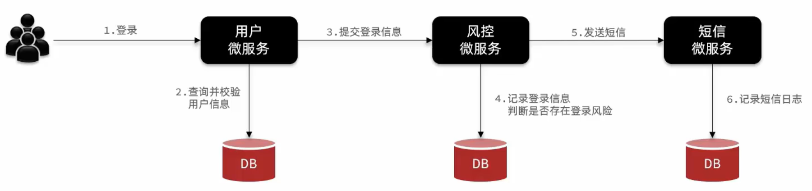
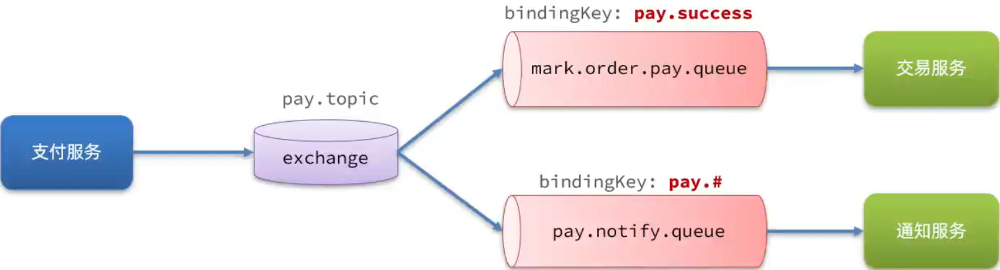

# RabbitMQ

高性能的异步通讯组件


## 背景

考虑以下架构，架构整体采用同步通讯



用户登录完成之后，会校验一下登录的风控信息，这个时候会调用另外一个微服务 —— 风控微服务。在调用的过程中，需要查询历史登录信息以进行风控校验，这个过程会耗费较长的时间。校验完成之后，如果发现有风控的异常信息，还需要给用户发送短信，这又会调用发送短信的微服务，又一次发起一个同步的远程调用。这个调用由于是同步的，需要等待短信发送结束才能继续执行。

在上面的场景，系统的总体性能偏低，登录效率差。在高并发情况下，可能都无法正常登录。

解决方案就是采用异步通讯来发送信息。这个时候，就可以借助消息队列 (MQ) 来做异步通信。


在引入消息队列之后，用户登录成功之后，不需要在同步调用微服务，而是直接发送信息到消息队列，无需等待返回结果。到这里登录业务就结束了，大大减少了远程调用开销，并发能力也会大大提高。这个时候，风控微服务、短信微服务都可以去监听 MQ 的消息，收到消息后执行各自的功能即可。


但是异步并非是同步的完全替代品，两者有各自的适用场景。


大纲


## 1. 初识 MQ

### 1.1 同步调用


以余额支付为例，当用户在应用商城去做支付时，调用支付服务，支付服务会做三件事

1. 远程调用用户服务，扣减用户的余额，这里需要得到扣减的结果 (成功/失败)，才有必要进行下一步操作。
2. 本地调用支付服务，更新支付状态。
3. 远程调用交易服务，更新订单状态。

这种做法存在一系列问题

- 业务耦合问题。支付服务和用户服务是核心服务，而交易服务是额外的服务。并且随着需求改动，还可能增加支付服务对通知服务的调用、对积分服务的调用等，需要频繁改动代码，这就是由于代码的耦合导致的，违反了开闭原则，拓展性差。
- 性能问题。基于 OpenFeign 应用的都是同步调用，对其他服务的每一次调用都会使支付服务进入等待状态。且每次只能串行地调用一个服务，这样下来，整体的耗时相当于每个服务调用的耗时累加以及其他的耗时开销之和。随着同步调用的服务数量增多，性能会严重下降，尤其是在微服务架构中。
- 级联失败问题。同步调用的服务之间是相互影响的，同步调用中的单个服务异常会导致整个业务全部失败，如果这个异常故障无法及时解决，很可能会导致服务资源耗尽崩溃。

尽管同步调用存在诸多问题，但是有些业务不得不采用同步调用。例如，支付服务必须要得到用户服务的扣减余额的结果才能进行下一步动作。**下一步操作需要依赖于上一步操作的结果。反之，那些没有依赖关系的操作就不需要同步等待。**


#### 总结

同步调用的优势是什么？

- 时效性强，等待到结果后才返回。像查询这类操作，因为需要较高的时效性，因此都是同步操作。

同步调用的问题是什么？

- 拓展性差
- 性能下降
- 级联失败问题


### 1.2 异步调用

异步调用方式其实就是基于消息通知的方式，一般包含三个角色：

- 消息发送者：投递消息的人，就是原来的调用方
- 消息代理：管理、暂存、转发消息，相当于一种中转服务器
- 消息接收者：接收和处理消息的人，就是原来的服务提供方


> 可以形象地类比为送外卖的人、外卖柜、收外卖的人。同样地还可以类比送快递、快递驿站、收快递。


在前面的案例中，支付服务不再同步调用业务关联度低的服务，而是发送消息通知到 Broker (消息代理)。


优势

- 解耦耦合，拓展性强。

  这些业务关联度低的服务只需要监听消息代理中的消息即可，这样不管后续再增加多少服务，支付服务的代码都不需要变动。

- 无需等待，性能更好。

  这些额外服务的耗时可能很长，但是支付服务在发送消息给消息代理之后就已经结束了业务，不受额外服务耗时的影响。

- 故障隔离。

  额外服务发生异常时，也不会影响支付服务。消息会依旧保留在消息代理中，可以让额外服务在发生异常后自动重启、重试，直到成功。不再强制要求事务一致，而是最终一致。

- 缓存消息，流量削峰填谷。

  

  削峰填谷就是把激增的流量放到后续慢慢执行，高峰流量会填充到低谷流量段，整体流量就会变得平缓。


#### 总结

异步调用的优势是什么？

- 耦合度低，拓展性强
- 异步调用，无需等待，性能好
- 故障隔离，下游服务故障不影响上游业务
- 缓存消息，流量削峰填谷

异步调用的问题是什么？

- 不能立即得到调用结果，时效性差
- 不确定下游业务执行是否成功
- 业务安全依赖于 Broker 的可靠性

使用异步调用的场景？

对于对方的执行结果并不关心，非核心业务，考虑异步调用。

高时效性场景如查询，不适合异步调用。

有高性能要求场景，考虑异步调用。


### 1.3 MQ 技术选型

异步通讯依赖于 Broker，这个 Broker 最常见的实现方案就是 MQ。

> MQ (Message Queue)，即消息队列，也就是异步通信中的 Broker。

MQ 框架主要有 RabbitMQ、ActiveMQ、RocketMQ、Kafka

RabbitMQ 是由 Rabbit 公司开发的开源项目，社区活跃。ActiveMQ、Kafka 都是由 Apache 开发的项目。RocketMQ 则是阿里开发的项目。

RabbitMQ 的开发语言是 Erlang，是一种面向并发的语言。ActiveMQ、RocketMQ 的开发语言都是 Java。Kafka 由 Scala 和 Java 混合开发。

RabbitMQ 支持 AMQP、XMPP、SMTP、STOMP 协议。ActiveMQ 支持 Openwire、STOMP、REST、XMPP、AMQP 协议。RocketMQ 和 Kafka 只支持自定义协议。

> Spirng 官方默认支持 RabbitMQ

在可用性 (即故障恢复能力) 方面，RabbitMQ、RocketMQ、Kafka 都支持集群模式。ActiveMQ 则可用性一般。

在单机吞吐量上，Kafka 吞吐量非常高，RocketMQ 较高，RabbitMQ 一般，ActiveMQ 则较差。

> 实际上大部分网站每日的并发量并不会很高，除了微信等日活量高达几亿的情况，或者是特殊时期会拥有较高的用户量访问的购物网站。

在消息延迟上，RabbitMQ 是微秒级的，ActiveMQ、RocketMQ、Kafka 则都是毫秒级的。

在消息可靠性上，RabbitMQ、RocketMQ 可靠性较高，ActiveMQ、Kafka 一般。

> RabbitMQ 有一套完善的消息确认机制可以确保消息不丢失，而 RokcetMQ 底层会有一张消息表，会把消息保存到文件系统中 (类似于内置数据库)。


Kafka 和 其他 MQ 的用途不同，Kafka 由于其非常高的吞吐量，可用于收集高达几十G的日志量，再传递给专门的日志检索服务。但是如果对消息可靠性有要求，则 RabbitMQ 或 RocketMQ 更合适，而 RabbitMQ 在消息延迟上又比 RocketMQ 更好。综合来看，RabbitMQ 实用性更好。


## 2. RabbitMQ

### 2.1 介绍和安装

RabbitMQ 是基于 Erland 语言开发的开源消息通信中间件，官网地址：https://www.rabbitmq.com/

基于 Docker 快速安装 RabbitMQ

```bash 
docker run \
	-e RABBITMQ_DEFAULT_USER=rabbit \
	-e RABBITMQ_DEFAULT_PASS=123456 \
	-v mq-plugins:/plugins \
	--name rabbitmq \
	--hostname rabbitmq \
	-p 15672:15672 \
	-p 5672:5672 \
	--network rabbitmq-net \
	-d \
	rabbitmq:3.13-management
```

如果提示没有找到 `rabbitmq-net` ，可以手动创建网络

```bash
docker network create rabbitmq-net
```

启动容器

```bash
docker start rabbitmq
```

访问 http://127.0.0.1:15672/ 控制台，输入前面配置的用户名 rabbit 和密码 123456


RabbitMQ 的整体架构及核心概念：

- virtual-host：虚拟主机，起到数据隔离的作用

- publisher：消息发送者
- consumer：消息的消费者
- queue：队列，存储消息
- exchange：交换机负责路由消息


### 2.2 快速入门

需求：在 RabbitMQ 的控制台完成下列操作：

- 新建队列 hello.queue1 和  hello.queue2
- 向默认的 amp.fanout 交换机发送一条消息
- 查看消息是否到达 hello.queue1 和 hello.queue2
- 总结规律


### 2.3 数据隔离

需求：在 RabbitMQ 的控制台完成下列操作：

- 新建一个用户 test
- 为 test 用户创建一个 virtual host
- 测试不同 virtual host 之间的数据隔离现象


## 3. Java 客户端

使用 Java 原生代码编写客户端会比较繁琐，可以使用 Spring AMQP 封装好的客户端。

### 3.1 快速入门

AMQP

Advanced Message Queuing Protocol，是用于在应用程序之间传递业务消息的开放标准。该协议与语言和平台无关，更符合微服务中独立性的要求。


Spring AMQP

Spring AMQP 是基于 AMQP 协议定义的一套 API 规范，提供了模板来发送和接受消息。包含两部分，其中 spring-amqp 是基础抽象，spring-rabbit 是底层的默认实现。

spring-amqp 官方地址：https://spring.io/projects/spring-amqp


#### 案例

- 利用控制台创建队列 simple.queue
- 在 publisher 服务中，利用 SpringAMQP 直接向 simple.queue 发送消息
- 在 consumer 服务中，利用 SpringAMQP 编写消费者，监听 simple.queue 队列

 

步骤：

1.引入 spirng-amqp 依赖

在父工程中引入 spring-amqp 依赖，这样 publisher 和 consumer 服务都可以使用父工程的依赖

```xml
<dependency>
  <groupId>org.springframework.boot</groupId>
  <artifactId>spring-boot-starter-amqp</artifactId>
</dependency>
```

2.配置 RabbitMQ 服务端信息

在每个微服务中引入 MQ 服务端信息，这样微服务才能连接到 RabbitMQ

```yaml
spring:
  rabbitmq:
    host: 127.0.0.1
    port: 5672
    virtual-host: /test
    username: test
    password: 123
```

3.发送消息

SpringAMQP 提供了 RabbitTemplate 工具类，方便我们发送消息。发送消息代码如下：

publisher 服务

```java
@SpringBootTest
public class PublisherApplicationTests {
    @Autowired
    private RabbitTemplate rabbitTemplate;

    @Test
    public void testSimpleQueue() {
        String queueName = "simple.queue";
        String message = "hello, spring amqp!";
        rabbitTemplate.convertAndSend(queueName, message);
    }
}
```

4.接收消息

SpringAMQP 提供声明式的消息监听，只需要通过注解在方法上声明要监听的队列名称，SpringAMQP 就会把消息传递给当前方法：

consumer 服务

```java
@Component
public class RabbitMQListener {
    @RabbitListener(queues = "simple.queue")
    public void listenSimpleQueueMessage(String msg) {
        System.out.println("consumer receive message from simple.queue [" + msg + "]");
    }
}
```


#### 总结

SpringAMQP 如何收发消息？

1. 引入 spring-boot-starter-amqp 依赖
2. 配置 rabbitmq 服务端信息
3. 利用 RabbitTemplate 发送消息
4. 利用 @RabbitListener 注解声明要监听的队列，监听消息


### 3.2 WorkQueue

Work queues，任务模型。简单来说就是让多个消费者绑定到一个队列，共同消费队列中的消息。


#### 案例：模拟 WorkQueue，实现一个队列绑定多个消费者

基本思路如下：

1. 在 RabbitMQ 的控制台创建一个队列，名为 work.queue
2. 在 publisher 服务中定义测试方法，在 1 秒内产生 50 条消息，发送到 work.queue
3. 在 consumer 服务中定义两个消息监听者，都监听 work.queue 队列
4. 消费者 1 每秒处理 50 条消息，消费者 2 每秒处理 5 条消息


#### 消费者消息推送限制

默认情况下，RabbitMQ 会将消息依次轮询传递给绑定在队列上的每一个消费者，但这并没有考虑到消费者是否已经处理完消息，可能出现消息堆积。

可以修改 application.yaml，设置 preFetch 值为 1，确保同一时刻最多传递给消费者 1 条消息

```yaml
spring:
  rabbitmq:
    host: 127.0.0.1
    port: 5672
    virtual-host: /test
    username: test
    password: 123
    listener:
      simple:
        prefetch: 1 # 每次只获取一条消息，处理完才能获取下一个消息
```


#### 总结

Work 模型的使用：

- 多个消费者绑定到一个队列，可以加快消息处理速度
- 同一条消息只会被一个消费者处理
- 通过设置 prefetch 来控制消费者预取的消息数量，处理完一条再处理下一跳，充分发挥每个消费者的性能


### 3.3 Fanout 交换机

实际生产环境都会经过 exchange 来发送消息，而不是直接发送到队列，有些消息需要被特定的服务消费或者需要被多个服务消费，因此需要交换机路由消息，确保消息能被正确的消费者消费。交换机的类型有以下三种：

- Fanout：广播
- Direct：定向
- Topic：话题


Fanout Exchange 会将接收到消息广播到每一个跟其绑定的 queue，也称为广播模式


#### 案例：利用 SpringAMQP 使用 FanoutExchange

实现思路如下：

1. 在 RabbitMQ 控制台中，声明队列 fanout.queue1 和 fanout.queue2	

2. 在 RabbitMQ 控制台中，声明交换机 test.fanout，将两个队列与其绑定

3. 在 consumer 服务中，编写两个消费者方法，分别监听 fanout.queue1 和 fanout.queue2

4. 在 publisher 中编写测试方法，向 test.fanout 发送消息

   向交换机发送消息的方法参数有三个：交换机名称、RoutingKey、消息


#### 总结

交换机的作用是什么？

- 接收 publisher 发送的消息
- 将消息按照规则路由到与之绑定的队列
- FanoutExchange 会将消息路由到每个绑定的队列


### 3.4 Direct 交换机

Direct Exchange 会将接收到的消息根据规则路由到指定的 Queue，因此称为**定向**路由。

- 每一个 Queue 都与 Exchange 设置一个 BindingKey
- 发布者发送消息时，指定消息的 RoutingKey
- Exchange 将消息路由到 BindKey 与消息 RoutingKey 一致的队列


#### 案例：利用 SpringAMQP 使用 DirectExchange

步骤：

1. 在 RabbitMQ 控制台中，声明队列 direct.queue1 和 direct.queue2

2. 在 RabbitMQ 控制台中，声明交换机 test.direct，将两个队列与其绑定

   绑定时需要指定 RoutingKey，每次只能指定一个 RoutingKey。给一个队列指定多个 RoutingKey，就需要重复绑定同一个队列，每次指定不同的 RoutingKey。

3. 在 consumer 服务中，编写两个消费者方法，分别监听 direct.queue1 和 direct.queue2

4. 在 publisher 中编写测试方法，使用不同的 RoutingKey 向 test.direct 发送消息


#### 总结

描述下 Direct 交换机与 Fanout 交换机的差异？

- Fanout 交换机将消息路由给每一个与之绑定的队列
- Direct 交换机根据 RoutingKey 判断路由给哪个队列
- 如果多个队列具有相同 RoutingKey，则与 Fanout 功能类似


### 3.5 Topic 交换机

TopicExchange 与 DirectExchange 类似，区别在于 routingKey 可以是多个单词的列表，并且以 `.` 分割

Queue 与 Exchange 指定 BindingKey 时可以使用通配符：

- `#`：代指 0 个或多个单词
- `*`：代指一个单词


#### 案例：利用 SpringAMQP 使用 TopicExchange

步骤：

1. 在 RabbitMQ 控制台中，声明队列 topic.queue1 和 topic.queue2
2. 在 RabbitMQ 控制台中，声明交换机 test.topic，将两个队列与其绑定
3. 在 consumer 服务中，编写两个消费者方法，分别监听 topic.queue1 和 topic.queue2
4. 在 publisher 中编写测试方法，使用不同的 RoutingKey 向 test.topic 发送消息


#### 总结

描述下 Topic 交换机与 Direct 交换机的差异？

- Topic 交换机接收的消息 RoutingKey 可以是多个单词，以 `.` 分割
- Topic 交换机与队列绑定时的 bindKey 可以指定通配符
- `#`：代表 0 个或多个词
- `*`：代表 1 个词


### 3.6 声明队列交换机

之前队列、交换机都是在 RabbitMQ 控制台手动创建的，在面对大量队列和交换机时，手动创建容易出错。实际上可以通过代码的方式自动创建，在面对大量的队列和交换机时，不易出错且效率高。


SpringAMQP 提供了几个类，用来声明队列、交换机及其绑定关系：

- Queue：用于声明队列，可以用工厂类 QueueBuilder 构建
- Exchange：用于声明交换机，可以用工厂类 ExchangeBuilder 构建
- Binding：用于声明队列和交换机的绑定关系，可以用工厂类 BindingBuiler 构建


#### 声明队列和交换机

声明一个 Fanout 类型的交换机，并且创建队列与其绑定

```java
@Configuration
public class FanoutConfiguration {
    @Bean
    public FanoutExchange fanoutExchange() {
        return new FanoutExchange("test.fanout2");
    }

    @Bean
    public Queue fanoutQueue3() {
        return new Queue("fanout.queue3");
    }

    @Bean
    public Binding fanoutBinding3(Queue fanoutQueue3, FanoutExchange fanoutExchange) {
        return BindingBuilder
                .bind(fanoutQueue3)
                .to(fanoutExchange);
    }

    @Bean
    public Queue fanoutQueue4() {
        return new Queue("fanout.queue4");
    }

    @Bean
    public Binding fanoutBinding4() {
        return BindingBuilder
                .bind(fanoutQueue4())
                .to(fanoutExchange());
    }
}
```

这种方式可以自动创建队列和交换机并进行绑定，但是创建具有多个 RoutingKey 的 Direct 交换机时每一个 RoutingKey 都需要写一个方法，比较繁琐。

SpringAMQP 还提供了基于 @RabbitListener 注解来声明队列和交换机的方式

```java
@RabbitListener(bindings = @QueueBinding(
  value = @Queue(name = "direct.queue1", durable = "true"),
  exchange = @Exchange(name = "test.direct", type = ExchangeTypes.DIRECT),
  key = {"red", "blue"}
))
public void listenDirectQueue1(String msg) {
  System.out.println("consumer receive message from direct.queue1.... [" + msg + "]");
}
```

这种方式完全基于注解实现，比 Java 代码更加简洁。


#### 总结

声明队列、交换机、绑定关系的 Bean 是什么？

- Queue
- FanoutExchange、DirectExchange、TopicExchange
- Binding

基于 @RabbitListener 注解声明队列和交换机有哪些常见注解？

- @QueueBinding
- @Queue
- @Exchange


### 3.7 消息转换器

#### 案例：测试利用 SpringAMQP 发送对象类型的消息

声明一个队列，名为 object.queue

编写单元测试，向队列中直接发送一条消息，消息类型为 Map

在控制台查看消息，会发现消息被转换成了字节的形式


Spring 对消息对象的处理是由 org.springframework.amqp.support.converter.MessageConverter 来实现的。默认实现是 SimpleMessageConverer，基于 JDK 的 ObjectOutputStream 完成序列化。

但存在下列问题：

- JDK 的序列化有安全风险
- JDK 序列化的消息太大
- JDK 序列化的消息可读性差

建议采用 JSON 序列化代替默认的 JDK 序列化

在 publisher 和 consumer 中引入 jackson 依赖 (或直接在父工程中引入)

```xml
<dependency>
  <groupId>com.fasterxml.jackson.core</groupId>
  <artifactId>jackson-databind</artifactId>
</dependency>
```

在 publisher 和 consumer 中配置 MessageConverter

```java
@Bean
public MessageConverter jacksonMessageConverter() {
  return new Jackson2JsonMessageConverter();
}
```


这里处理之前发的第一条非 json 格式的数据会出现异常，并且这条消息丢失了。


## 4. 业务改造

### 案例

改造余额支付功能，不再同步调用交易服务的 OpenFeign 接口，而是采用异步 MQ 通知交易服务更新订单状态。




### 步骤

消费者

1. 引入 spring-boot-starter-amqp 依赖
2. 配置 application.yaml
3. 配置消息转换器
4. 编写监听器

生产者

1. 引入 spring-boot-starter-amqp 依赖
2. 配置 application.yaml
3. 编写消息发送方法


# 进阶

[RabbitMQ 高级](./rabbitmq-advanced.md)
