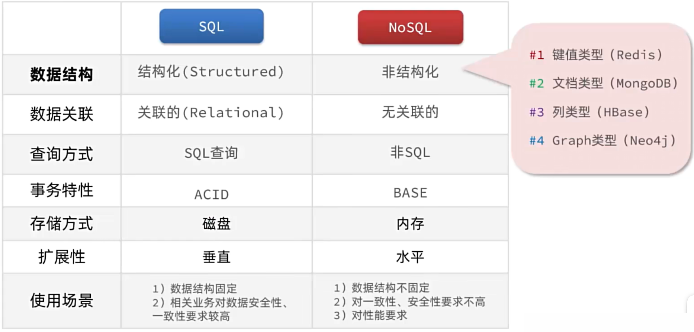
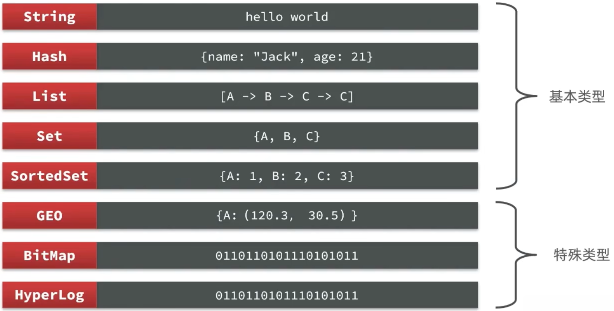
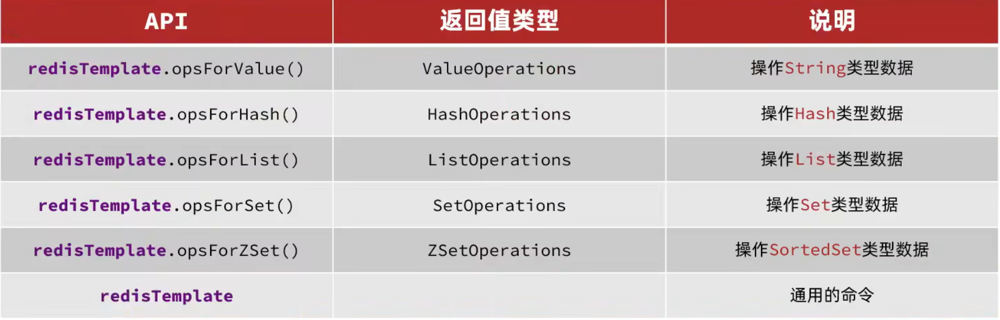
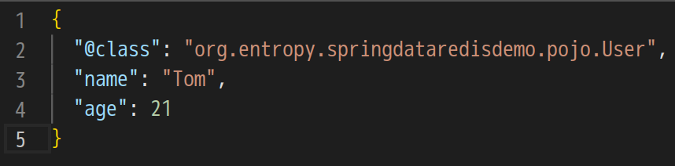

# Redis 基础

##  1. 初识 Redis

### 1.1 认识 NoSQL

SQL vs NoSQL

SQL：1.结构化；2.有关联的；3.使用 SQL 查询，语法统一；4.满足 ACID 特性

NoSQL：1.非结构化 (键值对型、json 文档型、图型)；2.无关联的；3.非 SQL 查询，语法多样；4.满足 BASE 特性




### 1.2 认识 Redis

Redis 诞生于 2009 年，全称是 Remote Dictionary Server，远程字典服务器，是一个基于内存的键值型 NoSQL 数据库。

特征：

- 键值 (key-value) 型，value 支持多种不同的数据结构，功能丰富
- 单线程，每个命令具备原子性
- 低延迟，速度快 (基于内存、IO 多路复用、良好的编码)
- 支持数据持久化
- 支持主从集群、分片集群
- 支持多语言客户端

 


### 1.3 安装 Redis

官网地址：https://redis.io/

安装 redis 后可修改 redis 的一些配置

```bash
# 监听的地址，默认为127.0.0.1，只能在本地访问。修改为0.0.0.0可供任意IP访问，生产环境不要使用0.0.0.0
bind 0.0.0.0
# 守护进程，修改为yes则在后台运行，如果使用systemd等则忽略该项设置
daemonize yes
# 密码，设置后访问redis操作需要密码
requirepass xxx
# 监听的端口，一般不用修改
port 6379
# 数据库数量，设置为1，只使用1个数据库，默认有16个库(0-15)，多用户使用
databases 1
# 设置最大内存
maxmemory 512mb
# 日志文件，默认为空，不记录日志，可以指定日志文件名
logfile "redis.log"
```


redis 可以通过命令启动，`redis-server` 和 `redis-cli`，在启动 redis 服务端的时候可指定配置文件。如果需要开机自启，可以使用 systemd 管理。


启动 redis 服务端后，使用 `redis-cli` 连接

```bash
redis-cli -h 127.0.0.1 -p 6379 -a xxx
```

`-h 127.0.0.1`：指定连接 redis 服务器的 IP 地址，默认为 127.0.0.1

`-p 6379`：指定要连接的 redis 服务器端口，默认为 6379

`-a xxx`：指定 redis 的访问密码 (如果设置了密码)，无密码访问可以连接但是没有任何操作权限


不建议通过 `-a` 参数的方式直接输入密码，可以先连接 redis 服务器，然后在客户端中使用 `auth xxx` 进行密码认证。


测试 redis 服务器的心跳，可以在客户端中使用 `ping` 命令，正常情况下 redis 服务器会响应 "PONG"


## 2. Redis 常见命令

### 2.1 Redis 数据结构介绍

Redis 是一个 key-value 的数据库，key 一般是 String 类型，不过 value 的类型多种多样




在 redis 客户端内的交互式终端使用 `help @generic` 可以查看通用命令手册，还可以用 `help command`，查看指定 command 的手册。


### 2.2 Redis 通用命令

通用指令是适用于任何数据类型的指令，可以通过 `help @generic` 查询手册。

#### 常用命令

- KEYS：查看符合模板的所有 key。`*name` 匹配任意以 name 结尾的 key，`a??` 匹配以 a 开头的三个字符长度的key

  这种模糊查询的效率不是很高，当数据量过大时，使用模糊查询会给服务器带来很大的压力，**不建议在生产环境上使用**

- DEL：删除一个指定的 key

- EXISTS：判断 key 是否存在

- EXPIRE：给一个 key 设置有效期，有效期到期时该 key 会被自动删除

- TTL：查看一个 key 的剩余有效期

  - 当一个 key 的 ttl 变为 -2 时，则表示该 key 已经被 redis 移除。

  - 当一个 key 的 ttl 为 -1 时，表示该 key 在 redis 中永久有效。

  通常在 redis 存储数据时，会设置一个过期时间。


### 2.3 String 类型

String 类型，也就是字符串类型，是 redis 中最简单的存储类型。

其 value 是字符串，但是根据字符串的不同格式，可以分为 3 类

- string：普通字符串
- int：整数类型，可以做自增、自减操作
- float：浮点类型，可以做自增、自减操作

不管是哪种格式，底层都是字节数组形式存储，只不过编码方式不同。字符串类型的最大空间不能超过 512 m

#### 常用命令

- SET：添加或修改已经存在的一个 String 类型的键值对
- GET：根据 key 获取 String 类型的 value
- MSET：批量添加多个 String 类型的键值对
- MGET：根据多个 key 获取多个 String 类型的 value
- INCR：让一个整型的 key 自增 1
- INCRBY：让一个整型的 key 自增指定的步长，例如 `incrby num 2` 让 num 值自增 2
- IINCRBYFLOAT：让一个浮点类型的数字自增指定的步长
- SETNX：添加一个 String 类型的键值对，仅当指定的 key 不存在时才添加
- SETEX：添加一个 String 类型的键值对，并且指定有效期


思考：Redis 中没有类似 MySQL 中的 Table 概念，该如何区分不同类型的 key？

例如，需要存储用户、商品信息到 redis，有一个用户 id 是 1，有一个商品 id 恰好也是 1。


#### key 的结构

Redis 的 key 允许有多个单词形成层级结构，多个单词之间用 ':' 隔开，例如以下格式

```bash
项目名:业务名:类型:id
```

假设项目名为 shop，有 user 和 product 两种不同类型的数据，可以定义如下 key

user 相关的 key

```bash
shop:user:1
```

product 相关的 key

```bash
shop:product:1
```

> 在图形化客户端中这种格式会以层级结构的形式展示。这种写法可以很好地分离不同类型的数据，避免冲突。


如果 value 是 一个 Java 对象，可以将对象序列化为 JSON 字符串后存储

|      KEY       |                   VALUE                    |
| :------------: | :----------------------------------------: |
|  shop:user:1   |    {"id": 1, "name": "Tom", "age": 18}     |
| shop:product:1 | {"id": 1, "name": "apple", "price": 21999} |


#### 总结

String 类型的三种格式

- 字符串
- int
- float

Redis 的 key 的格式

推荐按如下格式命名

```bash
[项目名]:[业务名]:[类型]:[id]
```


### 2.4 Hash 类型

Hash 类型，也叫散列，其 value 是一个无序字典，类似于 Java 中的 HashMap 结构。

String 结构是将对象序列化为 JSON 字符串后存储，当需要修改对象某个字段时很不方便，只能全部覆盖或删除整个 value 重新存储。

Hash 结构可以将对象中的每个字段独立存储，可以针对单个字段 CRUD。它的 value 被细分成了 field 和 value 两部分。

> 可以理解为 key-value 里面再嵌套 key-value


#### 常用命令

- HSET key field value：添加或者修改 hash 类型 key 的 fileld 的值
- HGET key filed：获取一个 hash 类型 key 的 field 的值
- HMSET：批量添加多个 hash 类型 key 的 field 的值
- HMGET：批量获取多个 hash 类型的 key 的 filed 的值
- HGETALL：获取一个 hash 类型的 key 中的所有 filed 和 value
- HKEYS：获取一个 hash 类型的 key 中的所有的 field
- HVALS：获取一个 hash 类型的 key 中的所有的 value
- HINCRBY：让一个 hash 类型的 key 的字段值自增指定步长
- HSETNX：添加一个 hash 类型的 key 的 field 值，仅当指定的 key 不存在时才添加


### 2.5 List 类型

Redis 中的 List 类型与 Java 中的 LinkedList 类似，可以看做是一个双向链表结构。既可以支持正向检索也可以支持反向检索。

特征也与 LinkedList 类似：

- 有序
- 元素可以重复
- 插入和删除速度快
- 查询速度一般

可以用来存储一些有序数据，例如：朋友圈点赞列表，评论列表等。


#### 常用命令

- LPUSH key element ...：向列表左侧插入一个或多个元素
- LPOP key：移除并返回列表左侧的第一个元素，没有则返回 nil
- RPUSH key element ...：向列表右侧插入一个或多个元素
- RPOP key：移除并返回列表右侧的第一个元素，没有则返回 nil
- LRANGE key start end：返回一段角标范围内的所有元素
- BLPOP 和 BRPOP：与 LPOP 和 RPOP 类似，只不过在没有元素时等待指定时间，而不是直接返回 nil


#### 思考

如何利用 List 结构模拟一个栈？

- 入口和出口在同一边

如何利用 List 结构模拟一个队列？

- 入口和出口在不同边

如何利用 List 结构模拟一个阻塞队列？

- 入口和出口在不同边
- 出队时采用 BLPOP 或 BRPOP


### 2.6 Set 类型

Redis 的 Set 结构与 Java 中的 HashSet 类似，可以看做一个 value 为 null 的 HashMap。因为也是一个 hash 表，因此具备与 HashSet 类似的特征：

- 无序
- 元素不重复
- 查找速度快
- 支持交集、并集、差集等功能


#### 常用命令

- SADD key member ...：向 set 中添加一个或多个元素
- SREM key member ...：移除 set 中的指定元素
- SCARD key：返回 set 中元素的个数
- SISMEMBER key member：判断一个元素是否存在于 set 中
- SMEMBERS：获取 set 中所有的元素
- SINTER key1 key2 ...：求 key1 与 key2 的交集
- SDIFF key1 key2 ...：求 key1 与 key2 的差集
- SUNION key1 key2 ...：求 key1 与 key2 的并集


#### 练习

将下列数据用 Redis 的 Set 集合来存储：

- 张三的好友有：李四、王五、赵六
- 李四的好友有：王五、麻子、二狗

利用 Set 的命令实现下列功能：

- 计算张三的好友有几人
- 计算张三和李四有哪些共同好友
- 查询哪些人是张三的好友却不是李四的好友
- 查询张三和李四的好友总共有哪些人
- 判断李四是否是张三的好友
- 判断张三是否是李四的好友
- 将李四从张三的好友列表中移除


### 2.7 SortedSet 类型

Redis 的 SortedSet 是一个可排序的集合，与 Java 中的 TreeSet 有些类似，但底层数据结构差别很大。SortedSet 中的每一个元素都带有一个 score 属性，可以基于 score 属性对元素排序，底层的实现是一个跳表 (SkipList) 加 hash 表。

SortedSet 具备下列特性：

- 可排序
- 元素不重复
- 查询速度快

因为 SortedSet 的可排序性，经常被用来实现排行榜这样的功能。


#### 常用命令

- ZADD key score member：添加一个或多个元素到 sorted set，如果已经存在则更新其 score 值
- ZREM key member：删除 sorted set 中的一个指定元素
- ZSCORE key member：获取 sorted set 中的指定元素的 score 值
- ZRANK key member：获取 sorted set 中的指定元素的排名
- ZCARD key：获取 sorted  set 中的元素个数
- ZCOUNT key min max：统计 score 值在给定范围内所有元素的个数
- ZINCRBY key increment member：让 sorted set 中的指定元素自增，步长为指定的 increment 值
- ZRANGE key min max：按照 score 排序后，获取指定排名范围内的元素
- ZRANGEBYSOCRE key min max：按照 score 排序后，获取指定 score 范围内的元素
- ZDIFF、ZINTER、ZUNION：求差集、交集、并集

注意：所有的排序都是默认都是升序，如果要降序则在命令的 Z 后面添加 REV 即可。例如 ZREVRANGE、ZREVRANK 等


#### 练习

将班级的下列学生得分存入 Redis 的 SortedSet 中：

Jack 85，Lucy 89，Rose 82，Tom 95，Jerry 78，Amy 92，Miles 76

实现下列功能

- 删除 Tom
- 获取 Amy 的分数
- 获取 Rose 的排名
- 查询 80 分以下有几个学生
- 给 Amy 加 2 分
- 查出成绩前 3 名的学生
- 查出成绩 80 分以下的所有学生


## 3. Redis 的 Java 客户端

三种客户端：Jedis、Lettuce、Redisson

Jedis 客户端以 Redis 命令作为方法名称，学习成本低，简单实用。但是 Jedis 实例是线程不安全的，多线程环境下需要基于连接池来使用。

Lettuce 是基于 Netty 实现的，支持同步、异步和响应式编程方式，并且是线程安全的。支持 Redis 的哨兵模式、集群模式和管道模式。

Redisson 是一个基于 Redis 实现的分布式、可伸缩的 Java 数据结构集合。包含了诸如 Map、Queue、Lock、Semaphore、AtomicLong 等强大功能。


### 3.1 Jedis

Jedis 官网地址：https://github.com/redis/jedis

#### 基本用法

1.引入依赖

```xml
<dependency>
  <groupId>redis.clients</groupId>
  <artifactId>jedis</artifactId>
  <version>5.0.0</version>
</dependency>
```

2.建立连接

```java
@BeforeEach
void setup() {
  // 建立连接
  jedis = new Jedis("127.0.0.1", 6379);
  // 密码认证
  jedis.auth("123");
  // 选择数据库
  jedis.select(0);
}
```

3.测试 string

```java
@Test
void testString() {
  // 存数据
  String result = jedis.set("name", "zs");
  System.out.println("result: " + result);
  // 取数据
  String name = jedis.get("name");
  System.out.println("name: " + name);
}
```

4.释放资源

```java
@AfterEach
void tearDown() {
  if (jedis != null) {
    jedis.close();
  }
}
```


#### 总结

Jedis 使用的基本步骤

1.引入依赖

2.创建 Jedis 对象，建立连接

3.使用 Jedis，方法名与 Redis 命令一致

4.释放资源


#### Jedis 连接池

Jedis 本身是线程不安全的，并且频繁地创建和销毁连接有性能损耗，因此推荐使用 Jedis 连接池代替 Jedis 的直连方式。

```java
public class JedisConnectionFactory {
  private static final JedisPool jedisPool;

  static {
    JedisPoolConfig jedisPoolConfig = new JedisPoolConfig();
    // 最大连接
    jedisPoolConfig.setMaxTotal(8);
    // 最大空闲连接
    jedisPoolConfig.setMaxIdle(8);
    // 最小空闲连接
    jedisPoolConfig.setMinIdle(0);
    // 最长等待时间 ms
    jedisPoolConfig.setMaxWait(Duration.ofMillis(200));
    jedisPool = new JedisPool(jedisPoolConfig, "127.0.0.1", 6379, 1000, "123");
  }

  public static Jedis getJedis() {
    return jedisPool.getResource();
  }
}
```

```java
@BeforeEach
void setup() {
  // jedis = new Jedis("127.0.0.1", 6379);
  jedis = JedisConnectionFactory.getJedis();
  jedis.auth("123");
  jedis.select(0);
}
```


### 3.2 SpringDataRedis 客户端

SpringData 是 Spring 中数据操作的模块，包含对各种数据库的集成，其中对 Redis 的集成模块就称为 SpringDataRedis，官网地址：https://spring.io/projects/spring-data-redis

- 提供了对不同 Redis 客户端的整合 (Lettuce 和 Jedis)
- 提供了 RedisTemplate 统一 API 来操作 Redis
- 支持 Redis 的发布订阅模型
- 支持 Redis 哨兵和 Redis 集群
- 支持基于 Lettuce 的响应式编程
- 支持基于 JDK、JSON、字符串、Spring 对象的数据序列化及反序列化
- 支持基于 Redis 的 JDKCollection 实现

#### 快速入门

SpringDataRedis 中提供了 RedisTemplate 工具类，其中封装了各种对 Redis 的操作，并且将不同数据类型的操作 API 封装到了不同的类型中：



SpringBoot 已经提供了对 SpringDataRedis 的支持

1.引入依赖

```xml
<dependency>
  <groupId>org.springframework.boot</groupId>
  <artifactId>spring-boot-starter-data-redis</artifactId>
</dependency>

<dependency>
  <groupId>org.apache.commons</groupId>
  <artifactId>commons-pool2</artifactId>
</dependency>
```

2.配置文件

```yaml
spring:
  data:
    redis:
      host: 127.0.0.1
      port: 6379
      password: 123
      lettuce:
        pool:
          max-active: 8 # 最大连接
          max-idle: 8 # 最大空闲连接
          min-idle: 0 # 最小空闲连接
          max-wait: 100ms # 连接等待时间
```

3.注入 RedisTemplate

```java
@Autowired
private RedisTemplate<Object, Object> redisTemplate;
```

4.编写测试方法

```java
@Test
void testString() {
  redisTemplate.opsForValue().set("name", "李四");
  Object name = redisTemplate.opsForValue().get("name");
  System.out.println("name = " + name);
}
```

注意：这里没有自定义配置 redisTemplate 的序列化，其使用的默认序列化实现在数据处理上存在一些问题。


#### 总结

SpringDataRedis 的使用步骤：

1.引入 spring-boot-starter-data-redis 依赖

2.在 application.yaml 配置 Redis 信息

3.注入 RedisTemplate


#### SpringDataRedis 的序列化方式

RedisTemplate 可以接收任意 Object 作为值写入 Redis，只不过写入前会把 Object 序列化为字节形式，默认是采用 JDK 序列化，得到的结果会包含额外的字节 (分析源码得知额外的字节是魔数和版本号)

写入魔数和版本号字节的代码片段

```java
protected void writeStreamHeader() throws IOException {
  bout.writeShort(STREAM_MAGIC);
  bout.writeShort(STREAM_VERSION);
}
```

这种序列化实现可读性差、内存占用较大。


可以自定义 RedisTemplate 的序列化方式，以下是参考的配置，准备了 `stringRedis` 和 `jsonRedis` 两种序列化配置。

```java
@Configuration(enforceUniqueMethods = false)
public class RedisConfig {

  @Bean
  public StringRedisSerializer stringRedisSerializer() {
    return new StringRedisSerializer();
  }

  @Bean(name = "stringRedis")
  public RedisTemplate<String, Object> redisTemplate(RedisConnectionFactory connectionFactory, StringRedisSerializer stringRedisSerializer) {
    RedisTemplate<String, Object> template = new RedisTemplate<>();
    template.setConnectionFactory(connectionFactory);
    template.setKeySerializer(stringRedisSerializer);
    template.setValueSerializer(stringRedisSerializer);
    return template;
  }

  @Bean
  public GenericJackson2JsonRedisSerializer genericJackson2JsonRedisSerializer() {
    return new GenericJackson2JsonRedisSerializer();
  }

  @Bean(name="jsonRedis")
  public RedisTemplate<String, Object> redisTemplate(RedisConnectionFactory connectionFactory,
                                                     GenericJackson2JsonRedisSerializer genericJackson2JsonRedisSerializer) {
    RedisTemplate<String, Object> template = new RedisTemplate<>();
    template.setConnectionFactory(connectionFactory);
    template.setKeySerializer(RedisSerializer.string()); // stringRedisSerializer
    template.setHashKeySerializer(RedisSerializer.string());
    template.setValueSerializer(genericJackson2JsonRedisSerializer);
    template.setHashValueSerializer(genericJackson2JsonRedisSerializer);
    return template;
  }
}
```

在测试代码中指定装配 `jsonRedis`

```java
@Autowired
@Qualifier("jsonRedis")
private RedisTemplate<String, Object> redisTemplate;
```


#### 序列化 Java 对象

```java
@Data
@NoArgsConstructor
@AllArgsConstructor
public class User {
  private String name;
  private Integer age;
}
```

```java
@Test
void testSaveUser() {
  redisTemplate.opsForValue().set("user:100", new User("Tom", 21));
  User user = (User) redisTemplate.opsForValue().get("user:100");
  System.out.println("user = " + user);
}
```


#### StringRedisTemplate

尽管 JSON 的序列化方式可以满足基本需求，但是存在一些问题，如图所示



为了在反序列化时知道对象的类型，JSON 序列化器会将类的 class 类型一并写入 json 数据，存入 Redis，这会带来额外的内存开销。

为了节省内存空间，不会使用 JSON 序列化器来处理 value，而是统一使用 String 序列化器，要求只能存储 String 类型的 key 和 value。当需要存储 Java 对象时，手动完成对象的序列化和反序列化。


Spring 默认提供了一个 StringRedisTemplate 类，它的 key 和 value 的序列化方式默认就是 String 方式，省去了自定义 RedisTemplate 的过程

```java
@Autowired
private StringRedisTemplate stringRedisTemplate;

private static final ObjectMapper mapper = new ObjectMapper();

@Test
void testStringTemplate() throws JsonProcessingException {
  User user = new User("Jerry", 17);
  String json = mapper.writeValueAsString(user);
  stringRedisTemplate.opsForValue().set("user:200", json);
  String val = stringRedisTemplate.opsForValue().get("user:200");
  User value = mapper.readValue(val, User.class);
  System.out.println("user= " + value);
}
```

存储在 Redis 中的数据如下

```json
{
  "name": "Jerry",
  "age": 17
}
```

这样就减少了内存占用。


#### 总结

RedisTemplate 的两种序列化实践方案

方案一：

1.自定义 RedisTemplate

2.修改 RedisTemplate 的序列化器为 GenericJackson2JsonRedisSerializer

方案二：

1.使用 StringRedisTemplate

2.写入 Redis 时，手动把对象序列化为 JSON

3.读取 Redis 时，手动把读取到的 JSON 反序列化为对象


[Redis 实战](./redis-practice.md)
