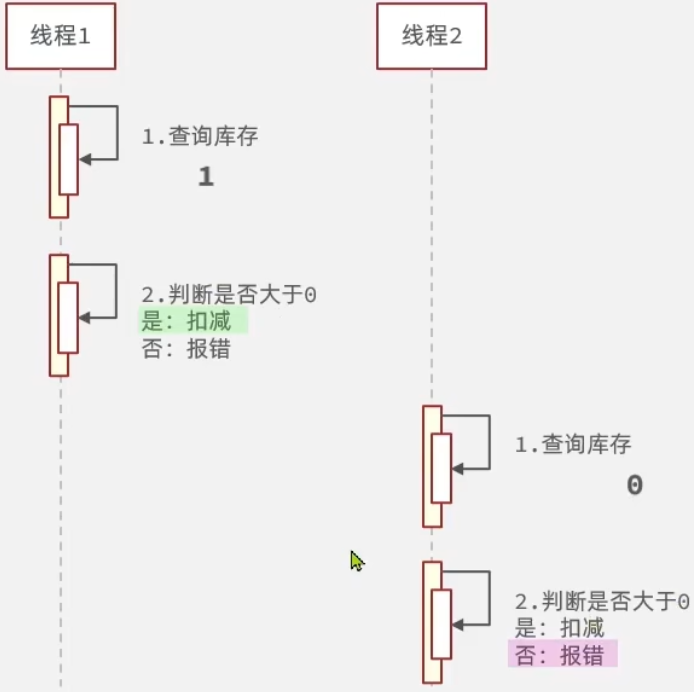
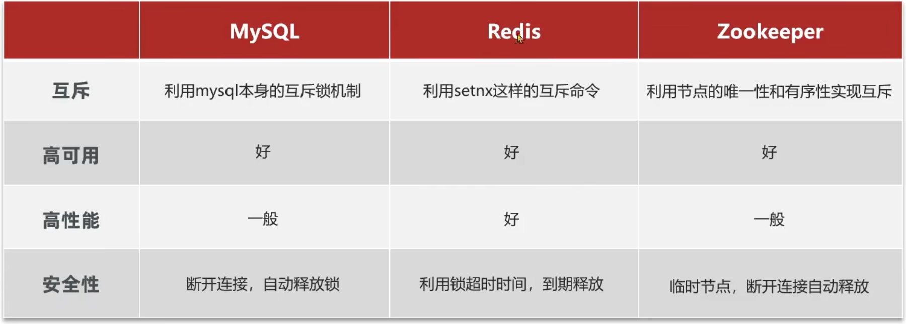
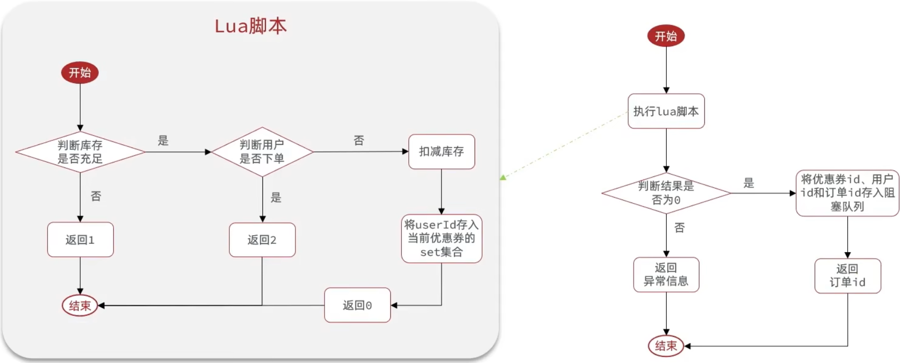

# Redis 实战

## 应用场景

### 短信登录

Redis 的共享 session 应用

### 商户查询缓存

企业的缓存使用技巧

缓存雪崩、穿透等问题解决

### 评论

基于 List 的点赞列表

基于 SortedSet 的点赞排行榜

### 优惠券秒杀

Redis 的计数器、Lua 脚本

分布式锁

Redis 的三种消息队列

### 好友关注

基于 Set 集合的关注、取关、共同关注、消息推送等功能

### 附近的商户

Redis 的 GeoHash 的应用

### 用户签到

Redis 的 BitMap 数据统计功能

### UV 统计

Redis 的 HyperLogLog 的统计功能


## 1. 短信登录

### 1.1 基于 Session 实现登录


#### 发送短信验证码

> 请求路径：/user/code
>
> 请求方式：POST
>
> 接口描述：该接口用于发送短信验证码

请求参数格式：x-www-form-urlencoded

请求参数说明：

| 参数名称 | 说明     | 类型   | 是否必须 | 备注      |
| -------- | -------- | ------ | -------- | --------- |
| phone    | 手机号码 | String | 是       | 11 位数字 |

请求示例

```sh
phone=12345678999
```

响应示例

```json
{
  "msg": "操作成功",
  "data": null
}
```


代码参考此 [commit](https://github.com/s-chance/redis-demo/commit/8db40bec70413d0358956ca9e98ae70bc55e4f79)


#### 短信验证码登录

> 请求路径：/user/login
>
> 请求方式：POST
>
> 接口描述：该接口用于短信验证码登录

请求参数格式：application/json

请求参数说明：

| 参数名称 | 说明     | 类型   | 是否必须 | 备注      |
| -------- | -------- | ------ | -------- | --------- |
| phone    | 手机号码 | String | 是       | 11 位数字 |
| code     | 验证码   | String | 是       | 6 位数字  |

请求示例：

```json
{
  "phone": "12345678999",
  "code": "514003"
}
```

响应示例

```json
{
  "msg": "操作成功",
  "data": null
}
```


代码参考此 [commit](https://github.com/s-chance/redis-demo/commit/3128ae49384a5783e8b43e26eea54ea4e66d73a7)


#### 登录验证功能

代码参考此 [commit](https://github.com/s-chance/redis-demo/commit/68eed67cd5adb1bbb74377c5e17bc14df8666ddc)


### 1.2 集群的 session 共享问题

session 共享问题：多个 Tomcat 无法共享 session 存储空间，当请求切换到不同 tomcat 服务时会导致数据丢失的问题。

> 早期针对这个问题，提出过让多个 tomcat 之间相互拷贝 session 的方案，但是由于浪费内存，这个方案并未得到广泛认可。

session 共享的替代方案应该满足：

- 数据共享 (最核心的功能)
- 内存存储 (高并发、IO 密集型)
- key、value 结构 (session 的数据结构)

因此可以使用能满足以上所有要求的中间件 ── Redis


### 1.3 基于 Redis 实现共享 session 登录

将前面流程图中保存到 session 的步骤改为保存到 Redis，这里需要注意：

由于 Redis 属于多个 tomcat 的共享内存空间，不能使用同一个 key 进行存储，因为相同的 key 会覆盖原有的数据。可以使用手机号作为 key 进行存储，这同时也能解决验证码被其他手机号使用的问题。

此外，原来浏览器请求时会携带 JSESSIONID 的 cookie 找到对应的 session 获取数据。在使用 Redis 后，就是直接根据手机号取值。


关于用户信息的存储形式，通常有两种方案：

使用 String 结构，以 JSON 字符串形式保存，比较直观

使用 Hash 结构，将对象中的每个字段独立存储，可以针对单个字段 CRUD，并且内存占用更少


前面提到使用手机号作为 key 存储，这个方案是可行的，但是这只适用于临时存储手机号与验证码的对应关系。如果要存储的是登录用户的信息，则不推荐使用原始的手机号作为 key，而是推荐使用随机生成的唯一的 token 作为  key。


这个 token 需要满足两个条件：一是唯一性，二是客户端需要能够方便地携带这个 token 请求，这就需要 token 在服务端生成后先在 Redis 中存储，再发送给客户端。


代码参考此 [commit](https://github.com/s-chance/redis-demo/commit/762e21aedc809463d5089580b0ea0dc1b243d8e9)


#### 总结

Redis 代替 session 需要考虑的问题：

- 选择合适的数据结构

  简单类型用 String，复杂类型用 Hash

- 选择合适的 key

  唯一性，可读性 (规范命名方便查找)，有效期 (避免占用过多内存)

- 选择合适的存储粒度

  存储用户信息时过滤掉敏感信息，同时节省内存空间


#### 补充：登录拦截器优化

前面刷新 token 有效期需要用户访问那些被拦截器拦截的路径，但是拦截器并不拦截所有的路径，而一部分路径是不需要经过拦截器的。这会导致用户在登录之后，如果一直访问不被拦截的路径，那么 token 的有效期就不会在拦截器中刷新，一段时间后当用户想访问那些被拦截的路径时就需要重新登录。这样即使用户一直在访问，但最终还是会失去登录状态，这种设计并不合理。

优化方案也很简单，就是在增加一个拦截所有路径的拦截器，在这个拦截器中进行刷新 token 有效期的操作。


第一个拦截器只负责找到对应的 token 刷新，如果存在则查询对应的用户信息存储到 ThreadLocal 中并刷新有效期，如果不存在则直接放行

第二个拦截器只负责查询 ThreadLocal 中是否有对应的用户信息来决定是否拦截

需要注意两个拦截器的拦截路径范围不同，所有的请求都会经过第一个拦截器，但不一定经过第二个拦截器。


代码参考此[commit](https://github.com/s-chance/redis-demo/commit/247159a64c6c622511b79493732d9ca82f9078d6)


## 2. 商户查询缓存

### 2.1 什么是缓存

缓存就是数据交换的缓冲区 (称作 Cache)，是存储的数据的临时区域，一般读写性能较高。

缓存的作用

- 降低后端负载
- 提高读写效率，降低响应时间

缓存的成本

- 数据一致性成本
- 代码维护成本
- 运维成本


### 2.2 添加 Redis 缓存

在客户端与数据库之间添加缓存中间件，避免了大量的请求直接发送到数据库，而是由高性能的缓存中间件处理。在初始状态下，缓存中间件还未存储数据，但是请求一定次数后，缓存中间件就存储了大部分高频访问数据，可以为数据库抵挡大部分请求，减轻数据库压力。


代码参考此[commit](https://github.com/s-chance/redis-demo/commit/b540a404ba0c7cce266eaf4c24079c9b9de0fd93)


练习：使用其他的 Rdis 数据结构实现缓存功能

[demo示例](https://github.com/s-chance/redis-demo/commit/25ff1ba429d99794ee878d690a36881abf4f9090)


### 2.3 缓存更新策略

**内存淘汰**

不用手动维护，利用 Redis 的内存淘汰机制，当内存不足时自动淘汰部分数据。下次查询时更新缓存。

不能保证数据一致性，但几乎没有维护成本。Redis 默认启用该机制。


**超时剔除**

给缓存数据添加 TTL 时间，到期后自动删除缓存。下次查询时更新缓存。

数据一致性一般，保证最终一致性，维护成本较低。


**主动更新**

编写业务逻辑，在修改数据库的同时更新缓存。

数据一致性较好，但维护成本较高。


业务场景：

低一致性需求：使用内存淘汰机制。缓存那些几乎不会发生变化或很少变化的数据。

高一致性需求：采用主动更新，并以超时剔除作为兜底方案。缓存那些经常发生变化或者实时性很高的数据。


#### 主动更新策略

主动更新策略有常见的三种模式：


第一种 Cache Aside Pattern (缓存预留模式)：需要手动编写更新缓存的代码，对调用者有些麻烦，但是可以人为控制。

第二种 Read/Write Through Pattern (透读/透写模式)：调用者可以直接调用服务而无须关心数据一致性问题，但是这样的服务设计是比较复杂的，市面上也难以找到现成的项目，开发成本较高。

第三种 Write Behind Caching Pattern (后写式缓存模式)：类似于第二种方案，都简化了调用者的调用，区别在于第二种方案是同时更新缓存和数据库，第三种方案是只操作缓存，并在一定时间后异步写入数据库，以此保持最终一致性。即使多次更新缓存，异步写入时只会取最后一次有效数据写入数据库，效率较高。但是维护这样一个异步任务需要成本，且数据一致性不是很好，如果单机缓存出现了故障则可能会导致数据完全丢失。

综合来看，方案一尽管复杂，但是可控性高。


操作缓存和数据库时有三个问题需要考虑：

1.删除缓存还是更新缓存？

更新缓存：每次更新数据库都更新缓存，无效写操作较多。(写多读少，可能会出现大量的无效写操作，容易出现线程安全问题)

删除缓存：更新数据库时让缓存失效，查询时再更新缓存。(延迟缓存，写操作的频率会降低，有效写操作会占比更多，线程安全问题出现的概率较低)

因此，一般推荐使用删除缓存的方案。

2.如何保证缓存与数据库的操作同时成功或失败？

单体系统：将缓存与数据库操作放在一个事务

分布式系统：利用 TCC 等分布式事务方案

3.先操作缓存还是先操作数据库？

> 这里考虑的是操作完成后的数据一致性

方案一：先删除缓存，再操作数据库

方案二：先操作数据库，再删除缓存

方案一的正常情况


方案一的异常情况，线程并行执行，查询到的是旧数据，数据不一致


这种线程安全问题的发生概率较高，因为操作缓存的效率高于操作数据库的效率，所以会在数据库更新之前就完成缓存的操作，使得缓存写入的是旧数据。

方案二的正常情况


方案二的异常情况，需要满足特定的条件


这种情况发生的条件是，初始还没有缓存或者是缓存失效，然后是在查询到数据和写入缓存的期间，数据库完成了更新并删除了缓存。但是由于数据库的操作效率低于缓存操作，因此这种情况发生的概率极低，除非缓存操作的速度要慢于数据库操作的速度。

综合来看，这两种方案都可能出现线程安全问题，但是方案二出现问题的概率远远小于方案一，而且发生了问题，也可以通过设置超时时间清理掉旧数据。因此，方案二在线程安全上更佳。


#### 总结

缓存更新策略的最佳实践方案：

1.低一致性需求：使用 Redis 自带的内存淘汰机制

2.高一致性需求：采用主动更新，并以超时剔除作为兜底方案

- 读操作
  - 缓存命中则直接返回
  - 缓存未命中则查询数据库，并写入缓存，设定超时时间
- 写操作
  - 先写数据库，再删除缓存
  - 确保数据库与缓存操作的原子性


#### 案例：查询商户缓存添加超时剔除和主动更新的策略

修改业务逻辑，满足以下需求：

1.根据 id 查询店铺时，如果缓存未命中，则查询数据库，将数据库结果写入缓存，并设置超时时间

2.根据 id 修改店铺时，先修改数据库，再删除缓存


代码参考此[commit](https://github.com/s-chance/redis-demo/commit/ebd2816fe4eac823ca7a48a4e76002276aea23cb)


### 2.4 缓存穿透

**缓存穿透**是指客户端请求的数据在缓存中和数据库中都不存在，这样缓存永远不会生效，这些请求都会直达数据库。


常见的解决方案有两种：

1.缓存空对象

- 优点：实现简单，维护方便

- 缺点：额外的内存消耗，可能造成短期的不一致

  内存消耗可以通过设置较短的 TTL 解决，短期不一致可以通过主动更新缓存解决 (在对数据库进行数据修改操作后，主动删除对应 key 的缓存)


2.布隆过滤器

- 优点：内存占用少，没有多余 key
- 缺点：实现复杂，存在误判的概率


布隆过滤器使用了哈希算法将数据库中的数据计算出哈希值并转换为二进制保存，这是一种概率上的统计，对于布隆过滤器中存在的数据它不一定存在，但是对于布隆过滤器中不存在的数据那一定不存在。


流程变更


代码参考此[commit](https://github.com/s-chance/redis-demo/commit/28c98d6a580d503ad5ddbd905358bc9483962bfa)


#### 总结

缓存穿透产生的原因是什么？

用户请求的数据在缓存中和数据库中都不存在，不断发起这样的请求，会给数据库带来巨大压力。


缓存穿透的解决方案有哪些？

被动方案

- 缓存 null 值

- 布隆过滤

主动方案

- 增加 id 的复杂度，避免被猜测无效 id 规律
- 做好数据的基础格式校验，按某套规范设计 id，凡是不符合规范的 id 直接丢弃
- 加强用户权限校验，需要经过认证授权才能访问
- 做好热点参数的限流，限制访问频率


### 2.5 缓存雪崩

**缓存雪崩**是指在同一时段大量的缓存 key 同时失效或者 Redis 服务宕机，导致了大量请求直达数据库，造成巨大压力。

解决方案：

- 给不同的 key 的 TTL 添加随机值
- 利用 Redis 集群提高服务可用性
- 给缓存业务添加降级限流策略
- 给业务添加多级缓存

除第一个方案以外，其他部分内容涉及微服务架构，这里不过多介绍。


### 2.6 缓存击穿

**缓存击穿问题**也叫热点 key 问题，就是一个**被高并发访问**并且**缓存重建业务较复杂**的 key 突然失效了，无数的请求会瞬间冲击数据库。


常见的解决方案有两种：

- 互斥锁
- 逻辑过期

互斥锁的方案，就是在重建缓存之前加上互斥锁，重建完成之后释放锁。但是同一时刻，只有一个线程在重建缓存，其他线程都只能等待。性能影响较大，于是有了逻辑过期的方案。

逻辑过期方案，就是在存储数据时，不设置 TTL，而是增加一个逻辑过期时间的字段，在逻辑上维护其有效性。


两种方案对比：

互斥锁

- 优点：

  - 没有额外的内存消耗

  - 保证一致性

  - 实现简单

- 缺点
  - 线程需要等待，性能受影响
  - 可能有死锁风险

逻辑过期

- 优点：线程无需等待，性能较好
- 缺点：
  - 不保证一致性
  - 有额外内存消耗
  - 实现复杂

具体选择需要根据对一致性或可用性的要求，如果更注重一致性就采取互斥锁方案，如果更注重可用性就采取逻辑过期方案。


#### 案例：基于互斥锁方式解决缓存击穿问题

修改根据 id 查询商铺的业务，基于互斥锁方式来解决缓存击穿问题


代码参考此 [commit](https://github.com/s-chance/redis-demo/commit/2455ae1fef8d5b7767e169d5779c35ab599397c0)


#### 案例：基于逻辑过期方式解决缓存击穿问题

修改根据 id 查询商铺的业务，基于逻辑过期方式来解决缓存击穿问题

逻辑过期不是真正的过期，而是在存储数据到 Redis 的时候额外添加一个过期时间的字段，它的过期时不由 Redis 控制，而是由开发者自行判断其是否过期。

理论上，这个缓存不会出现未命中的情况，一旦这个 key 被添加到缓存里，就会永久存在，除非人工删除。像这些热点 key 往往会在一些促销活动时期之前提前加入到缓存中，并设置一个逻辑过期时间。因此，不需要专门判断是否命中，如果说未命中，只能说明这个 key 并不是热点 key，或者说不是促销活动内容的商品。


但是给原有对象添加一个过期时间属性，修改了原有的结构，这里有两个方案可以避免直接修改原有对象：继承和组合。继承的方案较为简单，但是存在一定侵入性，推荐使用组合的方式。(装饰器模式)


代码参考此 [commit](https://github.com/s-chance/redis-demo/commit/4d639a3f2f8b8150d21b5c94e17156cb1f4b1220)


### 2.7 缓存工具封装

#### 案例：缓存工具封装

基于 StringRedisTemplate 封装一个缓存工具类，满足下列需求：

方法1：将任意 Java 对象序列化为 json 并存储在 string 类型的 key 中，并且可以设置 TTL 过期时间

方法2：将任意 Java 对象序列化为 json 并存储在 string 类型的 key 中，并且可以设置逻辑过期时间，用于应对缓存击穿问题

方法3：根据指定的 key 查询缓存，并反序列化为指定类型，利用缓存空值的方式解决缓存穿透问题

方法4：根据指定的 key 查询缓存，并反序列化为指定类型，利用逻辑过期解决缓存击穿问题


代码参考此 [commit](https://github.com/s-chance/redis-demo/commit/e7a26568f00db5e9a1dbaf889c5cc751732171fd)


## 3. 优惠券秒杀

### 3.1 全局唯一 ID

#### 全局 ID 生成器

使用数据库自增 ID 会存在一些问题：

- ID 的规律性比较明显
- 受单表数据量的限制


全局 ID 生成器，是一种在分布式系统下用来生成全局唯一 ID 的工具，一般要满足下列特性：

1. 唯一性

2. 高可用

3. 高性能

4. 递增性 (整体递增，但不是按1递增，有利于数据库创建索引，提高性能)

5. 安全性

而 Redis 正好可以满足上面的所有特性。


为了增加 ID 的安全性，一般不直接使用 Redis 自增的数值，而是拼接一些其它的信息：


ID 的组成部分：

- 符号位：1 bit，永远为 0
- 时间戳：31 bit，以秒为单位，可以存储 69 年左右的时间

- 序列号：32 bit，秒内的计数器，支持每秒产生 2^32 个不同的 ID


代码参考此 [commit](https://github.com/s-chance/redis-demo/commit/2e788d66e3ceea5ef51d2d77db69f10cf00a0e62)


#### 总结

全局唯一 ID 生成策略：

- UUID

  十六进制，返回的是字符串类型，非单调递增，不满足5个特性，作为秒杀系统 ID 而言使用率不高

- Redis 自增

  返回的是 long 类型，占用数据库存储空间小，整体单调递增，能够满足5个特性

- snowflake 算法

  采用的也是 long 类型，需要内部维护一个机器的 id，相对结构复杂一些。不依赖第三方中间件，性能理论上更好，但是高度依赖于时钟，需要确保系统时间正确

- 数据库自增

  采用单独的表进行 id 自增，类似于 Redis 自增，但是性能不如 Redis 自增。


Redis 自增 ID 策略：

- 按天划分 key，方便统计订单量
- ID 构造是 时间戳 + 计数器


### 3.2 实现优惠券秒杀下单

#### 添加优惠券

> 该部分为基础环境搭建

有两张数据表：

- tb_voucher：优惠券的基本信息，优惠金额和使用规则等。
- tb_sec_kill_voucher：优惠券的库存、开始抢购时间，结束抢购时间。(针对特价优惠券，而非普通优惠券的补充信息)


具体环境和代码参考此 [commit](https://github.com/s-chance/redis-demo/commit/906f6972f568d151b713cce317806720730269be)


#### 优惠券秒杀下单

下单时需要判断两点：

- 秒杀是否开始或结束，如果尚未开始或已经结束则无法下单
- 库存是否充足，不足则无法下单


代码参考此 [commit](https://github.com/s-chance/redis-demo/commit/03b0bb44e22034900d35ea17d329876107494439)

这部分代码并未经过高并发测试，高并发测试会在后面进行。


### 3.3 超卖问题

使用 jemter 模拟高并发场景，用远超过现有库存数的用户下单线程数量测试后可能会有两种情况：

一种是对应秒杀优惠券的数据表的库存字段出现了负值。

另一种则是库存字段值为 0，但是出现了数据操作失败的异常，导致数据回滚。

这两种情况是在创建数据表时是否使用了 UNSIGNED 修饰导致的差异，但它们都存在高并发下的线程安全问题。不过第二种情况只是恰好利用了 UNSIGNED 避免了负值，但是不能避免线程安全问题，因为如果是在线程安全的情况下，它不会在库存已经为 0 的时候还会执行数据操作代码，而是直接返回库存不足的提示。


普通情况下



高并发情况下


超卖问题是典型的多线程安全问题，针对这一问题的常见解决方案就是加锁：


悲观锁的使用较为简单，不过多介绍。这里主要介绍乐观锁的实现和使用。


#### 乐观锁

乐观锁的关键是判断之前查询得到的数据是否被修改过，常见的方式有两种：

- 版本号法：给数据额外加上版本号的字段，基于版本号判断数据有没有被修改。每修改一次数据，版本号就会加一

  

- CAS 法 (Compare And Set)：本身是对版本号法的简化，直接把要改动的数据本身作为一个版本。

  

但是乐观锁存在一个弊端：就是在大量并行线程中，只要有一个线程修改了数据之后，其他的线程都会失败，虽然可以解决线程安全问题，但是成功率过低。

这里可以通过放宽判断的范围，只要确保库存数大于 0 即可，把原来的等值判断改为范围判断。


代码参考此 [commit](https://github.com/s-chance/redis-demo/commit/2d8d100350d6fb335fc39592222a814a6ccf530c)


#### 总结

超卖这样的线程安全问题，解决方案有哪些？

1. 悲观锁：添加同步锁，让线程串行执行

   优点：简单直观

   缺点：性能一般

2. 乐观锁：不加锁，在更新时判断是否有其它线程在修改

   优点：性能好

   缺点：存在成功率低的问题

乐观锁存在的问题可以通过多种方案解决，例如分段锁等。

但是乐观锁还是要访问数据库的，在真正的秒杀场景下，仅使用乐观锁还不足以应对。后面会进一步优化。


### 3.4 一人一单

#### 案例：一人一单

修改秒杀业务，要求同一个优惠券，一个用户只能下一单。


但是如果只是简单的在扣减库存之前判断是否已经存在了订单，还是会出现重复购买的情况，只是重复的订单数量会降低。实际上还是线程安全问题。

由于乐观锁是用于更新数据的情况下进行判断，对于新增数据，乐观锁无法进行判断，只能用悲观锁。但是直接用悲观锁锁定整个对象并不是很好的做法，实际上可以将其优化为锁定用户的 id 来提高性能。

 

代码参考此 [commit](https://github.com/s-chance/redis-demo/commit/c651e591bf012ed9599106cfc1c3c215db2c1c12)


#### 一人一单的线程安全问题 (集群模式)

通过加锁可以解决在单机情况下的一人一单线程安全问题，但是在集群模式下就不行了。

1.将服务启动两份，端口分别为 8081 和 8082

2.修改 nginx 的 conf 目录下的 nginx.conf 文件，配置反向代理和负载均衡

```nginx
upstream backend {
  server 127.0.0.1:8081 max_fails=5 fail_timeout=10s weight=1;
  server 127.0.0.1:8082 max_fails=5 fail_timeout=10s weight=1;
}
```

测试在集群下的访问。


在集群模式下，每一个 JVM 进程会拥有自己的锁监视器，悲观锁只能为本进程内的线程加锁，无法对集群加锁。在拥有多个 JVM 进程的集群或分布式系统中，每个 JVM 进程都能有一个线程可以获取悲观锁，于是在多个 JVM 进程之间就会出现并行执行，造成多进程下的线程安全问题。

要解决这个问题，需要让多个 JVM 只能使用同一把锁，也就说这个锁是跨进程的锁 ── 分布式锁。


### 3.5 分布式锁

分布式锁的关键是让多个 JVM 进程能访问到同一个锁监视器。


#### 什么是分布式锁

**分布式锁**：满足分布式系统或集群模式下多进程可见并且互斥的锁。


#### 分布式锁的实现

分布式锁的核心是实现多进程之间互斥，而满足这一点的方式有很多，常见的有三种：



从安全性看，MySQL 和 Zookeeper 都可以自动处理，Redis 需要手动进行处理，不过在高可用和高性能上 Redis 较好。


#### 基于 Redis 的分布式锁

实现分布式锁时需要实现的两个基本方法：

- 获取锁：

  互斥：确保只能有一个线程获取锁

  非阻塞：只尝试一次，成功返回true，失败返回false

  ```bash
  # 添加锁，利用 setnx 的互斥特性
  setnx lock thread1
  ```

- 释放锁：

  手动释放

  ```bash
  # 释放锁，删除即可
  del lock
  ```

  超时释放：获取锁时设置超时时间

  ```bash
  # 设置过期时间，避免服务宕机引起死锁
  expire lock 10
  ```

  这里需要考虑到获取锁和设置过期时间是一个原子性操作，要么都成功，要么都失败，否则还是可能会出现死锁问题。

  ```bash
  setnx lock thread1
  expire lock 10
  ```

  这可以通过一个 set 命令加上参数实现

  ```bash
  # 添加锁，nx是互斥，ex是设置超时时间
  set lock thread1 ex 10 nx
  ```


#### 案例：基于 Redis 实现分布式锁

定义一个类，实现获取锁和释放锁的功能，结合 Redis 实现分布式锁。


代码参考此 [commit](https://github.com/s-chance/redis-demo/commit/fd856c41e1fba36955ef0f261d6c32f7fa3ad2d8)


#### Redis 分布式锁误删问题

如果在一个线程中获取锁成功之后遇到了业务阻塞问题，超过了设置的过期时间，那么会导致锁被提前释放。即实际业务执行的时间超过了预期设置的最大过期时间。

另外，阻塞的业务在执行完后也可能会误删掉其他线程的锁，导致后续可能会存在多个线程都会持有锁，也就会出现并行执行的情况。


对于误删问题，可以在每次释放锁之前判断该锁的标识是否一致。


#### 案例：改进 Redis 的分布式锁

修改之前的分布式锁，满足：

1.在获取锁时存入线程标识 (可以使用 UUID 表示，直接使用线程 ID 在分布式系统下会存在重复的情况)

2.在释放锁时先获取锁中的线程标识，判断是否与当前线程标识一致

- 一致，释放锁
- 不一致，不释放锁


代码参考此 [commit](https://github.com/s-chance/redis-demo/commit/237156a448747f56e3b256b7b2f1e0c4e26031ed)


#### 分布式锁原子性问题

上面的方案可以解决误删问题，但是在极端情况下会出现另外的问题。

如果在判断标识是否一致和释放锁这两个操作之间发生了阻塞（例如正好发生了 JVM 的垃圾回收操作），只要阻塞的时间足够长，就会导致锁超时释放。如果有其他线程进入获取了新的锁，由于前面已经判断了标识为一致，下一步操作就是直接释放锁，那么其他线程的锁会被本线程直接释放，又会造成误删。

> 在判断操作的时候，锁是属于本线程的锁，因此能直接释放锁，但是在锁释放之前的阻塞期间，本线程的锁被超时释放，其他线程创建了新的锁，那么在释放锁操作的时候，这把锁已经不是属于本线程原来的锁了，但在前面判断操作的时候，本线程已经认定为这是原来的锁，因此会造成误删。
>
> 另外这里不可能在阻塞结束之后再重新判断一次，因为阻塞可能会发生在任意一步操作的前后时间，无法控制。

本质是因为判断锁标识和释放锁是两个操作，在两个操作之间发生了阻塞，才导致问题的产生。

提示：模拟极端情况时可以适当设置较长的过期时间，然后手动删除 Redis 中的数据，模拟过期失效。


解决的方案就是确保判断锁标识和释放锁为一个原子性操作，即要判断的锁和要释放的锁是同一把锁。


在 Redis 中也存在事务的概念，但和 MySQL 的事务概念是有很大区别的。在 Redis 中的事务无法保证一致性，在 Redis 中的多个操作会作为批处理操作，最终一次性执行，因此在 Redis 中实现原子性比较复杂，不推荐。但是 Redis 提供了 Lua 脚本的方案。


#### Redis 的 Lua 脚本

Redis 提供了 Lua 脚本功能，在一个脚本中编写多条 Redis 命令，确保多条命令执行时的原子性。

Lua 是一种脚本语言，基本语法可以参考 https://www.runoob.com/lua/lua-tutorial.html

这里主要介绍在 Lua 中使用 Redis 提供了调用函数，语法如下

```lua
redis.call('命令', 'key', '其它参数', ...)
```

例如，在 Redis 中 set name jack 对应的 Lua 脚本内容如下

```lua
redis.call('set', 'name', 'jack')
```

要执行多个命令编写 Lua 脚本如下

```lua
-- 先执行 set name jack
redis.call('set', 'name', 'jack')
-- 再执行 get name
local name = redis.call('get', 'name')
-- 返回 name 的值
return name
```


编写完 Lua 脚本候，在 Redis 中可以使用 `EVAL` 命令

例如，要执行 `redis.call('set', 'name', 'jack')` 这个脚本，可以在 Redis 中执行如下命令

```bash
EVAL "return redis.call('set', 'name', 'jack')" 0
```

后面的 0 表示参数个数，这里表示无参。

如果想把 key、value 改写参数传递的形式，key 类型参数会放入 KEYS 数组，其它参数会放入 ARGV 数组，在脚本中可以从 KEYS 和 ARGV 数组获取这些参数

```bash
EVAL "return redis.call('set', KEYS[1], ARGV[1])" 1 name Tom
```

> Lua 中数组下标从 1 开始


#### Lua 脚本解决多条命令原子性问题

释放锁的业务流程是这样的：

1. 获取锁中的线程标识
2. 判断是否于当前线程标识一致
   - 一致，释放锁
   - 不一致，不释放锁

编写的 Lua 脚本如下

```lua
-- 获取锁的 key 传参
local key = KEYS[1]
-- 当前线程的标识
local threadId = ARGV[1]

-- 获取锁中的线程标识
local id = redis.call('get', key)
-- 比较标识是否一致
if (id == threadId) then
  -- 释放锁
  return redis.call('del', key)
end
return 0
```

可以进一步简化为

```lua
-- 比较标识是否一致
if (redis.call('get', KEYS[1]) == ARGV[1]) then
  -- 释放锁
  return redis.call('del', KEYS[1])
end
return 0
```


#### 案例：改进 Redis 的分布式锁 2.0

基于 Lua 脚本实现分布式锁的原子性释放锁逻辑


代码参考此 [commit](https://github.com/s-chance/redis-demo/commit/23728d5260b61ba9a7f0ecd0fc391b1592c4d8bf)


#### 总结

基于 Redis 的分布式锁实现思路：

- 利用 set nx ex 获取锁，并设置过期时间，保存线程标识
- 释放锁时先判断线程标识是否一致，一致则删除锁

特性：

- 利用 set nx 满足互斥性
- 利用 set ex 保证故障时依然能释放，避免死锁，提高安全性
- 利用 Redis 集群保证高可用和高并发特性


#### 基于 Redis 的分布式锁优化

基于 setnx 实现的分布式锁存在以下问题：

1.不可重入：同一个线程无法多次获取同一把锁

> 在一个线程中，方法 a 在获取锁之后需要调用方法 b，但在方法 b 中又需要获取锁，由于方法 a 未执行完成，因此方法 b 无法获取同一把锁，出现死锁的情况。

2.不可重试：获取锁只尝试一次就返回 false，没有重试机制

> 一般获取锁失败后，不会立即放弃操作，而是会有阻塞或重试的机制。

3.超时释放：锁超时释放可以避免死锁，但是如果业务执行耗时超过预期时间，会导致锁提前释放，存在安全隐患。

> 如果时间设置的太短，业务还未执行完锁就会释放，时间设置的太长，获取锁的阻塞周期过长。

4.主从一致性：Redis 提供了主从集群，主从同步存在延迟，当主节点宕机时，如果从节点没有同步主节点中的锁数据，就会出现多个线程可以获取锁的情况。

> 主从模式，可以理解为读写分离模式。Redis 会有一个主节点和多个从节点，执行写操作时访问主节点，执行读操作时访问从节点，主节点会将数据同步到从节点，保证主从数据一致。如果主节点宕机了，则会在多个从节点中选出一个新的主节点。但是主从数据同步存在一定延迟，在极端情况下可能会在主节点同步数据到从节点时正好宕机，导致数据不一致。
>
> 不过主从同步的延迟往往是极低的，发生问题的概率也比较低。

要解决以上四个问题，可以考虑使用 Redisson 实现。


#### Redisson

Redisson 是一个在 Redis 的基础上实现的 Java 驻内存数据网格 (In-Memory Data Grid)。它不仅提供了一系列的分布式的 Java 常用对象，还提供了许多分布式服务，其中就包含了各种分布式锁的实现。

Github 地址：https://github.com/redisson/redisson


##### Redisson 入门

1.引入依赖

```xml
<dependency>
   <groupId>org.redisson</groupId>
   <artifactId>redisson</artifactId>
   <version>3.34.1</version>
</dependency>
```

2.配置 Redisson 客户端

```java
@Configuration
public class RedisConfig {

  @Bean
  public RedissonClient redissonClient() {
    Config config = new Config();
    // 添加redis地址，单节点模式，也可以使用 config.useClusterServers()添加集群地址
    config.useSingleServer()
      .setAddress("redis://localhost:6379")
      .setPassword("123");
    return Redisson.create(config);
  }
}
```

3.使用 Redisson 的分布式锁

```java
@Resource
private RedissonClient redissonClient;

@Test
void testRedisson() throws InterruptedException {
  // 设置可重入的锁，指定锁的名称
  RLock lock = redissonClient.getLock("anyLock");
  // 尝试获取锁，参数分别为：获取锁的最大等待时间（等待期间会重试），锁自动释放时间，时间单位
  boolean isLocked = lock.tryLock(1, 10, TimeUnit.SECONDS);
  // 判断是否获取成功
  if (isLocked) {
    try {
      System.out.println("执行业务");
    } finally {
      // 释放锁
      lock.unlock();
    }
  }
}
```


代码参考此 [commit](https://github.com/s-chance/redis-demo/commit/76b11fa4e2e4c7943b46eb8caf3746c63dfcda82)


##### Redisson 可重入锁原理

可重入锁就是在本线程第二次获取锁时判断这个锁是否属于同一个线程，如果是同一个线程则成功获取锁。可重入锁会专门有一个计数器，当在本线程中每获取一次锁，计数器便会累加 1，当在本线程中释放锁时，计数器就会减 1。

> 对于可重入锁来说，释放锁不再是直接删除数据，而是将计数器减 1。当计数器减为 0 时，就可以删除响应的数据了。


如果要额外存储一个用于计数的字段，原本的 String 类型就不能很好地满足需求了，可以更换为 Hash 类型。


由于涉及到的步骤过多，为了确保原子性，推荐使用 Lua 脚本的方式实现，而不是使用 Java 代码

获取锁的 Lua 脚本

```lua
local key = KEYS[1] -- 锁的 key
local threadId = ARGV[1] -- 线程唯一标识
local releaseTime = ARGV[2] -- 锁的自动释放时间
-- 判断是否存在
if (redis.call('exists', key) == 0) then
  -- 不存在，获取锁
  redis.call('hset', key, threadId, '1')
  -- 设置有效期
  redis.call('expire', key, releaseTime)
  return 1 -- 返回结果
end
-- 锁已经存在，判断threadId是否是自己的
if (redis.call('hexists', key, threadId) == 1) then
  -- 获取锁，重入次数 +1
  redis.call('hincrby', key, threadId, '1')
  -- 设置有效期
  redis.call('expire', key, releaseTime)
  return 1 -- 返回结果
end
return 0 -- 返回获取锁失败的结果
```

释放锁的 Lua 脚本

```lua
local key = KEYS[1]
local threadId = ARGV[1]
local releaseTime = ARGV[2]
-- 判断锁是否属于本线程
if (redis.call('hexists', key, threadId) == 0) then
  return nil -- 不属于本线程，直接返回
end
-- 属于本线程，重入次数 -1
local count = redis.call('hincrby', key, threadId, -1)
-- 判断重入次数是否为 0
if (count > 0) then
  -- 大于 0 不能释放，重置有效期
  redis.call('expire', key, releaseTime)
  return nil
else
  -- 等于 0 可以释放，直接删除
  redis.call('del', key)
  return nil
end
```

实际上在 Redisson 的底层代码实现中就使用类似的 Lua 脚本，将其内容作为 String 类型的字符串加载。


简单来说，Redisson 可重入锁的核心原理就是利用 Hash 结构记录获取锁的线程标识以及重入的次数 (以标识为 field，以重入次数为 value)。


##### Redisson 锁重试和看门狗

Redisson 的锁重试底层使用了发布订阅机制。设置一个最大等待时间，在等待时间内，锁不会在第一次失败后不断重试，而是订阅锁的释放通知，如果超时未收到通知就直接返回 false，如果收到了通知，则减去等待时间后再尝试通过信号量获取锁，以此循环。如果在此期间剩余时间归零还未成功获取锁则返回 false。

使用发布订阅机制和信号量机制实现了较为高效的锁重试机制，避免了盲等带来的 cpu 开销。

WatchDog 看门狗机制会在锁的剩余时间不足时重新刷新时间以延长锁的有效时间，直到锁被主动释放。

> 看门狗机制的生效需要在 `tryLock` 方法中设置参数。


Redisson 分布式锁原理：

- 可重入：利用 Hash 结构记录线程 id 和重入次数
- 可重试：利用信号量和 PubSub 功能实现等待、唤醒、获取锁失败的重试机制
- 超时续约：利用 WatchDog，每隔一段时间 (releaseTime / 3)，重置超时时间


##### Redisson 分布式锁主从一致性问题

主从一致性问题产生的原因，其实是由于单节点的 Redis 可用性不高，一旦唯一的 Redis 宕机后，所有依赖于 Redis 的业务都会出现问题。为了解决这个问题，提高 Redis 的可用性，就会搭建 Redis 的主从模式集群，这也引入了新的主从一致性问题。

在 Redis 主从集群中，有一个主节点和多个从节点，主从节点的职责分离，主节点处理所有的写操作 (增删改)，从节点处理所有的读操作 (查)。由于这样的读写职责划分，主节点需要不断将数据同步到从节点上，保证主从一致性，但是毕竟同步的过程存在延迟，尽管延迟较短，但也可能引起主从一致性问题。


在程序获取锁之后，主节点存储了相应的数据，准备将数据同步到从节点。但是如果此时主节点发生了故障，那么这些数据就无法及时同步到从节点上。Redis 集群的哨兵节点会监控集群状态，当发现主节点宕机后，客户端连接会被断开，然后在从节点中选出一个作为新的主节点。但是由于之前的主从同步失败，数据已经丢失，客户端在访问新的主节点时已经找不到原来的锁了，此时其他的线程也能成功获取锁，就会出现线程并发安全问题。


Redisson 解决主从一致性的思路是将所有节点变成独立的 Redis 节点，取消了主从关系，对于所有节点都能进行读写操作。此时获取锁的方式发生了变化，之前获取锁需要找到主节点，现在必须依次向多个 Redis 节点获取锁，只有在所有节点都获取锁，才算获取成功。

由于不再区分主从节点，因此也不会出现主从一致性问题。即使有一个节点宕机，Redis 依旧可以使用其他节点。可用性取决于节点的数量规模，为了进一步保证可用性，还可以在此基础上再为每个节点扩展主从集群。


如果有一个主节点宕机，没有将数据同步到从节点上，此时会选出一个不存在同步数据的从节点成为新的主节点。但是即使这个新的主节点没有数据，最终也无法获取锁，因为需要在多个主节点中都能成功获取才算成功，只要在其中一个主节点上无法获取就视为失败。


这样的方案保留了主从同步机制，确保整体集群的高可用性，同时避免了主从一致性问题，被称为 multiLock，也就是把多个独立的锁联合在一起组成一个联合的锁。


代码参考此 [commit](https://github.com/s-chance/redis-demo/commit/8b3c59b18df5414eb9ef88ceaa0485f21ea28f54)

环境搭建参考下文


#### Redis 集群搭建

最小配置推荐创建 6 个节点，采用 3 主 3 从模式。

1.准备 Redis 配置文件

2.使用 docker-compose 创建集群，为了方便配置集群采用 host 网络模式


所有配置文件参考此 [commit](https://github.com/s-chance/redis-demo/commit/22ee3bd41638df5beeb8d56a1ca918597ee8d774)


测试集群

连接 Redis 集群，需要 `-c` 参数以支持集群模式操作，如槽位定向和重定向，否则会遇到 MOVED 错误。

```bash
redis-cli -c -h 127.0.0.1 -p 6381
```

> 如果本地没有安装 redis-cli，可以选择任意一个 redis 容器进入，调用 redis-cli 连接。

在 Redis 中查看集群状态

```bash
cluster info
```

在 Redis 中查看节点信息

```bash
cluster nodes
```

`slave` 代表从节点，`master` 代表主节点，`myself` 代表当前连接的节点。


Redis 集群模式具备故障转移机制，不同于哨兵模式的故障转移，它不依赖额外的哨兵节点，而是通过集群内部节点之间的相互监控实现的。


#### Redis 主从架构搭建

主从架构主要实现主从复制和读写分离等功能，本身不具备故障转移能力。通常和哨兵配合，以实现自动故障转移。因此推荐的最小配置需要创建 3 主 3 从 3 哨兵共 9 个节点。

所有配置文件参考此 [commit](https://github.com/s-chance/redis-demo/commit/5093ae0f6bddd6bc6e9cb54d9f16fa1e652f1b3a)


#### 总结

1.不可重入 Redis 分布式锁

原理：利用 setnx 的互斥性；利用 ex 避免死锁；释放锁时判断线程标识

缺陷：不可重入、无法重试、锁超时失效问题

2.可重入的 Redis 分布式锁

原理：利用 hash 结构，记录线程标识和重入次数；利用 watchDog 延续等待时间；利用信号量控制锁重试等待

缺陷：Redis 宕机引起锁失效问题

3.Redisson 的 multiLock

原理：多个独立的 Redis 节点，必须在所有节点都获取重入锁之后，才算获取锁成功

缺陷：运维成本高、实现复杂


### 3.6 Redis 优化秒杀

前面为了提高服务的可用性，引入了较多的机制，导致性能会有所下降。因此这里会再对秒杀业务进行性能优化。


前面的整体业务流程还是涉及到多次对数据库请求，一个完整的秒杀流程需要至少四次数据库请求，而数据库的并发能力不高，性能存在瓶颈。

这里可以将整个秒杀业务分为两部分：第一部分主要是查询库存和订单等读操作，耗时相对短一些。第二部分是扣减库存和创建订单等写操作。

在代码实现上可以将这两部分交给不同的线程实现，主线程判断用户是否有购买资格，如果有则开启一个独立的线程来处理扣减库存和创建订单等耗时操作。

判断用户购买资格还是基于数据库查询，这里可以进行 Redis 缓存优化，先将订单数据缓存到 Redis，并返回订单号给用户，后续再使用独立的线程异步读取缓存的数据，完成创建订单的操作。


这样整个业务的流程会缩短，后续操作会交由独立的线程异步完成，整个业务的吞吐能力、并发能力会有所提高。不过需要考虑如何在 Redis 中实现这些操作。


Redis 中需要保存优惠券的库存信息和有关的订单信息。库存信息是一个简单的数值，使用 string 结构即可，key 就使用优惠券的 id 值。判断的时候，判断库存是否大于 0 即可，不过需要在 Redis 中将库存预减。

与指定优惠券相关的订单信息有很多，需要在一个 key 中保存多个值，另外这些值由于一人一单的限制，不会存在重复，使用 set 结构即可。set 可以天然保持元素的唯一性。

相关的操作流程如下


此外，为了确保这些操作的原子性，可以使用 Lua 脚本实现这些操作，在业务代码中只需要调用脚本得到返回的结果即可。



整个业务下来，没有对数据库的写操作，耗时大大减短，并发能力也得到提高。而对于数据库的写操作，则会在之后使用独立的线程来异步完成。

由于改造了原本的业务逻辑，缩短了业务流程，使得其对数据库的写操作不再有较高的时效性要求。对于数据库的写入频率也可以通过异步减缓。如果需要提高异步写入的性能，可以考虑增加异步线程的数量。


#### 案例：改进秒杀业务，提高并发性能

1.新增秒杀优惠券的同时，将优惠券信息保存到 Redis 中

2.基于 Lua 脚本，判断秒杀库存、一人一单，决定用户是否抢购成功

3.如果抢购成功，将优惠券 id 和用户 id 封装后存入阻塞队列

4.开启线程任务，不断从阻塞队列中获取信息，实现异步下单功能


代码参考此 [commit](https://github.com/s-chance/redis-demo/commit/392d5f03ea1b3b8d1969cd29c3f8dd7f20850041)


#### 总结

秒杀业务的优化思路？

1. 先利用 Redis 完成库存余量、一人一单判断，完成抢购业务

2. 再将下单业务放入阻塞队列，利用独立的异步线程完成下单

基于阻塞队列的异步秒杀存在哪些问题？

- 内存限制问题
- 数据安全问题

目前使用的阻塞队列是由 jdk 提供的，会占用 jvm 的内存，需要设置一个大小上限。另外，这个阻塞队列是基于内存存储的，而且不存在持久化机制，如果服务宕机则会丢失所有数据。


### 3.7 Redis 消息队列实现异步秒杀

前面基于 JVM 的阻塞队列实现异步秒杀存在两个问题，jvm 内存限制问题和数据安全问题。

最佳的解决方案就是使用消息队列。


消息队列 (Message Queue)，就是指存消息的队列。最简单的消息队列模型包括 3 个角色：

- 消息队列：存储和管理消息，也称为消息代理 (Message Broker)
- 生产者：发送消息到消息队列
- 消费者：从消息队列获取消息并处理消息

消息队列实现了生产者与消费者的解耦。


阻塞队列与消息队列的区别在于消息队列是独立于 JVM 的服务，不受 JVM 内存的限制，其次，消息队列不仅具有数据存储功能，还能通过持久化保证数据安全，并且确保消息被消费者成功消费。

消息队列的选型有很多种，也存在一定的成本。在这里直接使用 Redis 实现消息队列是一个成本低的方案。Redis 提供了三种不同的方式来实现消息队列：

- list 结构：基于 List 结构模拟消息队列
- PubSub：基本的点对点消息模型
- Stream：比较完善的消息队列模型


#### 基于 List 结构模拟消息队列

Redis 的 list 数据结构是一个双向链表，很容易模拟出队列效果。

队列是入口与出口不在一边，可以使用 LPUSH 配合 RPOP 或 RPUSH 配合 LPOP 来实现。

不过要注意的是，当队列中没有消息时 RPOP 或 LPOP 操作返回的是 null，不会像 Java 的阻塞队列那样阻塞并等待消息。这里需要使用 BRPOP 或 BLPOP 来实现阻塞效果。

本质上是通过 list 结构和 Redis 的阻塞式命令来模拟 Java 中的阻塞队列，由于是独立储存，并且能够确保数据安全，因此是一个较好的方案。


#### 总结

基于 List 的消息队列有哪些优缺点？

优点：

- 利用 Redis 存储，不受限于 JVM 内存上限
- 基于 Redis 的持久化机制，数据安全性有保证
- 可以满足消息有序性

缺点：

- 无法避免消息丢失 (消息处理时发生异常导致消息丢失)
- 只支持单消费者


#### 基于 PubSub 的消息队列

PubSub (发布订阅) 是 Redis 2.0 版本引入的消息传递模型。消费者可以订阅一个或多个 channel，生产者向对应的 channel 发送消息后，所有订阅者都能收到相关消息 (多消费者)。

相关的命令如下

- SUBSCRIBE channel [channel]：订阅一个或多个频道
- PUBLISH channel msg：向一个频道发送消息
- PSUBSCRIBE pattern [pattern]：订阅与 pattern 格式匹配的所有频道


#### 总结

基于 PubSub 的消息队列有哪些优缺点

优点：

- 采用发布订阅模型，支持多生产、多消费

缺点：

- 不支持数据持久化
- 无法避免消息丢失
- 消息堆积有上限，超出时数据丢失 (消费者缓冲区容量有限)

对于可靠性要求较高的服务不建议使用基于 PubSub 的消息队列


#### 基于 Stream 的消息队列

Stream 是 Redis 5.0 引入的一种新数据类型，可以实现一个功能非常完善的消息队列。

发送消息的命令：


例如：


读取消息的方式之一：XREAD


例如：

使用 XREAD 读取 s1 队列的第一条消息

```bash
XREAD COUNT 1 STREAMS s1 0
```

读取 s1 队列的最新消息

```bash
XREAD COUNT 1 STREAMS s1 $
```

阻塞等待 s1 队列的最新消息，设置为 0 代表永久阻塞直到读取到最新消息

```bash
XREAD COUNT 1 BLOCK 0 STREAMS s1 $
```

在业务开发中可以循环调用 XREAD 阻塞方式来查询最新消息，从而实现持续监听队列的效果，代码参考如下

```java
while (true) {
  // 尝试读取队列中的消息，最多阻塞2秒
  Object msg = redis.execute("XREAD COUNT 1 BLOCK 2000 STREAMS s1 $");
  if (msg == null) {
    continue;
  }
  // 处理消息
  handleMessage(msg);
}
```

注意：当指定起始 ID 为 $ 时，代表读取最新的消息，如果有超过 1 条以上的消息到达队列，则下次获取时只能获取到最新的一条，其他的消息被最新的消息覆盖，会出现漏读消息的问题。


#### 总结

STREAM 类型消息队列的 XREAD 命令特点

- 消息可回溯
- 一个消息可以被多个消费者读取
- 可以阻塞读取
- 有消息漏读的风险


#### 基于 Stream 的消息队列 - 消费者组

消费者组 (Consumer Group)：将多个消费者划分到一个组中，监听同一个队列。具备以下特点：


创建消费者组

```bash
XGROUP CREATE key groupName ID [MKSTREAM]
```

- key：队列名称
- groupName：消费者组名称
- ID：起始 ID 标识，$ 代表队列中最后一个消息 (也就是最新消息)，0 则代表队列中第一个消息
- MKSTREAM：队列不存在时自动创建队列

其它常见命令

删除指定的消费者组

```bash
XGROUP DESTORY key groupName
```

给指定的消费者组添加消费者

```bash
XGROUP CREATECONSUMER key groupName consumerName
```

删除消费者组中的指定消费者

```bash
XGROUP DELCONSUMER key groupName consumerName
```


从消费者组读取消息

```bash
XREADGROUP GROUP group consumer [COUNT count] [BLOCK milliseconds] [NOACK] STREAMS key [key ...] ID [ID ...]
```

- group：消费者组名称
- consumer：消费者名称，如果消费者不存在，会自动创建一个消费者
- count：本次查询的最大数量
- BLOCK milliseconds：当没有消息时的最长等待时间
- NOACK：无需手动 ACK，获取到消息后自动确认，一般不建议使用此项
- STREAMS key：指定队列名称
- ID：获取消息的起始 ID：
  - ">"：从下一个未消费的消息开始 (在正常情况下使用)
  - 其它：根据指定 id 从 pending-list 中获取已消费但未确认的消息，例如 0，是从 pending-list 中的第一个消息开始 (在异常情况下读取被消费但未被确认的消息)


消费者监听消息的基本思路：

```java
while (true) {
  // 尝试监听队列，使用阻塞模式，最长等待2秒
  Object msg = redis.call("XREADGROUP GROUP g1 c1 COUNT 1 BLOCK 2000 STREAMS s1 >");
  if (msg == null) { // 没有消息，直接进入下一次循环
    continue;
  }
  try {
    // 处理消息，处理完之后ACK确认
    handleMessage(msg);
  } catch (Exception e) {
    while (true) {
      Object msg = redis.call("XREADGROUP GROUP g1 c1 COUNT 1 STREAMS s1 0");
      if (msg == null) { // 没有异常消息，结束循环
        break;
      }
      try {
        // 重新处理异常消息
        handleMessage(msg);
      } catch (Exception e) {
        // 再次出现异常，记录日志，继续循环
        continue;
      }
    }
  }
}
```


#### 总结

STREAM 类型消息队列的 XREADGROUP 命令特点：

- 消息可回溯
- 可以多消费者处理消息，加快消费速度
- 可以阻塞读取
- 没有消息漏读的风险
- 有消息确认机制，保证消息至少被消费一次


三种方式对比


通常推荐使用 Stream 作为 Redis 消息队列的首选方案。

如果业务较为庞大，对消息队列有更高的要求，则建议使用更加专业的消息队列。因为 Redis 消息队列只是一个低成本的简易方案，即使是 Stream 类型也依赖于 Redis 本身的持久化机制，存在一定的丢失风险。而且 Redis 消息队列只支持消费者确认机制，对比更为专业的消息队列，它不支持生产者确认等机制。

如果业务较为简单，那么使用低成本的 Redis 消息队列已经能够满足需求，不需要额外使用成本相对较高的专业级消息队列。


#### 案例：基于 Redis 的 Stream 结构作为消息队列，实现异步秒杀下单

1.创建一个 Stream 类型的消息队列，名为 stream.orders

```bash
XGROUP CREATE stream.orders g1 0 MKSTREAM
```

2.修改之前的秒杀下单 Lua 脚本，在确认有抢购资格后，直接向 stream.orders 中发送消息，内容包含了 voucherId、userId、orderId

3.项目启动时，开启一个线程任务，尝试获取 stream.orders 中的消息，完成下单


代码参考此 [commit](https://github.com/s-chance/redis-demo/commit/6ccd724c42f7f595d0a2e556ff7779abb36f0ed4)


## 4. 评论

### 4.1 发布笔记

对应的表有两个

- tb_blog：笔记表，包含了笔记的标题、文字、图片等
- tb_blog_comment：其他用户对笔记的评价

图片存储使用的是 minio 方案，minio 搭建参考此 [commit](https://github.com/s-chance/redis-demo/commit/62b93669de3cd1784ce041c76d93fa345c6e556e)

发布笔记功能实现参考此 [commit](https://github.com/s-chance/redis-demo/commit/ef11a6f96bc1262c601325862ed05b5457db1009)


#### 案例：实现查看已发布笔记的接口

代码参考此 [commit](https://github.com/s-chance/redis-demo/commit/04b1a3d926bb61ad8c02405a0b6fed9439615c17)


### 4.2 点赞

#### 案例：点赞功能

需求：

1.同一个用户只能点赞一次，再次点击则取消点赞

2.如果当前用户已经点赞，则点赞按钮高亮显示 (在前端实现，通过判断标记字段)


步骤：

1.给 Blog 类添加标记字段 `isLike`，标记当前用户是否已点赞

> 可以使用传统的数据库实现，但是会增加数据库的压力，这里可以通过更轻量的方案 Redis 实现。

2.修改点赞功能，利用 Redis 的 set 集合判断是否点赞过，未点赞过则点赞数 +1，已点赞过则取消点赞

3.修改根据 id 查询 Blog 的业务，判断当前登录用户是否点赞过，赋值给 isLike 字段


代码参考此 [commit](https://github.com/s-chance/redis-demo/commit/b9b74ac941ca45eff80fe7738e8183b710d7b1f0)


### 4.3 点赞排行榜

#### 案例：实现查询点赞排行榜的接口

需求：按照点赞时间先后排序，返回 Top 5 的用户

有以下三种方式


综合来看，符合需求的只有 SortedSet 结构。


代码参考此 [commit](https://github.com/s-chance/redis-demo/commit/68f064c9805da11fe7d52182d3fe5931022fc5f4)，更改原来使用的 Set 结构为 SortedSet 结构，使用时间戳作为排序依据，并增加点赞排行榜的功能。


## 5. 好友关注

### 5.1 关注和取关

#### 案例：实现关注和取关功能

基于 tb_follow 表数据结构，实现两个接口：

- 关注和取关接口
- 查询关注情况接口

关注是 User 之间的多对多关系。


代码参考此 [commit](https://github.com/s-chance/redis-demo/commit/335d9b3d8a9efe21cf6a4f27caea4f0726065e29)


### 5.2 共同关注

#### 案例：实现共同关注功能

需求：利用 Redis 中恰当的数据结构，实现共同关注功能。

如果手动请求创建数据比较麻烦，可以直接将数据存入 Redis (需要和数据表的数据对应)

```bash
SADD follows:1 2
SADD follows:1 3
SADD follows:2 3
SINTER follows:1 follows:2
```

1 关注 2、3，2 关注 3，1、2 的共同关注是 3


代码参考此 [commit](https://github.com/s-chance/redis-demo/commit/934984adf41995641b7b658f7e9c44421e9a4b3b)


### 5.3 关注推送

关注推送也叫作做 Feed 流，直译为“投喂”，能为用户持续提供沉浸式体验。关注的动态、RSS 订阅等都属于 Feed 流的表现。

传统模式，用户通过搜索引擎自行检索相关的内容，并分析和鉴别需要的有效信息。

Feed 流模式，用户不需要手动查找内容，而是应用程序自动根据用户的订阅或关注，匹配相关的内容并推送给用户，减少了用户查找、思考和分析的过程。


Feed 流产物有两种常见的模式：

- Timeline：不做内容筛选，简单地按照内容发布时间排序，常用于好友或关注，例如朋友圈。
  - 优点：信息全面，不会有缺失，实现相对简单
  - 缺点：信息噪音较多，用户不一定感兴趣，内容获取效率低
- 智能排序：利用智能算法屏蔽掉违规的、用户不感兴趣的内容，推送用户感兴趣的信息来吸引用户。
  - 优点：投喂用户感兴趣的信息，用户粘度很高，容易沉迷。
  - 缺点：依赖于智能算法的质量，如果算法不精准，则用户体验较差。

这里使用 Timeline 模式来实现功能。该模式的实现方案有三种：

- 拉模式
- 推模式
- 推拉结合


#### Feed 流的实现方案

拉模式：发布者会将消息携带时间戳发送到发件箱，接收者只有在读取消息时，会将关注的发布者消息从对应的发件箱中拉取到收件箱，这些消息会按时间戳进行排序展示。只有在读取的时候，才会将消息扩散，因此也叫做读扩散。


这种模式优点是节省内存，缺点是每次读取消息都需要重新拉取消息并排序，读取的延迟比较高。


推模式：发布者发布的消息会直接发送到对应用户的收件箱中，并进行排序，接收者读取的时候不需要再从发件箱拉取 (这种模式下不存在发件箱)。由于在发送的时候，已经分成多份完整地发送到了多个订阅用户的收件箱中，因此也叫做写扩散。


这种模式优点就是读取延迟低，缺点是每条消息都会直接发送到收件箱，如果有多个用户关注，那么消息也会生成多个副本，占用内存较高。


推拉结合模式：针对不同的发布者和不同的接收者群体进行不同的处理，对于关注数量较少的发布者采取推模式，对于关注数量较多的发布者采取拉模式。在此基础上进一步对接收者群体分类处理，对于不活跃的用户采取拉模式，对于非常活跃的用户则采取推模式。这种模式也叫做读写混合，兼备拉模式和推模式的优点。


方案总结：


#### 案例：基于推模式实现关注推送功能

需求：

1.修改新增笔记的业务，在保存 blog 到数据库的同时，推送到粉丝的收件箱

2.收件箱满足可以根据时间戳排序，必须用 Redis 的数据结构实现

3.查询收件箱时，可以实现分页查询


关于 Redis 数据结构的选择，涉及到 Feed 流的分页问题

##### Feed 流的分页问题

Feed 流中的数据会不断更新，数据的角标也在变化，不能采用传统的分页模式。


可以看到在数据更新时，如果采用传统的分页模式根据角标读取会因为新增数据使角标发生偏移而读取到部分重复的数据。可以通过滚动分页的模式解决。


##### Feed 流的滚动分页

使用一个标记(初值为无限大)记录上次读取到的分页数据中最小的角标，下次读取就以该标记开始读取分页数据。


由于 list 结构不如 sorted set 结构灵活，这里最终选用 sorted set 结构实现功能。


代码参考此 [commit](https://github.com/s-chance/redis-demo/commit/2c1410d72324d4d3e79c10686df0e7a83b1e1e52)


#### 案例：实现关注推送的分页查询

创建 Redis 初始数据

```bash
ZADD feed:1 1 m1 2 m2 3 m3 4 m4 5 m5 6 m6
```

传统的分页查询方式

```bash
# 查询角标为0-2的数据
ZREVRANGE feed:1 0 2
# 模拟新增数据，此时角标会发生偏移
ZADD feed:1 7 m7
# 下次查询会读取到部分重复的数据
ZREVRANGE feed:1 3 5
```

滚动分页查询方式

```bash
# 查询score在0-1000范围内的三条最新数据
ZREVRANGEBYSCORE feed:1 1000 0 WITHSCORES LIMIT 0 3
# 模拟新增数据，此时角标会发生偏移
ZADD feed:1 8 m8
# 下次查询根据上次的最小score值开始查询，例如上次查询的最小score为5，则本次查询范围为0-5
# 设置偏移量为1，避免包含score为5的数据
ZREVRANGEBYSCORE feed:1 5 0 WITHSCORES LIMIT 1 3
```

这里存在一个问题，如果出现了相同的 score 值，则偏移量为 1 的情况下还是会出现重复，需要根据重复的 score 值数量设置偏移量。


代码参考此 [commit](https://github.com/s-chance/redis-demo/commit/ac2b59a589e61eef44d72a4d11207e748a543379)


## 6. 附近的商户

### 6.1 GEO 数据结构

GEO 就是 Geolocation 的简写形式，代表地理坐标位置。Redis 在 3.2 版本中加入了对 GEO 的支持，允许存储地理坐标信息，根据经纬度来检索数据。常用的命令有：

- GEOADD：添加一个地理空间信息，包含经度 (longitude)、纬度 (latitude)、值 (member)
- GEODIST：计算指定的两个点之间的距离并返回
- GEOHASH：将指定的 member 的坐标转换为 hash 字符串形式并返回
- GEOPOS：返回指定 member 的坐标
- GEORADIUS：指定圆心、半径，找到该圆内包含的所有 member，并按照与圆心之间的距离排序后返回
- GEOSEARCH：在指定范围内搜索 member，并按照与指定点之间的距离排序后返回。范围可以是圆形或矩形
- GEOSEARCHSTORE：与 GEOSEARCH 功能一致，不过可以把结果存储到一个指定的 key


#### 案例：练习使用 Redis 的 GEO 功能

需求：

1.添加下面几条数据

- 北京南站 ( 116.378248 39.865275 )
- 北京站 ( 116.42803 39.903738 )
- 北京西站 ( 116.322287 39.893729 )

```bash
GEOADD g1 116.378248 39.865275 bjn 116.42803 39.903738 bjz 116.322287 39.893729 bjx
```

GEO 底层使用的就是 Sorted Set，经纬度信息被转换为 score 存储。


2.计算北京西站到北京站的距离

```bash
GEODIST g1 bjx bjz
```

默认距离单位为米


3.搜索天安门 ( 116.397904 39.909005 ) 附近 10 km 内的所有火车站，并按照距离升序排序

```bash
GEORADIUS g1 116.397904 39.909005 10 KM WITHDIST ASC
# 或
GEOSEARCH g1 FROMLONLAT 116.397904 39.909005 BYRADIUS 10 KM WITHDIST
```


### 6.2 附近商户搜索

按照商户类型做分组，类型相同的商户作为同一组，以 typeId 为 key 存入同一个 GEO 集合中即可


初始数据准备和数据导入到 Redis 的 GEO 结构相关的代码参考此 [commit](https://github.com/s-chance/redis-demo/commit/4433c12eed1a01437583d050a74e4e1bc3ca9be3)

附近商户搜索功能具体实现代码参考此 [commit](https://github.com/s-chance/redis-demo/commit/4ec0b5e85179ad2c27d3a34dca638cecf509e12a)


## 7. 用户签到

### 7.1 BitMap 用法

创建用户签到表，结构如下

```sql
CREATE TABLE `tb_sign`
(
  `id`        BIGINT(20) UNSIGNED NOT NULL AUTO_INCREMENT COMMENT '主键',
  `user_id`   BIGINT(20) UNSIGNED NOT NULL COMMENT '用户id',
  `year`      YEAR(4)             NOT NULL COMMENT '签到年份',
  `month`     TINYINT(2)          NOT NULL COMMENT '签到月份',
  `date`      DATE                NOT NULL COMMENT '签到日期',
  `is_backup` TINYINT(1) UNSIGNED DEFAULT NULL COMMENT '是否补签',
  PRIMARY KEY (`id`)
);
```

假设有1000 万用户，平均每人每年签到次数为 10 次，则这张表一年的数据量为 1 亿条。

每签到一次需要使用 (8 + 8 + 1 + 1 + 3 + 1) 共 22 字节的内存，一个月则最多需要 600 多字节。

这里直接使用数据库存储会耗费大量空间，可以使用 Redis 来优化。


可以将签到情况转为二进制表示，按月来统计用户签到信息，签到记为 1，未签到则记为 0。


使用这种统计方式，31 bit 就能表示一个用户一个月的签到情况，只占用 4 个字节。

把每个 bit 位对应当月的每一天，形成了映射关系。用 0 和 1 标识业务状态，这种思路就称为位图 (BitMap)。

Redis 中是利用 string 类型数据结构实现 BitMap，因此最大上限是 512 M，转换为 bit 则是 2^32 个 bit 位。BitMap 的常用命令有：

- SETBIT：向指定位置 (offset) 存入一个 0 或 1
- GETBIT：获取指定位置 (offset) 的 bit 值
- BITCOUNT：统计 BitMap 中值为 1 的 bit 位的数量
- BITFIELD：操作 (查询、修改、自增) BitMap 中 bit 数组中的指定位置 (offset) 的值
- BITFIELD_RO：获取 BitMap 中 bit 数组，并以十进制形式返回
- BITOP：将多个 BitMap 的结果做位运算 (与、或、异或)
- BITPOS：查找 bit 数组中指定范围内第一个 0 或 1 出现的位置


### 7.2 签到功能

需求：实现签到接口，将当前用户当天签到信息保存到 Redis 中

> 因为 BitMap 底层基于 String 数据结构，因此其操作也都封装在字符串相关操作中。


代码参考此 [commit](https://github.com/s-chance/redis-demo/commit/3022d77462b66114bdf04955ee12ce87ee4ba143)


### 7.3 签到统计

连续签到天数：从最后一次签到开始向前统计，直到遇到第一次未签到为止，计算总的签到次数，就是连续签到天数。


获取本月到今日为止的所有签到数据

```bash
BITFIELD key GET u[dayOfMonth] 0
```


从后向前遍历每个 bit 位，可以先和 1 做与运算得到最后一个 bit 位。随后将签到数据右移 1 位，再和 1 做与运算得到前面的 bit 位。


#### 案例：实现签到统计功能

需求：统计当前用户截止到当前时间在本月的连续签到天数


代码参考此 [commit](https://github.com/s-chance/redis-demo/commit/e11f3730e310e59135bbfade76fb0581deaf3047)


## 8. UV 统计

### 8.1 HyperLogLog 用法

UV：全称 Unique Visitor，也叫独立访客量，是指通过互联网访问、浏览这个网页的自然人。1 天内同一个用户多次访问该网站，只记录 1 次。

PV：全称 Page View，也叫页面访问量或点击量，用户每访问网站的一个页面，记录 1 次 PV，用户多次打开页面，则记录多次 PV。往往用来衡量网站的流量。


UV 统计在服务端实现会很麻烦，因为要判断该用户是否已经被统计过，需要将统计过的用户信息保存。但是如果每个访问用户都保存到 Redis 中，数据量会相当庞大。


HyperLogLog (HLL) 是从 LogLog 算法派生的概率算法，用于确定非常大的集合的基数，而不需要存储其所有值。算法原理可以参考这篇文章 https://juejin.cn/post/6844903785744056333

Redis 中的 HLL 是基于 string 结构实现的，单个 HLL 的内存永远小于 16 kb，内存占用极低。但是其测量结果是概率性的，会存在小于 0.81% 的误差，不过对于 UV 统计来说，这些误差可以忽略。

> HyperLogLog 虽然是基于 string 结构，但是也拥有不会出现重复元素的特征。


### 8.2 实现 UV 统计

使用单元测试，向 HyperLogLog 中添加 100 万条数据，查看内存占用和统计效果

```java
@Test
void testHyperLogLog() {
  String[] users = new String[1000];
  int index = 0;
  for (int i = 1; i <= 1000_000; i++) {
    users[index++] = "user_" + i;
    // 每1000条发送一次到redis中
    if (i % 1000 == 0) {
      index = 0;
      stringRedisTemplate.opsForHyperLogLog().add("hll1", users);
    }
  }
  // 统计数量
  Long size = stringRedisTemplate.opsForHyperLogLog().size("hll1");
  System.out.println("size = " + size);
}
```

代码参考此 [commit](https://github.com/s-chance/redis-demo/commit/866cf22631154618bfa26befa48a336403f7dc6b)，只提供了单元测试代码，可自行整合到业务中。
